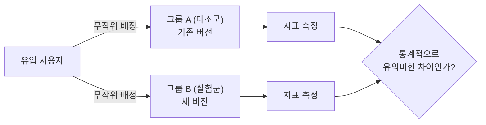

## A/B 테스트는 "비교"가 아니라 "실험"이다

새 버튼 디자인을 배포한 다음 주 전환율이 올랐다고 해서 그 디자인이 원인이라고 말할 수 있을까? 그 주에 마케팅 캠페인이 겹쳤을 수도 있고, 요일 분포가 달랐을 수도 있고, 계절적 성수기였을 수도 있다. **배포 전/후를 시간순으로 비교하는 방식은 디자인 말고도 수많은 변수가 같이 바뀌기 때문에, 전환율 변화의 원인을 디자인으로 단정할 수 없다.**

A/B 테스트는 이 문제를 "같은 시간, 같은 조건에서 사용자를 무작위로 두 그룹(A: 기존안, B: 새 버전)으로 나눠 동시에 노출시키는" 방식으로 해결한다. 시간·계절·캠페인 같은 외부 요인은 두 그룹에 동일하게 걸리기 때문에, 두 그룹 사이에 남는 차이는 이론상 오직 "어떤 버전을 봤는가" 하나뿐이다. 이게 A/B 테스트가 상관관계가 아니라 **인과관계**를 주장할 수 있는 근거다.

## 실험을 설계하는 순서

1. **가설을 먼저 세운다** — "체크아웃 버튼을 초록색에서 주황색으로 바꾸면 클릭률이 오를 것이다"처럼, 무엇을 바꾸고 어떤 지표가 왜 움직일지를 미리 명시한다. 지표를 먼저 보고 나중에 그럴듯한 이야기를 붙이면(HARKing, Hypothesis After Results are Known) 우연한 변동을 진짜 효과로 오해하기 쉽다.
2. **핵심 지표(OEC)와 가드레일 지표를 정한다** — OEC(Overall Evaluation Criterion)는 이 실험의 성패를 가를 단 하나의 지표다. 동시에 "이 지표는 오르되 다른 게 망가지면 안 된다"는 가드레일 지표(예: 클릭률은 올라도 결제 완료율이 떨어지면 실패)도 같이 정해둬야, 지표 하나만 보고 잘못된 결론을 내리지 않는다.
3. **표본 크기를 계산한다** — 실험 시작 전에 "이 정도 효과 크기를 이 정도 신뢰도로 잡아내려면 그룹마다 몇 명이 필요한가"를 계산한다. 이 계산 없이 "일단 2주만 돌려보자"는 식으로 시작하면, 뒤에서 다룰 조기 판단 문제로 바로 이어진다.
4. **무작위 배정 단위를 정한다** — 사용자 단위(user_id)로 나눌지, 세션 단위로 나눌지, 디바이스 단위로 나눌지에 따라 결과가 달라진다. 로그인 사용자가 여러 기기를 오가는 서비스라면 세션 단위 배정은 같은 사람이 A와 B를 번갈아 보게 만들어 실험을 오염시킨다.
5. **정해둔 기간만큼 돌리고, 정해둔 시점에 딱 한 번 판단한다** — 3번에서 계산한 표본 크기에 도달할 때까지는 중간 결과를 실험 종료 근거로 쓰지 않는다.

## 결과를 읽을 때 필요한 통계 개념

| 개념 | 의미 |
|---|---|
| 귀무가설(H0) | "두 그룹 사이에 차이가 없다"는 기본 가정. A/B 테스트는 이걸 기각할 근거를 찾는 절차다. |
| p-value | 귀무가설이 참이라고 가정했을 때, 지금 관측된 차이(혹은 그 이상의 차이)가 우연히 나올 확률. 낮을수록 "우연이라고 보기 어렵다"는 뜻이다. |
| 유의수준(α) | p-value가 이 값보다 작으면 귀무가설을 기각하기로 미리 정한 기준선. 보통 0.05를 쓰며, "실제로는 차이가 없는데 있다고 잘못 판단할 확률(1종 오류)"을 이 값 이하로 통제하겠다는 뜻이다.
| 검정력(power, 1-β) | 실제로 효과가 있을 때 그 효과를 실험이 통계적으로 잡아낼 확률. 보통 80%를 목표로 삼는다. 검정력이 낮으면 진짜 효과가 있어도 "유의미하지 않다"고 놓치기 쉽다(2종 오류). |
| MDE(최소 탐지 가능 효과) | 이 실험이 잡아내고자 하는 최소한의 효과 크기. MDE를 작게 잡을수록(아주 미세한 차이까지 잡고 싶을수록) 필요한 표본 크기가 커진다. |

이 네 가지(α, 1-β, MDE, 그리고 지표의 기존 변동성)를 정하면 표본 크기 계산기로 "그룹마다 몇 명이 필요한지"가 나온다. 표본 크기를 먼저 정하지 않고 실험을 시작하면, 결과를 볼 때마다 "지금 유의미해 보이는데 끝낼까?"를 반복하게 되는데, 이게 다음에 나오는 조기 종료 문제다.

## 결과를 잘못 읽게 만드는 흔한 함정

| 함정 | 무슨 문제인가 |
|---|---|
| 조기 중단(peeking problem) | 실험 도중 중간 결과를 계속 확인하면서 p-value가 0.05 밑으로 떨어지는 순간 바로 종료하면, 실제로는 차이가 없어도 우연히 유의미해 보이는 순간이 반드시 한 번은 온다. 반복해서 들여다볼수록 거짓 양성(1종 오류) 확률이 명목상 5%를 훨씬 넘어선다. |
| SRM(Sample Ratio Mismatch) | 50:50으로 나눴어야 할 그룹 비율이 실제로는 48:52처럼 어긋나 있는 현상. 배정 로직 버그나 특정 그룹에서의 로딩 실패·이탈을 의미할 수 있어서, 비율이 어긋난 실험은 지표 차이를 신뢰할 수 없다. 카이제곱 검정으로 배정 비율 자체를 먼저 점검해야 한다. |
| 신기함 효과(novelty effect) | 새 버전이라는 이유만으로 초반에 반짝 지표가 오르는 현상. 실험 기간이 너무 짧으면 "새로워서 좋아진 것"과 "진짜 개선"을 구분하지 못한다. |
| 다중 비교 문제 | 지표를 10개 동시에 검정하면 그중 하나는 우연히 유의미하게 나올 확률이 크게 높아진다(각 지표 α=0.05라도 여러 개를 동시에 보면 전체 거짓 양성 확률은 훨씬 커진다). OEC를 하나로 못 박아두는 이유가 여기 있다. |
| 네트워크 효과(interference) | 사용자끼리 서로 영향을 주는 서비스(SNS 피드, 마켓플레이스)에서는 A그룹 사용자의 행동이 B그룹 사용자에게도 전파돼, 두 그룹이 완전히 독립이라는 A/B 테스트의 전제 자체가 깨질 수 있다. |

## A/B 테스트와 멀티암드 밴딧의 차이

A/B 테스트는 실험 기간 내내 트래픽을 정해진 비율(예: 50:50)로 계속 나눈다. 실험이 끝나야 승자를 정하고, 그 전까지는 성과가 나쁜 쪽에도 계속 트래픽을 준다 — **탐색(exploration)에 무게를 둔 방식**이다. 멀티암드 밴딧은 실험 도중에도 지금까지 성과가 좋은 쪽에 점점 더 많은 트래픽을 몰아준다 — **활용(exploitation)에 무게를 둔 방식**이다.

그래서 "확실한 인과 결론이 필요하고, 나쁜 쪽에 트래픽이 쏠려도 감당 가능한" 상황(UI 변경, 카피 문구 테스트)은 A/B 테스트가 맞고, "나쁜 성과가 지속되는 비용이 크고, 통계적으로 완벽한 결론보다 당장의 손실 최소화가 중요한" 상황(광고 입찰, 실시간 추천)은 밴딧 쪽이 더 맞는 경우가 많다.

## 정리

- A/B 테스트가 배포 전후 비교보다 나은 이유는 무작위 배정으로 시간·외부 요인 변수를 두 그룹에 동일하게 걸어, 남은 차이를 인과관계로 해석할 수 있게 만들기 때문이다.
- 가설 → OEC·가드레일 지표 정의 → 표본 크기 계산 → 무작위 배정 단위 결정 → 정해진 기간 실행, 이 순서를 실험 시작 전에 다 정해둬야 한다.
- 유의수준(α)은 거짓 양성 허용치, 검정력(1-β)은 진짜 효과를 잡아낼 확률, MDE는 잡아내고자 하는 최소 효과 크기다. 이 셋과 지표의 기존 변동성으로 필요한 표본 크기가 정해진다.
- 결과를 중간에 자주 들여다보고 유의미해 보이는 순간 바로 끝내는 조기 중단은 거짓 양성 확률을 크게 높인다. SRM, 신기함 효과, 다중 비교 문제, 네트워크 효과도 결과를 오독하게 만드는 대표적인 원인이다.
- A/B 테스트는 탐색 중심(정확한 인과 결론), 멀티암드 밴딧은 활용 중심(당장의 손실 최소화)이라는 차이가 있어, 상황에 따라 둘 중 더 맞는 도구가 다르다.
