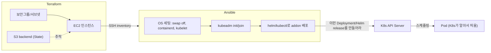

## Terraform만으로는 끝나지 않는 지점

[Terraform](/blog/terraform-basics)으로 `aws_instance`를 선언해 `terraform apply`를 돌리면 EC2 인스턴스가 뜬다. 여기까지는 Terraform의 일이 맞다. 그런데 그 EC2 안에 `swap`을 끄고, `containerd`를 설치하고, `kubelet`을 띄우고, `kubeadm init`으로 클러스터를 구성하는 건 Terraform이 할 일이 아니다. HCL은 "이런 리소스가 존재해야 한다"를 선언하는 언어지, 서버 안에 SSH로 들어가서 순서대로 명령을 실행하는 언어가 아니기 때문이다.

이 지점에서 Ansible이 들어온다. Terraform이 만든 EC2 인스턴스를 대상으로, 그 안에서 무엇을 설치하고 어떤 상태로 맞춰둘지를 Ansible이 담당한다.

## 경계선: 클라우드가 뭘 아는가 vs 서버가 뭘 하고 있는가

- **Terraform** — 클라우드 리소스 그 자체를 다룬다. EC2 인스턴스가 존재하는지, 어떤 보안그룹/서브넷을 참조하는지, State가 S3 backend에 어떻게 저장되는지. AWS API에 "이런 리소스를 만들어라/지워라"라고 말하는 계층이다.
- **Ansible** — 이미 존재하는 서버 위에서 벌어지는 일을 다룬다. OS 레벨 세팅(swap 비활성화, containerd 설치, kubelet 설정)부터 `kubeadm init`으로 K8s 클러스터 자체를 구성하는 것까지. SSH로 서버 안에 들어가 "이 상태를 만들어라"라고 말하는 계층이다.

한 문장으로 요약하면: **Terraform은 클라우드가 뭘 아는가(서버가 존재하는지)를 결정하고, Ansible은 그 서버들이 뭘 하고 있는가(OS 설정 + 클러스터 상태)를 결정한다.**



## Ansible이 하는 일: 인벤토리 → 플레이북

Ansible은 두 가지로 구성된다. **인벤토리(inventory)**는 "어떤 서버들을 대상으로 할 것인가" 목록이고, **플레이북(playbook)**은 "그 서버들에 무엇을 할 것인가"를 순서대로 적은 YAML이다. Terraform이 만든 EC2의 IP를 인벤토리에 넣는 것부터 시작한다.

```ini
# inventory.ini
[k8s_control_plane]
10.0.1.10 ansible_user=ec2-user

[k8s_workers]
10.0.1.11 ansible_user=ec2-user
10.0.1.12 ansible_user=ec2-user
```

```yaml
# site.yml
- name: OS 레벨 K8s 사전 준비
  hosts: k8s_control_plane:k8s_workers
  become: true
  tasks:
    - name: swap 비활성화
      command: swapoff -a
      changed_when: true

    - name: fstab에서 swap 항목 제거 (재부팅 후에도 유지)
      lineinfile:
        path: /etc/fstab
        regexp: "swap"
        state: absent

    - name: containerd 설치
      dnf:
        name: containerd
        state: present

    - name: kubelet, kubeadm 설치
      dnf:
        name: "{{ item }}"
        state: present
      loop:
        - kubelet
        - kubeadm

    - name: kubelet 서비스 활성화
      systemd:
        name: kubelet
        enabled: true
        state: started

- name: 컨트롤 플레인 초기화
  hosts: k8s_control_plane
  become: true
  tasks:
    - name: kubeadm init
      command: kubeadm init --pod-network-cidr=10.244.0.0/16
      register: kubeadm_init
      creates: /etc/kubernetes/admin.conf   # 이미 초기화됐으면 재실행하지 않음
```

여기서 눈여겨볼 건 `creates: /etc/kubernetes/admin.conf`다. Ansible 태스크는 기본적으로 **멱등성(idempotency)**을 지향한다 — 같은 플레이북을 몇 번을 다시 실행해도 결과가 같아야 한다. `admin.conf`가 이미 있으면(=이미 초기화됐으면) `kubeadm init`을 다시 실행하지 않는다. `swapoff -a`처럼 그 자체로 멱등하지 않은 명령은 `changed_when`이나 조건을 걸어 반복 실행 시에도 안전하게 만든다. Terraform이 State 파일로 "지금 상태 vs 선언된 상태"를 비교해 멱등성을 보장하는 것과 같은 목표를, Ansible은 각 태스크 단위의 조건과 `creates`/`changed_when` 같은 옵션으로 구현한다.

## Ansible은 파드를 직접 다루지 않는다

여기서 흔히 헷갈리는 지점이 하나 있다. "Ansible이 K8s 클러스터를 구성하니까, 파드도 Ansible이 관리하는 거 아닌가?"

아니다. Ansible이 하는 일은 딱 여기까지다.

1. 클러스터 자체를 만든다(`kubeadm init`/`join`).
2. 클러스터가 만들어진 뒤, `helm install`이나 `kubectl apply` 명령을 실행해서 "이런 Deployment를, 이런 Helm release를 만들어라"라고 **K8s API에 지시**한다.

파드를 스케줄링하고, 죽으면 다시 띄우고, 어느 노드에 배치할지 결정하는 건 그 이후부터 K8s 컨트롤러(Deployment Controller, 스케줄러)의 일이다. Ansible은 이 reconciliation loop 안에 들어가 있지 않다 — `ansible-playbook`을 한 번 실행해서 `helm install`을 성공시키고 나면, Ansible의 역할은 끝난다. 그 뒤로 파드가 재시작되든 노드를 옮기든, 그건 K8s가 스스로 처리하는 영역이다. ([Pod·Deployment·Service의 역할 분리](/blog/kubernetes-pod-deployment-service)를 보면 이 컨트롤러가 실제로 뭘 하는지 더 자세히 볼 수 있다.)

```yaml
# addon.yml — 클러스터가 이미 구성된 뒤, addon 배포만 담당
- name: Helm addon 배포
  hosts: k8s_control_plane
  become: true
  tasks:
    - name: nginx ingress controller 배포
      kubernetes.core.helm:
        name: ingress-nginx
        chart_ref: ingress-nginx/ingress-nginx
        release_namespace: ingress-nginx
        create_namespace: true
      # 이 태스크가 끝나는 순간 Ansible의 역할은 끝난다.
      # 이후 파드가 몇 개 뜨고, 어느 노드에 배치되고, 죽으면 재시작되는 건
      # 전부 K8s 컨트롤러의 일이다.
```

즉 Ansible과 K8s의 관계는 "Ansible이 파드를 다룬다"가 아니라, **"Ansible이 K8s API에 리소스 생성을 요청하고, K8s가 그 리소스를 실제로 실행 상태로 만든다"**는 위임 구조다.

## Terraform vs Ansible 한눈에 비교

| | Terraform | Ansible |
|---|---|---|
| 대상 | 클라우드 리소스 (EC2, 보안그룹, S3 등) | 이미 존재하는 서버 내부 상태 |
| 실행 방식 | API 호출 (Provider) | SSH 접속 후 원격 명령 실행 |
| 상태 추적 | State 파일(S3 backend)로 전체 상태를 기록 | 상태 파일이 없음 — 매 실행 시 대상 서버를 직접 확인 |
| 멱등성 확보 방법 | State vs 실제 인프라 diff 계산 | 태스크 단위 조건(`creates`, `changed_when` 등) |
| K8s와의 관계 | 클러스터가 올라갈 서버(EC2)를 만든다 | 클러스터 자체를 구성하고 그 위에 addon을 배포한다 |
| 파드 관리 여부 | 관여하지 않음 | 관여하지 않음 — K8s 컨트롤러가 담당 |

## 정리

- Terraform은 "클라우드가 뭘 아는가"를 담당한다 — EC2, 보안그룹, 서브넷, S3 backend 같은 인프라 그 자체.
- Ansible은 "그 서버들이 뭘 하고 있는가"를 담당한다 — OS 세팅부터 `kubeadm init`으로 클러스터를 구성하고, `helm`/`kubectl`로 그 위에 addon을 배포하는 것까지.
- Ansible이 파드를 직접 다루는 게 아니라, "이런 Deployment/Helm release를 만들어라"라고 K8s API에 요청하면 그 뒤로는 K8s가 알아서 스케줄링·재시작을 처리한다 — Ansible의 역할은 그 요청을 성공시키는 순간 끝난다.
- 두 도구 모두 멱등성을 지향하지만 구현 방식이 다르다. Terraform은 State 파일로 전체 diff를 계산하고, Ansible은 태스크 단위 조건으로 반복 실행을 안전하게 만든다.
