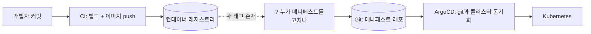
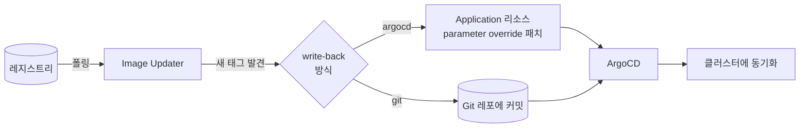

[EKS 관측 플랫폼](/blog/eks-multi-cluster-observability-platform)을 만들 때 겪은 일이다. ArgoCD가 `Synced`인데 파드는 `ImagePullBackOff`였다. 이유는 단순했다 — git의 매니페스트가 예전 레지스트리의 낡은 이미지 태그를 가리키고 있었다. **ArgoCD는 git에 적힌 대로만 배포한다. git이 틀리면 ArgoCD도 틀리게 배포한다.** ArgoCD의 잘못이 아니다.

그런데 이 "git의 이미지 태그"는 누가 갱신하나? 보통은 CI 파이프라인이 이미지를 빌드해서 레지스트리에 push한 다음, **사람이 직접 매니페스트 레포를 열어서 태그를 고쳐 커밋**한다. 아니면 CI가 그 커밋까지 대신 하도록 스크립트를 짜 넣는다. 둘 다 번거롭고, 후자는 CI 파이프라인에 매니페스트 레포 쓰기 권한까지 줘야 한다. Argo CD Image Updater는 이 "태그 갱신"이라는 마지막 수작업 고리를 없애는 도구다.

## GitOps에서 빠져 있던 한 조각

GitOps 파이프라인을 그림으로 그리면 보통 이렇다.



CI는 이미지를 만들어 레지스트리에 올려놓기만 한다. ArgoCD는 git을 클러스터에 반영하기만 한다. **그 사이, "레지스트리에 새 이미지가 생겼으니 git의 태그를 바꿔라"는 아무도 자동으로 안 한다.** 이게 흔히 "CI는 있는데 CD가 반쪽"이라고 부르는 상태다 — 빌드·테스트는 자동인데, 배포로 이어지는 마지막 트리거는 사람이 커밋 버튼을 눌러야 한다.

## Argo CD Image Updater가 하는 일

**Argo CD Image Updater**는 ArgoCD 프로젝트가 만든 별도 컨트롤러다. ArgoCD 본체와는 독립적으로 클러스터에 떠서, 레지스트리를 주기적으로 폴링하며 다음을 한다.

1. ArgoCD `Application` 리소스에 달린 **annotation**을 읽어 "이 앱이 어떤 이미지를, 어떤 규칙으로 추적할지" 파악
2. 그 이미지의 레지스트리(Docker Hub, ECR, GCR, Harbor 등)를 폴링해 태그 목록 조회
3. 갱신 전략(latest / semver / digest / 정규식)에 맞는 **새 태그**를 발견
4. 새 태그를 발견하면 **write-back 방식**에 따라 Application 리소스 또는 git 매니페스트에 반영
5. (git write-back이면) ArgoCD가 그 커밋을 감지해 평소처럼 동기화



핵심은 **"태그를 감지하고 고치는 일"을 CI에서 떼어내 별도 컨트롤러로 분리**했다는 점이다. CI는 이미지를 빌드해서 push만 하면 끝나고, 매니페스트 레포에 쓰기 권한을 가질 필요가 없다. 그 권한과 책임은 Image Updater 하나로 집중된다.

## 두 가지 write-back 방식

여기가 이 도구를 쓸 때 가장 중요한 선택이다.

| | `argocd` (기본값) | `git` |
|---|---|---|
| 새 태그를 어디에 반영하나 | ArgoCD `Application`의 parameter override에 직접 패치 | 매니페스트 git 레포에 커밋 |
| git에 남는 기록 | 없음 — 실제 배포된 태그가 git에는 안 보임 | 커밋 이력으로 남음 |
| 롤백 | ArgoCD 히스토리로만 가능 | `git revert`로 가능, git이 여전히 유일한 진실 |
| GitOps 원칙 | 깨짐 — 클러스터 실제 상태와 git이 어긋남 | 지켜짐 — git이 계속 "지금 배포된 것"을 정확히 반영 |
| 속도 | 빠름 (git 커밋·PR 사이클 없음) | 상대적으로 느림 (커밋 → ArgoCD 감지 → sync) |
| 적합한 환경 | 실험용, 이미지가 자주 바뀌는 개인 dev 클러스터 | 여러 명이 같이 보는 dev/staging, 감사 기록이 필요한 환경 |

`argocd` 모드는 편하지만, **ArgoCD의 핵심 가치인 "git = 유일한 진실"을 스스로 깨뜨린다.** [EKS 관측 플랫폼 글](/blog/eks-multi-cluster-observability-platform)에서 다룬 `Synced ≠ Healthy` 교훈과 이어지는 지점이다 — git과 클러스터가 항상 같아야 문제를 git에서 추적할 수 있는데, `argocd` 모드는 그 전제를 스스로 어긴다. 그래서 실무에서는 dev 환경만 `argocd` 모드로 빠르게 돌리고, 공유 환경 이상은 `git` 모드로 감사 추적을 남기는 조합이 흔하다.

## 갱신 전략 — 아무 태그나 새 버전으로 취급하면 안 된다

annotation으로 이미지별 추적 전략을 지정한다.

```yaml
apiVersion: argoproj.io/v1alpha1
kind: Application
metadata:
  name: inference-worker
  annotations:
    argocd-image-updater.argoproj.io/image-list: worker=123456789.dkr.ecr.ap-northeast-2.amazonaws.com/inference-worker
    argocd-image-updater.argoproj.io/worker.update-strategy: semver
    argocd-image-updater.argoproj.io/worker.allow-tags: "regexp:^v[0-9]+\\.[0-9]+\\.[0-9]+$"
    argocd-image-updater.argoproj.io/write-back-method: git
    argocd-image-updater.argoproj.io/git-branch: main
```

| 전략 | 동작 | 언제 쓰나 |
|---|---|---|
| `semver` | 시맨틱 버저닝(`1.2.3`) 규칙으로 더 높은 버전만 채택 | 태그를 버전으로 관리하는 정식 릴리스 |
| `latest` | 이미지 빌드 시각(created timestamp) 기준 가장 최근 태그 | 태그 이름이 임의 문자열이라도 상관없을 때 |
| `digest` | 태그는 고정(`:latest`, `:stable`)이지만 그 뒤의 **digest**(내용물)가 바뀌면 감지 | CI가 같은 태그를 재사용하며 계속 덮어쓰는 구조 |
| `name` (정규식) | `allow-tags`에 지정한 패턴에 맞는 태그만 추적 | `build-<git-sha>`처럼 커밋 단위로 태그를 찍는 CI |

`allow-tags`를 안 걸어두면 레지스트리의 아무 태그나(심지어 `test`, `debug` 같은 것도) 새 것으로 인식해 배포해버릴 수 있다. **패턴을 명시적으로 좁히는 게 사실상 필수**다.

## 왜 쓰는가 — 장점

- **CD 루프를 완성한다.** "이미지 push → 클러스터 반영"까지가 전부 자동이 된다. 사람이 하는 일은 코드를 커밋하는 것까지고, 그 뒤로는 CI든 Image Updater든 기계가 맡는다.
- **CI의 권한을 좁힌다.** CI가 매니페스트 레포에 쓰기 권한(또는 ArgoCD API 토큰)을 가질 필요가 없어진다. CI는 "이미지를 만드는 것"까지만 책임지고, "그걸 언제·어떻게 배포에 반영할지"는 별도 컨트롤러의 책임으로 분리된다 — 권한 경계가 명확해진다.
- **레지스트리가 유일한 신뢰 소스가 된다.** CI 스크립트마다 제각각 짜여 있던 "태그 갱신 로직"이 Image Updater 하나의 정책(annotation)으로 통일된다. 여러 앱, 여러 레포에 흩어진 배포 자동화 스크립트를 걷어낼 수 있다.
- **속도와 통제를 환경별로 다르게 가져갈 수 있다.** dev는 `latest` + `argocd` write-back으로 이미지 push 즉시 반영하고, prod는 `semver` + `git` write-back으로 커밋 기반 승인 절차를 거치게 한다 — 같은 도구로 두 극단을 다 커버하는 식이다.
- **[EKS 관측 플랫폼](/blog/eks-multi-cluster-observability-platform)에서 겪은 문제를 구조적으로 막는다.** "누군가 태그를 깜빡하고 안 바꿔서 git이 죽은 이미지를 가리킨다"는 애초에 사람이 태그를 손으로 만지기 때문에 생긴다. Image Updater가 그 경로를 자동화하면 이 클래스의 실수 자체가 사라진다.

## 흔한 함정

- **`allow-tags` 없이 운영** — 레지스트리의 모든 태그를 "새 버전 후보"로 본다. 테스트용으로 push한 태그가 프로덕션에 배포되는 사고로 이어질 수 있다.
- **레지스트리 인증 누락** — Image Updater는 ArgoCD의 클러스터 접근 권한과 별개로, **레지스트리를 읽을 자격증명**이 따로 필요하다(ECR이면 IRSA, Docker Hub면 pull secret). 이게 없으면 조용히 폴링만 실패한다.
- **폴링 주기 오해** — push 기반이 아니라 폴링 기반이다(기본 2분). "이미지 push하자마자 바로 배포되던데?"를 기대하면 안 되고, 이 지연이 문제가 되는 환경이면 웹훅으로 즉시 트리거하는 보완이 필요하다.
- **`argocd` 모드를 공유 환경에 그대로 씀** — 위에서 다뤘듯 git과 실제 배포 상태가 어긋난다. 여러 사람이 보는 환경, 감사가 필요한 환경은 `git` 모드로.
- **Rate limit** — Docker Hub처럼 익명 API 호출에 제한이 있는 레지스트리는 이미지·앱 개수가 늘수록 폴링이 막힐 수 있다. 인증된 호출로 제한을 늘리거나 폴링 주기를 늘려야 한다.

## 정리

| 질문 | 답 |
|---|---|
| Argo CD Image Updater란 | 레지스트리의 새 이미지를 감지해 ArgoCD Application 또는 git 매니페스트를 자동으로 갱신하는 별도 컨트롤러 |
| 뭘 대신해주나 | "이미지 push 후 매니페스트 태그를 손으로(또는 CI 스크립트로) 갱신하는" 수작업 |
| write-back 방식 두 가지 | `argocd`(빠르지만 git과 상태가 어긋남) / `git`(느리지만 GitOps 원칙·감사 추적 유지) |
| 갱신 전략 | semver, latest, digest, 정규식(name) — 아무 태그나 배포되지 않게 `allow-tags`로 반드시 제한 |
| 핵심 장점 | CD 루프 완성, CI 권한 축소, 레지스트리를 유일한 신뢰 소스로, 환경별로 속도/통제 수준을 다르게 가져갈 수 있음 |

한 줄 요약: **ArgoCD는 "git에 적힌 대로 배포"까지만 책임진다. 그 git을 최신 이미지로 계속 맞추는 일은 원래 사람의 몫이었는데, Argo CD Image Updater가 레지스트리를 신뢰 소스 삼아 이 고리를 자동화하면서, GitOps를 깨지 않으면서도(`git` write-back 기준) CI-CD 사이의 마지막 수작업을 없앤다.**
