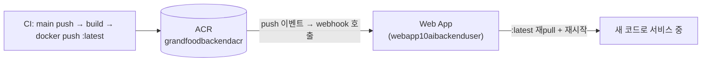
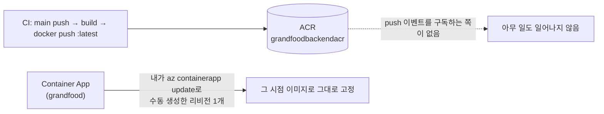

Azure에서 컨테이너를 돌리는 방법은 크게 Web App(App Service, 컨테이너 배포)과 Container App 두 가지다. 둘 다 "ACR에 있는 이미지를 pull해서 실행한다"는 점은 같지만, **ACR에 새 이미지가 push된 뒤 그걸 실제로 반영시키는 방식**이 근본적으로 다르다. 이 차이를 모르고 있으면 "Container App에 이미지가 떠 있다"는 사실과 "앞으로 main에 merge되는 코드가 거기 반영된다"는 사실을 같은 걸로 착각하기 쉽다.

## Web App은 ACR webhook으로 자동 재배포된다

Web App for Containers는 Deployment Center에서 "연속 배포(Continuous Deployment)"를 켜면, Azure가 ACR(Azure Container Registry)에 **webhook**을 하나 만들어준다. 이후 CI가 이미지를 빌드해서 같은 태그(`:latest`)로 push하면, ACR이 그 push 이벤트를 감지해서 등록된 webhook URL로 알림을 쏘고, Web App은 그 알림을 받아 컨테이너를 재시작하면서 이미지를 다시 pull한다.



여기서 "트리거"는 **레지스트리 쪽**에 있다. CI는 이미지를 push하는 것 말고는 배포에 관여하지 않고, 그다음부터는 ACR과 Web App이 알아서 처리한다. 그래서 그동안 별생각 없이 "main에 merge되면 알아서 배포된다"고 믿을 수 있었던 거다.

## Container App은 그 webhook이 없다

Container App은 배포 단위 자체가 다르다. 이미지, 환경변수, 스케일 규칙 같은 설정을 바꿀 때마다 새 **리비전(revision)**이 만들어지고, 기본값인 단일 리비전 모드에서는 새 리비전이 활성화되면 이전 리비전이 내려간다. 문제는 **"이미지 참조 문자열이 그대로면(`...:latest`), ACR에 새 이미지가 push돼도 Container App 입장에서는 스펙이 안 바뀐 것**이라 새 리비전을 만들 이유가 없다는 점이다. Web App처럼 레지스트리 push를 감시해서 알아서 재pull해주는 장치가 기본으로 붙어있지 않다.



예를 들어 `az containerapp create` 혹은 `update`로 이미지를 한 번 넣어서 리비전 1개를 수동으로 만들어 놓은 상태라면, 그 뒤로 ACR에 새 이미지가 몇 번을 올라가든 Container App은 그 사실 자체를 모른다. 이 상태에서 기존 Web App을 지워버리면, 배포 파이프라인의 "실행 결과"는 그대로 초록불(빌드 성공, push 성공)인데 실제 서비스에는 코드가 하나도 반영되지 않는, 겉으로는 티가 안 나는 상태가 된다.

## Web App vs Container App, 배포 트리거 위치가 다르다

| | Web App (App Service) | Container App |
|---|---|---|
| 배포 단위 | 컨테이너 슬롯 하나 | 리비전(revision) — 설정이 바뀔 때마다 새로 생성 |
| 트리거가 있는 곳 | 레지스트리(ACR webhook)가 플랫폼에 알려줌 | 기본적으로 없음 — CI/CD가 명시적으로 갱신을 호출해야 함 |
| `:latest` 재사용 시 | webhook이 push를 감지해 자동 재pull | 이미지 참조 문자열이 그대로면 새 리비전을 만들 이유가 없어 아무 일도 안 일어남 |
| "배포됐다"의 의미 | 컨테이너가 재시작되고 새 이미지를 물었다 | 새 리비전이 생성되고 트래픽이 그쪽으로 옮겨갔다 |

Web App은 "레지스트리를 구독하는 모델"이고, Container App은 "누군가 명시적으로 갱신을 호출해야 하는 모델"이다. 마이그레이션할 때 놓치기 쉬운 게 바로 이 지점이다 — 인프라를 옮겼다고 생각했지만 실제로는 **트리거의 위치 자체를 CI 파이프라인 쪽으로 옮겨와야 하는 작업**이 남아있었던 거다.

## Container App에 자동 배포 붙이기

가장 간단한 방법은 Azure CLI가 제공하는 GitHub Actions 연동이다.

```bash
az containerapp github-action add \
  --resource-group grandfood-rg \
  --name grandfood \
  --repo-url https://github.com/my0614/grandfood-backend \
  --branch main \
  --registry-url grandfoodbackendacr.azurecr.io \
  --service-principal-client-id <sp-id> \
  --service-principal-client-secret <sp-secret> \
  --service-principal-tenant-id <tenant-id>
```

이 명령은 리포지토리에 GitHub Actions 워크플로 파일을 하나 생성해준다. 핵심은 이 워크플로가 이미지를 빌드·push한 뒤, 마지막 스텝에서 `az containerapp update`를 **직접 호출**해서 새 리비전을 만든다는 점이다.

```yaml
# .github/workflows/azure-container-apps... (자동 생성되는 워크플로 발췌)
- name: Build and push container image
  run: |
    docker build -t $REGISTRY/grandfood:${{ github.sha }} .
    docker push $REGISTRY/grandfood:${{ github.sha }}

- name: Deploy to Container App
  run: |
    az containerapp update \
      --name grandfood \
      --resource-group grandfood-rg \
      --image $REGISTRY/grandfood:${{ github.sha }}
```

여기서 태그로 `:latest`가 아니라 **커밋 SHA**를 쓰는 것도 중요하다. 이미지 참조 문자열이 매번 달라지기 때문에 Container App 입장에서 "스펙이 바뀌었다"는 게 명확해지고, 리비전 히스토리에서 "이 리비전이 정확히 어느 커밋인지"도 바로 확인할 수 있다. `:latest`를 계속 쓰면 매번 `--image` 값이 문자열상 동일해서, 실제로는 `az containerapp update`가 호출돼도 변경 감지가 애매해지는 경우가 생긴다.

GitHub Actions 대신 기존 CI(Jenkins, Bitbucket Pipelines 등)를 쓰고 있다면 워크플로 자동 생성 기능 없이도 마지막 배포 스텝에 `az containerapp update --image ...` 한 줄만 추가하면 동일하게 동작한다. 중요한 건 도구가 아니라 **"이미지를 push하는 것"과 "Container App이 그 이미지를 실제로 물게 하는 것"이 서로 다른 두 단계이고, 후자를 CI가 명시적으로 책임져야 한다**는 사실이다.

## Web App에서 Container App으로 옮길 때 확인해야 할 것

Web App을 Container App으로 완전히 대체하려면, 리소스를 옮기는 것과 별개로 다음 세 가지를 확인해야 한다.

- Container App 쪽 CI 워크플로에 `az containerapp update`(혹은 동등한 배포 스텝)가 실제로 붙어 있는가 — 이미지가 한 번 떠 있다는 것과 파이프라인이 완성됐다는 건 다르다.
- 태그를 `:latest`가 아니라 커밋 SHA 같은 고유 값으로 바꿨는가 — 그래야 매 배포가 새 리비전으로 명확히 잡힌다.
- 더미 커밋 하나를 push해서, main → 새 리비전 생성 → 트래픽 전환까지 실제로 눈으로 확인했는가.

"자동 배포가 설정돼 있다"는 것과 "지금 이 순간 실제로 걸리는지"는 다른 문제다. [Harbor 취약점 정책](/blog/harbor-trivy-image-scan)을 걸었을 때도 정책을 걸었다는 사실과 그게 실제로 작동하는지가 달랐던 것처럼, 이 세 가지를 눈으로 확인하기 전까지는 기존 Web App을 지우지 않는 게 안전하다.

## 정리

- Web App(App Service)은 ACR webhook이 레지스트리 push를 감지해 자동으로 재배포하는 "구독형" 모델이다.
- Container App은 리비전 기반이라, 이미지 참조가 그대로면(`:latest` 재사용) 새 이미지가 push돼도 자동으로 새 리비전을 만들지 않는다. 트리거를 레지스트리가 아니라 **CI 파이프라인이 명시적으로** 쥐고 있어야 한다.
- `az containerapp github-action add` 같은 CLI로 GitHub Actions 연동을 붙이거나, 기존 CI 마지막 스텝에 `az containerapp update`를 추가하면 해결된다. 이때 태그는 `:latest`보다 커밋 SHA처럼 매번 바뀌는 값을 쓰는 게 리비전 추적에도 유리하다.
- 인프라를 옮길 때는 "새 인프라에 리소스가 떠 있는가"가 아니라 "새 인프라가 배포 파이프라인의 트리거를 실제로 물고 있는가"를 기준으로 삼아야, 구인프라를 지운 뒤에도 배포가 끊기지 않는다.
