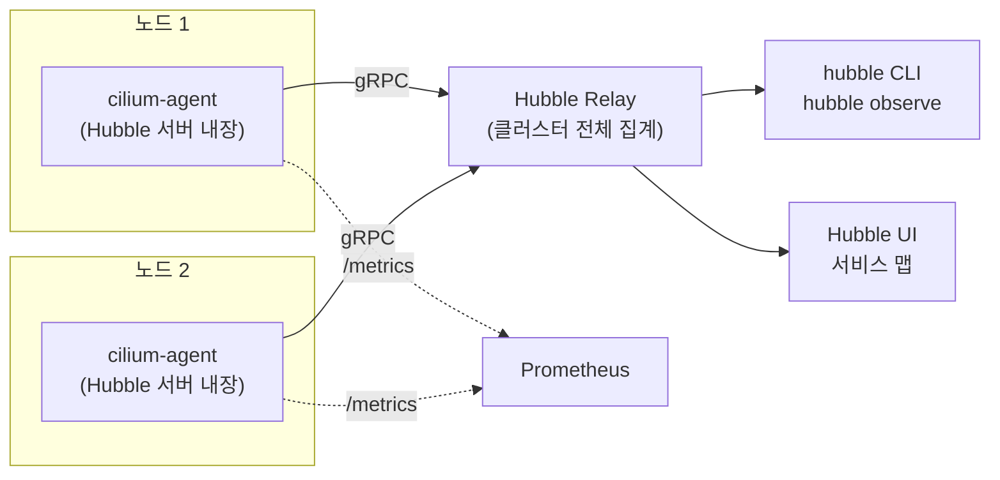
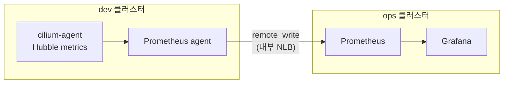

[EKS 2개로 관측 플랫폼을 만든 글](/blog/eks-multi-cluster-observability-platform)에서 CNI를 Cilium으로 고른 이유를 "eBPF, Hubble 가시성을 써보고 싶었다"고 적었다. 그런데 정작 그 글에서는 overlay → ENI 모드 전환, webhook 순서, finalizer 지옥을 정리하느라 Hubble 이야기를 한 줄도 쓰지 못했다. 이번 글에서 그 빈칸을 채운다.

[Prometheus·Loki 글](/blog/kubernetes-observability-prometheus-loki)과 [OpenTelemetry·Tempo 글](/blog/opentelemetry-tempo-distributed-tracing)로 메트릭·로그·트레이스라는 관측의 세 축을 채웠다면, Hubble은 그보다 한 층 아래에서 **파드와 파드 사이 네트워크에 실제로 무슨 일이 일어났는가**를 보는 도구다.

## 쿠버네티스에서 네트워크 문제는 왜 보기 어려운가

"A 서비스에서 B 서비스로 요청이 안 가요"라는 제보를 받았다고 하자. VM 시절이라면 두 서버 IP를 알고 `tcpdump`나 방화벽 로그를 보면 됐다. 쿠버네티스에서는 이 방법이 잘 통하지 않는다.

- **IP가 정체성이 아니다.** 파드는 재시작될 때마다 새 IP를 받는다. 로그에 찍힌 `10.10.3.47`이 5분 전에는 결제 파드였지만 지금은 전혀 다른 파드일 수 있다. [구축기](/blog/eks-multi-cluster-observability-platform)에서 ENI 모드로 바꾼 뒤 파드가 VPC IP를 직접 받게 됐지만, IP가 계속 바뀐다는 사실은 그대로다.
- **막는 주체가 여러 겹이다.** NetworkPolicy, 보안 그룹, DNS 실패, 서비스 셀렉터 오타, 대상 파드 미기동까지 원인은 제각각인데, 증상은 모두 "연결이 안 된다" 하나로 같다.
- **어디서 봐야 할지 모른다.** 패킷은 노드의 커널(iptables 또는 eBPF)에서 처리되는데, 애플리케이션 로그에는 "timeout"만 남는다.

결국 필요한 것은 "IP 10.10.3.47 → 10.10.5.12, TCP SYN" 같은 기록이 아니라, "`default/frontend` → `default/payment:8080`, 정책에 의해 DROP"처럼 **쿠버네티스 정체성(네임스페이스·라벨) 단위로 읽히는 네트워크 기록**이다.

## Hubble이 하는 일

Cilium은 파드 트래픽을 iptables 대신 **eBPF 프로그램**으로 커널 안에서 처리한다. 즉 Cilium은 패킷이 지나가는 바로 그 자리에서 이미 "이 패킷은 어느 엔드포인트(파드)에서 왔고, 어느 정책에 걸렸고, 통과했는지 버려졌는지"를 알고 있다.

**Hubble**은 이 eBPF 데이터패스가 만들어 내는 이벤트를 **flow**라는 단위로 모아서 보여 주는 Cilium의 관측 계층이다. 핵심은 Cilium이 파드마다 부여하는 **identity**(라벨 조합으로 만든 숫자 ID)를 flow에 함께 실어 준다는 점이다. 그래서 IP가 바뀌어도 "frontend 라벨을 가진 파드들"이라는 단위로 흐름을 추적할 수 있다.

flow 하나에 담기는 정보는 대략 이렇다.

| 필드 | 예시 |
|---|---|
| 출발지 / 목적지 | `default/frontend-7d9f` → `default/payment-5c4b` (라벨·네임스페이스 포함) |
| L4 | TCP `8080`, SYN / ACK / RST |
| verdict | `FORWARDED`, `DROPPED`, `AUDIT` 등 |
| drop 이유 | `Policy denied`, `Unsupported L3 protocol` 등 |
| 방향 | ingress / egress |
| L7 (조건부) | HTTP 메서드·경로·상태 코드, DNS 질의·응답 |

## 구성 요소



| 구성 요소 | 역할 |
|---|---|
| **Hubble 서버** | 각 노드의 cilium-agent 안에 내장. 그 노드에서 일어난 flow를 메모리 링 버퍼에 담아두고 gRPC로 노출한다 |
| **Hubble Relay** | 모든 노드의 Hubble 서버에 붙어서 flow를 모아 **클러스터 단위 API**로 제공한다. 이게 없으면 노드별로 따로 봐야 한다 |
| **hubble CLI** | Relay에 붙어서 flow를 필터링·조회하는 명령줄 도구 (`hubble observe`) |
| **Hubble UI** | 서비스 간 통신을 그래프(서비스 맵)로 보여 주는 웹 UI |
| **Hubble metrics** | flow를 Prometheus 메트릭으로 집계해서 노출. 대시보드·알람용 |

여기서 짚고 갈 점이 하나 있다. **Hubble 서버가 가진 flow는 노드 메모리의 링 버퍼에만 있다.** 버퍼가 차면 오래된 것부터 밀려난다. 즉 Hubble은 기본적으로 "지금 무슨 일이 일어나고 있나"를 보는 도구이고, 과거 기록을 오래 보관하려면 메트릭이나 로그로 따로 내보내야 한다. 이 부분은 뒤에서 다시 다룬다.

## 켜기 — Terraform의 Cilium Helm 값에 추가

[구축기](/blog/eks-multi-cluster-observability-platform)에서는 Cilium을 `helm_release.cilium`으로 설치했다. Hubble은 같은 차트에 값 몇 줄만 추가하면 켜진다. ENI 모드 설정은 그대로 두고 `hubble` 블록만 추가한다.

```hcl
eni                        = { enabled = true }
ipam                       = { mode = "eni" }
routingMode                = "native"
egressMasqueradeInterfaces = "eth0"

hubble = {
  enabled = true
  relay   = { enabled = true }
  ui      = { enabled = true }
  metrics = {
    enabled = [
      "dns",
      "drop",
      "tcp",
      "flow",
      "port-distribution",
      "httpV2:labelsContext=source_namespace,source_workload,destination_namespace,destination_workload",
    ]
    serviceMonitor = { enabled = true }
  }
}
```

- `relay`를 켜야 CLI·UI가 클러스터 전체 flow를 본다.
- `metrics.enabled`는 어떤 메트릭을 만들지 고르는 목록이다. 많이 켤수록 시계열이 늘어난다(카디널리티 문제는 아래에서 다룬다).
- `serviceMonitor`는 kube-prometheus-stack이 Hubble 메트릭 엔드포인트를 자동으로 수집(scrape)하게 해 준다.

설치 후 상태는 Cilium CLI로 확인한다.

```bash
cilium status              # 'Hubble Relay: OK'인지 확인
cilium hubble port-forward # 로컬에서 Relay(4245)로 접속할 수 있게 포워딩
hubble status              # 수집 중인 flow 수, 연결된 노드 수
```

## hubble observe — "왜 막혔나"를 찾는 법

Hubble을 쓰는 이유의 절반은 이 명령 하나다. 앞의 "A에서 B로 요청이 안 가요" 상황을 다시 보자.

```bash
# 1) 지금 버려지고 있는 트래픽만 본다
hubble observe --verdict DROPPED --follow

# 2) 범위를 좁힌다: default 네임스페이스의 frontend 파드에서 나가는 것
hubble observe --from-pod default/frontend --verdict DROPPED

# 3) 특정 목적지 포트
hubble observe --to-pod default/payment --port 8080
```

`DROPPED` flow에는 drop 이유가 같이 찍힌다. `Policy denied`라면 NetworkPolicy가 막은 것이고, 반대로 flow가 아예 보이지 않는다면 패킷이 애초에 목적지 파드까지 가지 않았다는 뜻이니, 서비스 셀렉터나 DNS 쪽을 봐야 한다. **"flow가 있는데 DROP"과 "flow가 아예 없음"을 구분할 수 있다는 것 자체가** 디버깅 범위를 크게 줄여 준다.

자주 쓰는 필터를 모아 보면 다음과 같다.

| 알고 싶은 것 | 명령 |
|---|---|
| 네임스페이스 전체 흐름 | `hubble observe --namespace default --follow` |
| DNS 질의가 실패하는지 | `hubble observe --protocol dns` |
| HTTP 5xx만 | `hubble observe --protocol http --http-status 5+` |
| 외부 도메인으로 나가는 트래픽 | `hubble observe --to-fqdn "*.amazonaws.com"` |
| 결과를 JSON으로 | `hubble observe -o json` (jq로 가공) |

## L3/L4와 L7 가시성은 조건이 다르다

위 표의 `--protocol http`, `--http-status`는 **L7 정보**다. 여기서 흔히 헷갈리는 부분이 있다.

- **L3/L4(IP·포트·TCP 플래그·verdict)는 Hubble을 켜기만 하면 전부 보인다.** eBPF 데이터패스가 모든 패킷을 처리하기 때문이다.
- **L7(HTTP 경로·상태 코드, DNS 질의 내용)은 그 트래픽이 Cilium의 L7 프록시(Envoy)를 거칠 때만 보인다.** 기본적으로 모든 트래픽이 프록시를 거치지는 않는다. 보통 L7 규칙이 들어간 `CiliumNetworkPolicy`를 걸어서 해당 트래픽을 프록시로 보내야 한다.

예를 들어 payment로 들어오는 HTTP를 보고 싶다면 이런 정책을 건다.

```yaml
apiVersion: cilium.io/v2
kind: CiliumNetworkPolicy
metadata:
  name: payment-l7-visibility
  namespace: default
spec:
  endpointSelector:
    matchLabels:
      app: payment
  ingress:
    - fromEndpoints:
        - matchLabels:
            app: frontend
      toPorts:
        - ports:
            - port: "8080"
              protocol: TCP
          rules:
            http:
              - {}   # 모든 HTTP 요청 허용 — 막는 게 아니라 '보기 위한' 규칙
```

주의할 점이 두 가지 있다.

1. 이건 **정책**이다. `fromEndpoints`에 없는 출발지는 이 순간부터 막힌다. 가시성을 보려고 걸었다가 다른 서비스의 통신을 끊는 실수를 조심해야 한다.
2. 프록시를 거치는 만큼 **지연과 CPU가 늘어난다.** 모든 트래픽에 L7 가시성을 켜는 건 권하지 않는다. 문제가 되는 구간에만 건다.

## Hubble UI — 서비스 맵

`cilium hubble ui` 명령으로 UI를 열고 네임스페이스를 고르면 **서비스 간 통신이 그래프로** 그려진다. 그래프의 노드는 서비스, 화살표는 실제로 관측된 통신이며, 드롭된 연결은 따로 표시된다.

"이 서비스가 누구에게 의존하는가"를 코드나 문서가 아니라 **실제 트래픽으로** 확인할 수 있다는 게 핵심이다. 팀에 새로 합류해 시스템 구조를 파악할 때나 NetworkPolicy를 처음 설계할 때 "어떤 통신을 허용 목록에 넣어야 하나"를 정하는 근거로 특히 쓸모 있다.

## 메트릭 — 흘러가는 flow를 오래 남기는 첫 번째 방법

앞에서 말했듯 flow 자체는 메모리 링 버퍼에만 있다. 추세를 보고 알람을 걸려면 **Hubble metrics**를 쓴다. 위 Helm 값에서 켠 항목이 각각 `hubble_` 접두사가 붙은 Prometheus 메트릭이 된다.

```promql
# 초당 드롭 수를 이유별로
sum by (reason) (rate(hubble_drop_total[5m]))

# DNS 응답 중 에러(NXDOMAIN 등) 비율
sum(rate(hubble_dns_responses_total{rcode!="No Error"}[5m]))
  / sum(rate(hubble_dns_responses_total[5m]))
```

이 메트릭은 [구축기](/blog/eks-multi-cluster-observability-platform)의 구조에 그대로 얹을 수 있다. dev 클러스터의 Prometheus agent가 Hubble 메트릭도 scrape해서 ops로 remote_write하면, ops Grafana에서 `{cluster="dev"}`로 네트워크 드롭까지 함께 볼 수 있다.



**카디널리티 주의.** `httpV2`의 `labelsContext`에 `source_ip`처럼 값이 계속 바뀌는 라벨을 넣으면 시계열 수가 폭발한다. 파드 IP는 재시작마다 바뀌기 때문이다. 위 예시처럼 **네임스페이스·워크로드 단위**로만 라벨을 붙이는 게 안전하다. 메트릭은 "추세"용이고, 개별 IP 단위까지 봐야 할 때는 `hubble observe`나 아래에서 설명할 로그를 쓴다.

## 로그로 내보내기 — 두 번째 방법

사고가 난 뒤 "어제 새벽 3시에 누가 DB 포트로 접근했나"를 보고 싶다면, 메트릭으로는 부족하고 flow 원본이 필요하다. Cilium에는 flow를 노드의 파일로 쓰는 **Hubble exporter** 기능이 있다. 이 파일을 [구축기](/blog/eks-multi-cluster-observability-platform)의 fluent-bit DaemonSet이 읽도록(tail) 입력을 하나 더 추가하면, 기존 파이프라인(dev fluent-bit → ops 집계기 → Elasticsearch)으로 그대로 흘러간다.

exporter 관련 Helm 값의 이름은 Cilium 버전에 따라 조금씩 바뀌어 왔으니, 설치한 버전의 문서에서 `hubble.export` 항목을 확인하고 넣는 게 좋다. 그리고 flow는 양이 매우 많으니 **전부 내보내지 말고** `DROPPED`나 특정 네임스페이스처럼 필터를 걸어 필요한 것만 남기는 걸 권한다. 이렇게 모은 네트워크 기록은 [SIEM 글](/blog/siem-vs-observability-log-pipeline)에서 다룬 보안 탐지의 재료로도 쓸 수 있다.

## 다른 도구와 뭐가 다른가

| | Hubble | VPC Flow Logs | 서비스 메시 (Istio + Kiali 등) |
|---|---|---|---|
| 기록 단위 | 파드 identity (네임스페이스·라벨) | ENI의 IP·포트 | 서비스 (사이드카 기준) |
| 쿠버네티스 맥락 | 있음 | 없음 (IP만) | 있음 |
| L7 (HTTP 등) | 조건부 (L7 정책 필요) | 없음 | 있음 (사이드카가 전부 봄) |
| 정책 drop 이유 | 있음 (Cilium 정책 기준) | 보안 그룹 ACCEPT/REJECT만 | 메시 정책 기준 |
| 추가 비용 | 사이드카 없음, eBPF | CloudWatch·S3 저장 비용 | 파드마다 사이드카 리소스 |
| 보관 | 메모리 버퍼 (내보내기 필요) | 저장소에 계속 쌓임 | 백엔드에 따라 다름 |

VPC Flow Logs는 "이 ENI에서 어떤 IP가 오갔나"는 알려 주지만, 그 IP가 그때 어떤 파드였는지는 모른다. 서비스 메시는 L7을 훨씬 풍부하게 보지만 모든 파드에 사이드카를 붙이는 비용이 든다. **이미 Cilium을 CNI로 쓰고 있다면 Hubble은 추가 컴포넌트 없이 얻는 네트워크 가시성**이라는 게 가장 큰 장점이다.

## 정리

- 쿠버네티스에서 IP는 정체성이 아니다. Hubble은 Cilium의 **identity**를 flow에 실어 "어떤 워크로드가 어떤 워크로드와 통신했고, 왜 막혔나"를 보여 준다.
- 구성은 **노드별 Hubble 서버 + 클러스터 단위 Relay + CLI / UI / 메트릭**이다. flow 원본은 노드 메모리 버퍼에만 있다.
- 디버깅은 `hubble observe --verdict DROPPED`에서 시작한다. **"DROP된 flow가 있다"와 "flow가 아예 없다"를 구분하는 것**이 핵심이다.
- **L3/L4는 켜면 전부 보이지만, L7은 L7 정책으로 프록시를 거치게 해야 보인다.** 정책이 통신을 막을 수 있고 오버헤드도 있으니 필요한 구간에만 건다.
- 오래 남기려면 **메트릭**(추세·알람, 카디널리티 주의)과 **로그 내보내기**(사후 조사, 필터 필수)를 쓴다. 둘 다 [구축기](/blog/eks-multi-cluster-observability-platform)의 Prometheus agent → ops, fluent-bit → Elasticsearch 파이프라인에 그대로 얹을 수 있다.
