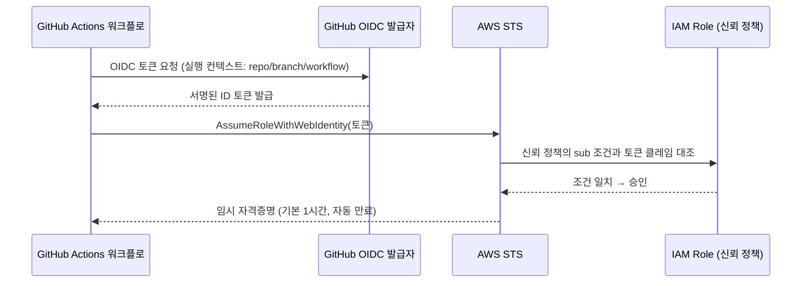

CI 파이프라인에서 AWS 리소스를 다루려면 어떻게든 인증이 필요하다. 가장 흔하게 보는 방식은 IAM 사용자를 하나 만들고, Access Key ID/Secret Access Key를 발급해서 GitHub Repository Secrets에 넣는 것이다.

```yaml
# ❌ 흔하지만 구조적으로 위험한 방식
- uses: aws-actions/configure-aws-credentials@v4
  with:
    aws-access-key-id: ${{ secrets.AWS_ACCESS_KEY_ID }}
    aws-secret-access-key: ${{ secrets.AWS_SECRET_ACCESS_KEY }}
```

이 방식의 문제는 단순하다. 이 키는 **로테이션하기 전까지 영구히 유효**하고, Secrets에 한 번 등록되면 그 값 자체를 다시 볼 방법은 없지만 워크플로 로그 실수, 서드파티 Action의 악의적 코드, 저장소 권한 관리 실수로 유출될 경로는 여럿 있다. 유출되면 그 키가 가진 권한 전체가 그대로 공격자 손에 들어간다 — [SAS URL 글](/blog/azure-blob-sas-url)에서 다룬 "계정 키 하나가 스토리지 전체를 여는" 문제와 정확히 같은 구조다.

## Workload Identity Federation이 하는 일

**Workload Identity Federation**(WIF)은 특정 제품명이 아니라 패턴의 이름이다. 핵심은 하나다.

> 정적인 비밀키를 아예 만들지 않는다. 대신 신뢰할 수 있는 신원 증명자(IdP)가 발급한 **단기 토큰**을, 클라우드 쪽이 검증한 뒤 **그때그때 짧게 유효한 임시 자격증명으로 교환**해준다.

AWS에서는 IAM의 OIDC Identity Provider 기능으로 이걸 구현한다. GitHub Actions는 워크플로 실행마다 `token.actions.githubusercontent.com`이 서명한 OIDC ID 토큰을 발급할 수 있고, AWS IAM이 이 발급자를 신뢰하도록 등록해두면, 워크플로가 그 토큰을 들고 `AssumeRoleWithWebIdentity`를 호출해 IAM Role의 임시 자격증명(기본 1시간)을 받아올 수 있다. **어디에도 저장된 비밀키가 없다.**



이 흐름은 낯설지 않다. [Argo CD Image Updater 글](/blog/argocd-image-updater)에서 "ECR이면 IRSA가 필요하다"고 짧게 언급했는데, **IRSA(IAM Roles for Service Accounts)도 정확히 같은 패턴**이다. 다만 토큰 발급자가 GitHub이 아니라 EKS 클러스터의 OIDC 발급자이고, 토큰을 요청하는 주체가 워크플로가 아니라 파드일 뿐이다. GitHub Actions OIDC, EKS IRSA, GCP Workload Identity, Azure Workload Identity — 이름은 다 다르지만 "신뢰하는 IdP의 단기 토큰을 클라우드 임시 자격증명으로 교환한다"는 뼈대는 같다.

## 설정 — 신뢰 관계 두 군데

### 1. AWS 쪽: IAM OIDC Provider + Role 신뢰 정책

```hcl
resource "aws_iam_openid_connect_provider" "github" {
  url             = "https://token.actions.githubusercontent.com"
  client_id_list  = ["sts.amazonaws.com"]
  thumbprint_list = ["6938fd4d98bab03faadb97b34396831e3780aea1"]
}

resource "aws_iam_role" "github_actions_deploy" {
  name = "github-actions-deploy"

  assume_role_policy = jsonencode({
    Version = "2012-10-17"
    Statement = [{
      Effect = "Allow"
      Principal = { Federated = aws_iam_openid_connect_provider.github.arn }
      Action = "sts:AssumeRoleWithWebIdentity"
      Condition = {
        StringEquals = {
          "token.actions.githubusercontent.com:aud" = "sts.amazonaws.com"
        }
        StringLike = {
          # repo와 브랜치까지 제한 — main 브랜치에서 실행된 워크플로만 이 Role을 빌릴 수 있다
          "token.actions.githubusercontent.com:sub" = "repo:my-org/my-repo:ref:refs/heads/main"
        }
      }
    }]
  })
}
```

`sub` 클레임이 핵심이다. GitHub OIDC 토큰의 `sub`는 `repo:<org>/<repo>:ref:refs/heads/<branch>` 같은 형태로 "어느 레포, 어느 브랜치(또는 PR, 환경)에서 실행됐는가"를 담고 있다. 이 조건을 얼마나 좁히느냐가 이 Role의 실제 보안 경계다.

### 2. GitHub 쪽: 워크플로에 토큰 요청 권한 부여

```yaml
permissions:
  id-token: write   # 이게 없으면 OIDC 토큰 자체를 발급받지 못한다
  contents: read

jobs:
  deploy:
    runs-on: ubuntu-latest
    steps:
      - uses: aws-actions/configure-aws-credentials@v4
        with:
          role-to-assume: arn:aws:iam::123456789012:role/github-actions-deploy
          aws-region: ap-northeast-2
      - run: aws s3 sync ./dist s3://my-bucket/
```

`configure-aws-credentials` Action이 내부적으로 위 시퀀스 다이어그램의 토큰 교환을 전부 처리한다. 그 뒤의 `aws s3 sync`는 그냥 평소처럼 AWS CLI를 쓰면 되고, 자격증명은 환경변수로 이미 주입돼 있다.

## 왜 쓰는가 — 정적 키와 비교

| | 정적 Access Key | OIDC / WIF |
|---|---|---|
| 저장되는 비밀 | Access Key ID + Secret (Repository Secrets) | 없음 — 매 실행마다 새로 교환 |
| 유효 기간 | 로테이션하지 않는 한 무기한 | 기본 1시간, 자동 만료 |
| 유출 시 파급 범위 | 로테이션 전까지 키의 전체 권한 | 이미 만료된 세션이면 무의미, 살아있어도 최대 1시간 |
| 어느 워크플로가 쓸 수 있나 | Secrets에 접근 가능한 모든 워크플로 | 신뢰 정책의 `sub` 조건에 맞는 워크플로만 |
| 로테이션 운영 부담 | 사람이 주기적으로 교체해야 함 | 없음 — 애초에 로테이션할 대상이 없음 |
| 감사 추적 | 어떤 워크플로가 호출했는지 CloudTrail만으론 특정 어려움 | 세션 이름·클레임으로 어느 repo/branch/run인지 추적 가능 |

정적 키의 근본 문제는 "한 번 발급하면 사람이 계속 관리해야 하는 비밀"이라는 점이다. WIF는 그 비밀 자체를 없애고, 매번 짧게 사는 자격증명으로 교체한다 — [SAS URL 글](/blog/azure-blob-sas-url)에서 정리했던 "만료 시간은 편의가 아니라 유출 시 노출 창을 기준으로 정한다"는 원칙이 여기서도 그대로 적용된다.

## 흔한 함정

- **`sub` 조건을 repo까지만 걸고 브랜치는 안 거름** — `repo:org/repo:*`처럼 와일드카드로 열어두면, 그 레포의 **아무 브랜치, 아무 PR**에서 실행된 워크플로도 이 Role을 빌릴 수 있다. PR에서 임의 코드가 실행되는 경우(fork PR 등)까지 고려하면 이건 프로덕션 권한을 사실상 열어둔 것과 같다. 브랜치·환경(`environment:`)까지 명시적으로 좁혀야 한다.
- **`id-token: write` 권한 누락** — 이게 없으면 `configure-aws-credentials`가 토큰 자체를 못 받아서 인증이 실패한다. 흔한 첫 삽질 지점.
- **audience(`aud`) 불일치** — GitHub이 발급하는 토큰의 `aud`(대상)와 IAM 신뢰 정책의 `aud` 조건이 안 맞으면 거부된다. `configure-aws-credentials`는 기본으로 `sts.amazonaws.com`을 쓰므로 신뢰 정책도 그와 맞춰야 한다.
- **기존 정적 키를 제거하지 않음** — OIDC로 전환해놓고 예전 IAM 사용자와 키를 그대로 살려두면, 여전히 유출 가능한 정적 키가 남아있는 셈이다. 전환의 의미는 새 방식을 "추가"하는 게 아니라 정적 키를 **없애는** 데 있다.
- **Role의 권한 자체가 과함** — WIF는 "누가 이 Role을 빌릴 수 있는가"를 좁히는 도구지, Role에 붙은 권한(policy)까지 자동으로 최소화해주진 않는다. Role 정책도 최소 권한 원칙으로 따로 좁혀야 한다.

## 정리

| 질문 | 답 |
|---|---|
| WIF란 | 정적 비밀키 대신, 신뢰하는 IdP가 발급한 단기 토큰을 클라우드 임시 자격증명으로 교환하는 패턴 |
| GitHub Actions에서 어떻게 동작하나 | GitHub OIDC 토큰 발급 → AWS `AssumeRoleWithWebIdentity` → 임시 자격증명(기본 1시간) |
| 무엇을 없애나 | Repository Secrets에 저장된 영구 Access Key, 그리고 그걸 사람이 주기적으로 로테이션해야 하는 부담 |
| 보안 경계는 어디서 정해지나 | IAM 신뢰 정책의 `sub`(repo/branch/environment) 조건 — 좁힐수록 안전 |
| 비슷한 다른 구현체 | EKS IRSA, GCP Workload Identity, Azure Workload Identity — 전부 같은 패턴 |

한 줄 요약: **정적 키는 "한 번 발급하고 사람이 계속 지켜야 하는 비밀"이고, WIF는 그 비밀 자체를 없애서 지킬 대상을 지운다. CI가 매번 짧게 사는 자격증명을 새로 빌려 쓰게 하면, 유출돼도 위험한 시간이 최대 1시간으로 줄고, 애초에 로테이션할 것도 없어진다.**
