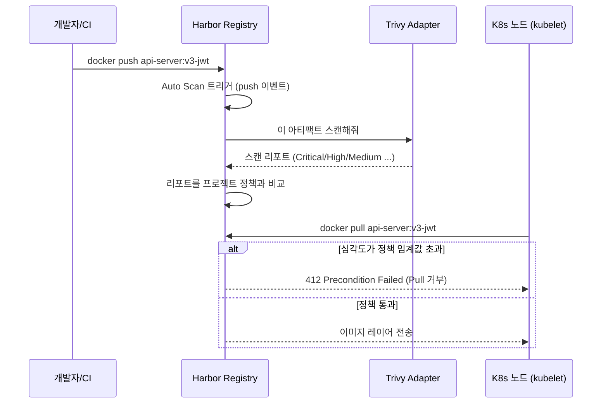
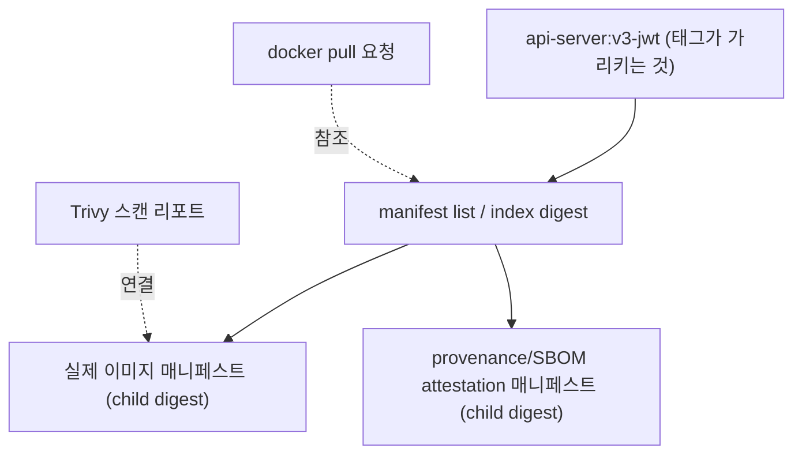

컨테이너 이미지 취약점 관리라고 하면 보통 "CI에서 `trivy image`를 한 번 돌리고 로그에 CVE 목록이 찍히는" 정도로 끝나는 경우가 많다. 그런데 그 로그를 누가 매번 읽고, 심각한 취약점이 있는 이미지를 실제로 배포 안 하는지는 별개 문제다. 그래서 "스캔 결과를 사람이 확인하는 단계" 자체를 없애고, **심각한 취약점이 있는 이미지는 애초에 Pull이 안 되게** Harbor 레지스트리 레벨에서 정책을 걸어보기로 했다. 정책을 걸고 나서 진짜 골치 아팠던 건 따로 있었다 — **정책을 걸었다는 사실과, 그 정책이 실제로 걸리는지는 다른 문제**였다.

## 1. Harbor와 Trivy는 각자 뭘 하는 도구인가

먼저 역할부터 나눠야 헷갈리지 않는다.

| | Harbor | Trivy |
|---|---|---|
| 정체 | 프라이빗 컨테이너 레지스트리 (Docker Hub 대체) | 오픈소스 취약점 스캐너 |
| 하는 일 | 이미지 저장·버전 관리·프로젝트 단위 RBAC·정책 적용 | 이미지 레이어를 열어서 OS 패키지·언어 의존성의 CVE 대조 |
| 혼자 할 수 있는 일 | 이미지를 저장하고 내려준다 (취약점은 모른다) | 이미지 하나를 스캔해서 리포트를 뱉는다 (저장·정책은 모른다) |

Harbor는 "이미지 창고"고 Trivy는 "그 창고에 들어오는 물건을 검수하는 사람"이다. Harbor는 이 검수를 자체적으로 하지 않고, **스캐너 어댑터(Scanner Adapter)**라는 표준 인터페이스를 열어두고 Trivy를 그 안에 꽂아 넣는 구조를 택했다.



## 2. 정책 설정 — 처음엔 엉뚱한 API를 짚었다

Harbor 프로젝트에 "취약점 있으면 Pull 차단" 정책을 걸려고 API 문서를 보고 처음 시도한 게 이거였다.

```bash
curl -X PUT "https://harbor.internal/api/v2.0/projects/dflow/scanner" \
  -u "$HARBOR_ADMIN:$HARBOR_ADMIN_PW" \
  -H "Content-Type: application/json" \
  -d '{"uuid": "..."}'
```

이 엔드포인트는 실패했다. `/projects/{id}/scanner`는 "이 프로젝트가 어떤 스캐너 등록 정보(uuid)를 쓸지 지정하는" 엔드포인트지, 취약점 정책(임계값·차단 여부)을 설정하는 곳이 아니었다. 실제 에러 메시지를 따라가면서 알게 된 건데, 정책은 프로젝트 자체의 **메타데이터**로 관리된다.

```bash
curl -X PUT "https://harbor.internal/api/v2.0/projects/dflow" \
  -u "$HARBOR_ADMIN:$HARBOR_ADMIN_PW" \
  -H "Content-Type: application/json" \
  -d '{
    "metadata": {
      "auto_scan": "true",
      "prevent_vul": "true",
      "severity": "critical"
    }
  }'
```

`auto_scan`으로 push 시 자동 스캔을, `prevent_vul` + `severity`로 "Critical 등급 이상이면 Pull 차단"을 설정한다. 문서만 봐서는 어느 엔드포인트가 맞는지 바로 안 나와서, 스캐너 어댑터 등록(scanner)과 프로젝트 정책(project metadata)이 서로 다른 리소스라는 걸 실패를 통해 확인해야 했다.

## 3. 가장 중요한 발견 — 정책이 걸려 있는데도 Pull이 되는 케이스

정책을 걸어놓고 안심하고 있었는데, 실제로 취약한 이미지를 push해서 확인해보니 **Pull이 그냥 됐다.** 정책이 있는데 왜 안 걸리는지 원인을 추적했다.

원인은 이미지를 빌드하는 방식에 있었다. Docker buildx(BuildKit)는 기본 설정에서 이미지를 빌드할 때 provenance(SLSA 출처 증명)와 SBOM attestation을 자동으로 함께 만든다. 이렇게 만든 이미지는 하나의 매니페스트가 아니라 **manifest list(멀티 아키텍처 인덱스)**로 push된다 — 실제 이미지 매니페스트와 attestation용 매니페스트가 인덱스 하나 아래 자식으로 묶이는 구조다.



Trivy의 스캔 리포트는 실제 이미지가 있는 **자식(child) digest**에 연결되는데, `docker pull`은 태그가 가리키는 **부모 인덱스(index) digest**를 참조해서 요청한다. Harbor의 차단 정책이 인덱스 digest 기준으로 취약점 리포트를 찾다 보니, 정작 취약점이 붙어 있는 건 그 아래 자식 digest라서 매칭이 안 되고 정책이 사실상 무력화되는 버그였다. **정책을 설정했다는 것과, 그 정책이 실제로 걸리는지는 다른 문제**라는 걸 직접 겪은 셈이다.

고친 방법은 애초에 인덱스를 만들지 않는 것이었다.

```bash
docker build --provenance=false --sbom=false \
  -t harbor.internal/dflow/api-server:v3-jwt .
```

`--provenance=false --sbom=false`로 attestation 생성을 끄면 단일 매니페스트로만 push되고, 태그가 가리키는 digest와 Trivy가 스캔한 digest가 정확히 일치하게 된다.

수정 후에는 admin 계정과 일반 계정 양쪽으로 직접 Pull을 시도해서 A/B로 검증했다. 취약점이 있는 이미지는 두 계정 모두에서 동일하게 막혔다.

```bash
docker pull harbor.internal/dflow/api-server:v3-jwt
# Error response from daemon: pull access denied,
# repository does not exist or may require 'docker login':
# denied: current image with at least one severity level Critical
# vulnerability cannot be pulled due to configured policy in
# 'Prevent Vulnerable Images from Running' policy (HTTP 412 Precondition Failed)
```

## 4. Jenkins CI에 실제로 연동 — 스캔 완료를 기다리는 스테이지

push하자마자 바로 배포로 넘어가면 스캔이 끝나기 전에 배포될 수 있다. 그래서 Jenkins 파이프라인에 스캔이 끝날 때까지 기다리는 스테이지를 하나 넣었다.

```groovy
stage('Wait for Trivy Scan') {
    steps {
        script {
            def maxAttempts = 30
            def status = ''
            for (int i = 0; i < maxAttempts; i++) {
                def response = sh(
                    script: """
                        curl -s -u "\$HARBOR_USER:\$HARBOR_PASSWORD" \\
                          "https://harbor.internal/api/v2.0/projects/dflow/repositories/api-server/artifacts/${IMAGE_TAG}?with_scan_overview=true"
                    """,
                    returnStdout: true
                ).trim()
                status = sh(
                    script: "echo '${response}' | jq -r '.scan_overview[\"application/vnd.security.vulnerability.report; version=1.1\"].scan_status'",
                    returnStdout: true
                ).trim()
                if (status == 'Success') {
                    echo "Trivy scan complete: ${status}"
                    break
                }
                sleep(time: 10, unit: 'SECONDS')
            }
            if (status != 'Success') {
                error("Trivy scan did not complete in time")
            }
        }
    }
}
```

Harbor의 Artifact 조회 API(`?with_scan_overview=true`)로 스캔 상태를 폴링하다가 `Success`가 되면 다음 배포 스테이지로 넘어가는 구조다. 최근 JWT 인증 기능을 붙인 `v3-jwt` 이미지를 push했을 때도 이 스테이지를 실제로 태워서, API 응답으로 `status: Success, severity: Medium`을 확인하고 배포를 진행했다.

## 5. 그 외에 붙잡고 있던 문제들

- **containerd가 Harbor 인증서를 안 믿는 문제** — Harbor가 내부 CA로 발급한 인증서를 쓰다 보니, 쿠버네티스 노드의 containerd가 기본적으로 이 CA를 신뢰하지 않아 Pull이 TLS 에러로 실패했다. `/etc/containerd/certs.d/harbor.internal/`에 CA 인증서와 호스트 설정을 넣어서 해결했다.
- **`ingressClassName`이 빈 값으로 생성되는 문제** — Harbor를 Helm으로 재설치할 때마다 Ingress 리소스의 `ingressClassName`이 비어있는 상태로 생성돼서, 재설치할 때마다 수동으로 patch해야 했다(`kubectl patch ingress ... --type merge -p '{"spec":{"ingressClassName":"nginx"}}'`).
- **Helm release 이름 충돌** — 클러스터를 통째로 재구축할 때 `helm install harbor ...`이 `cannot re-use a name that is still in use`로 실패한 적이 있다. 이전 release의 Helm 시크릿(`sh.helm.release.v1.harbor.v1`)이 정리되지 않고 남아있어서 생긴 문제였고, 정리 후 재설치해서 해결했다.

## 6. ISMS-P 통제항목과의 연결

| ISMS-P 통제항목 | 요구사항 요지 | 이번 구축으로 대응한 부분 |
|---|---|---|
| **2.10.8 패치관리** | 소프트웨어·서비스의 보안취약점에 대해 패치 적용 정책을 수립하고 운영 | 취약점이 패치되지 않은 이미지는 배포 경로(Pull)에서 차단 |
| **2.11.2 취약점 점검** | 정기적으로 취약점 점검을 수행하고 발견된 취약점을 신속히 조치 | push 시점 자동 스캔 + CI 파이프라인에서 스캔 완료 확인 후 배포 |

## 7. 한계와 교훈

- 이번에 발견한 manifest list 우회 문제처럼, **정책은 설정만으로 끝나는 게 아니라 실제로 걸리는지 직접 취약한 이미지로 테스트해봐야 확인된다.** 설정 화면에 체크박스가 켜져 있다고 안심하면 안 된다는 걸 이번에 제대로 배웠다.
- Trivy는 스캔 시점의 CVE 데이터베이스 기준으로 판단한다. 스캔 이후 새로 공개된 CVE는 재스캔 전까지 반영되지 않는다.
- 애플리케이션 코드 자체의 로직 취약점(인증/인가 갭 등)은 이미지 스캐너의 영역이 아니다 — 이건 [ISMS-P로 읽는 JWT 인증/인가](/blog/isms-p-jwt-auth)에서 다룬 것처럼 별도의 코드 레벨 점검이 필요하다.

## 8. 정리

- Harbor는 이미지를 저장하는 레지스트리, Trivy는 그 이미지를 검수하는 스캐너 — 스캐너 어댑터로 연결된다.
- 정책은 `/projects/{id}/scanner`(스캐너 등록)가 아니라 `/projects/{id}`의 metadata(`prevent_vul`, `severity`, `auto_scan`)로 설정한다.
- **가장 중요했던 발견**: Docker buildx의 기본 attestation이 만드는 manifest list 때문에, Trivy 리포트가 붙는 digest와 Pull이 참조하는 digest가 어긋나 차단 정책이 실제로는 우회됐다 — `--provenance=false --sbom=false`로 단일 매니페스트를 만들어 해결했고, admin/일반 계정 양쪽으로 412 차단을 직접 검증했다.
- Jenkins 파이프라인에 스캔 완료를 폴링하는 스테이지를 넣어, push 직후 스캔이 끝나기 전에 배포되는 걸 방지했다.
