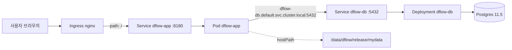

IaC를 설명할 때 흔히 Terraform이나 CloudFormation을 예로 들지만, 사실 **Kubernetes YAML 자체가 IaC의 가장 정석적인 사례**다. 그냥 "설정 파일"이 아니라, 클러스터에 지속적으로 그 상태를 유지시키는 컨트롤러가 붙어 있기 때문이다. 이번 글은 그 개념을 내가 만든 `aip` 프로젝트의 `dflow`(자체 호스팅 데이터 라벨링 툴) 배포 매니페스트로 확인하고, 실제로 어디까지 그 원칙을 지키고 있는지 점검해본 기록이다.

## 1. 왜 Kubernetes YAML이 IaC의 정석인가

Docker Compose나 셸 스크립트로 인프라를 다루는 것과 Kubernetes YAML의 결정적인 차이는 **"한 번 실행하면 끝"이 아니라는 점**이다.

- `docker-compose up`은 명령을 실행하는 순간에만 그 상태를 만든다. 컨테이너가 죽으면(재시작 정책이 없다면) 그냥 죽은 채로 남는다.
- Kubernetes에 `kubectl apply -f deployment.yaml`을 하면, 그 YAML은 "지금 이렇게 만들어라"가 아니라 **"클러스터가 항상 이 상태를 유지해야 한다"는 선언**이 된다. 컨트롤러(예: Deployment Controller)가 몇 초 간격으로 "지금 실제 상태 vs YAML이 선언한 목표 상태"를 비교하고, 차이가 있으면 스스로 맞춘다 (이걸 **재조정 루프, reconciliation loop**라고 부른다). Pod가 죽으면 컨트롤러가 알아서 새로 띄운다.

즉 Kubernetes YAML은 "선언적 정의"라는 IaC의 핵심 원칙을 언어 차원에서 강제한다. 이 관점을 들고 실제 매니페스트를 보자.

## 2. 배경 — 이 클러스터는 무엇을 하는가

`aip` 저장소는 Rocky Linux 8.8 위에 `kubeadm`으로 구성한 온프레미스(airgap) K8s 클러스터다. 클라우드가 아니라 **자체 서버실의 물리 노드 위에 직접 구축한 GPU 쿠버네티스 클러스터**이고, GPU 노드에는 `nvidia-device-plugin`이 설치돼 있다. 그 위에 `dflow`(라벨링 UI, Label Studio 기반), `god_detector`/`mmdetector`(객체 탐지 모델), `redis`(작업 큐) 같은 서비스들이 각각 파드로 올라간다.

이번 글에서는 그중 사용자가 직접 웹에서 접근하는 `dflow` 하나에 집중한다. `dflow` 배포는 크게 세 매니페스트로 나뉜다 — 앱(Pod+Service)을 정의한 파일, DB(ConfigMap+Deployment+Service)를 정의한 파일, 그리고 nginx ingress controller 전체 설치본. 여기에 `kube_run.sh`라는 `kubectl create`를 호출하는 얇은 래퍼 스크립트가 붙어 있다.

## 3. 실제 매니페스트

### 3-1. 애플리케이션

`dflow-app`은 raw `Pod`로 정의돼 있다. 이미지는 `dflow:1.0`이고, 눈여겨볼 부분은 `POSTGRE_HOST` 환경변수에 IP 대신 `dflow-db.default.svc.cluster.local`이라는 **클러스터 DNS 이름**이 들어가 있다는 점이다. 데이터·모델 볼륨은 `hostPath`로 특정 노드의 로컬 디스크 경로에 직접 연결돼 있고, `Service`는 `NodePort 30000`으로 외부에 열려 있다.

`POSTGRE_HOST`가 IP가 아닌 `<서비스이름>.<네임스페이스>.svc.cluster.local` 형태의 DNS 이름이라는 게 K8s 서비스 디스커버리를 그대로 보여준다. `dflow-db`가 어느 노드로 재스케줄되든, IP가 바뀌든 이 이름은 그대로 유효하다. 인프라의 위치가 바뀌어도 선언된 이름(계약)은 안 바뀐다는 게 IaC가 주는 이점이다.

### 3-2. 데이터베이스

DB 쪽은 `ConfigMap`(`dflow-db`)에 `POSTGRE_PASSWORD: ''` 등 접속정보를 담아두고, `Deployment`(역시 이름은 `dflow-db`, `replicas: 1`)가 `envFrom`으로 그 `ConfigMap`을 통째로 주입받아 `postgres:11.5` 컨테이너를 띄운다. 데이터는 마찬가지로 `hostPath`에 연결되고, `Service`는 5432 포트를 `NodePort 32000`으로 노출한다.

`replicas: 1`이지만, 이 파드가 죽으면 **Deployment Controller가 알아서 새 파드를 만든다** — 이게 앞서 말한 reconciliation loop가 실제로 작동하는 지점이다. 값을 하나하나 나열하지 않고 `ConfigMap` 하나를 통째로 주입하는 `envFrom` 패턴도, 설정을 코드(리소스)로 분리해 재사용하는 IaC다운 방식이다.

### 3-3. 라우팅

`dflow.pod.linux.yaml` 맨 위에는 `Ingress` 리소스도 함께 선언돼 있다. `nginx.ingress.kubernetes.io/proxy-body-size: "2000m"`이라는 annotation으로 업로드 용량 제한을 2GB로 늘려뒀고, `/` 경로로 들어오는 요청을 전부 `dflow-app` 서비스의 8180 포트로 라우팅한다.

`proxy-body-size: "2000m"`처럼 "라벨링 대상 이미지/영상 업로드 용량 제한을 2GB로 늘린다"는 도메인 지식이 annotation 한 줄로 남아있다. 인프라 담당자가 nginx 설정 파일을 서버에 SSH로 들어가 직접 고치는 대신, 이 리소스 정의 한 줄만 보고도 "왜 업로드 제한이 이 값인지" 알 수 있는 것 — 이게 IaC가 "코드"인 이유다.

전체 요청 흐름을 그리면 이렇다.

## 4. 정리

- Kubernetes YAML이 다른 설정 파일과 다른 이유는 컨트롤러의 **reconciliation loop**가 그 선언을 계속 강제하기 때문이다 — 이게 IaC의 "선언적 정의" 원칙을 가장 순수하게 구현한 형태다.
- `dflow-db`처럼 IP 대신 클러스터 DNS 이름으로 서비스를 참조하면, 인프라의 위치(IP)가 바뀌어도 선언된 이름(계약)은 그대로 유지된다.
- `Ingress`의 annotation 한 줄(`proxy-body-size: "2000m"`)에 "왜 업로드 제한이 이 값인지"라는 도메인 지식이 그대로 남는다는 것도, IaC가 단순 설정 파일이 아니라 "코드"로 취급되는 이유를 보여준다.
