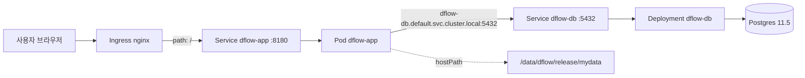

IaC를 설명할 때 흔히 Terraform이나 CloudFormation을 예로 들지만, 사실 **Kubernetes YAML 자체가 IaC의 가장 정석적인 사례**다. 그냥 "설정 파일"이 아니라, 클러스터에 지속적으로 그 상태를 유지시키는 컨트롤러가 붙어 있기 때문이다. 이번 글은 그 개념을 내가 만든 `aip` 프로젝트의 `dflow`(자체 호스팅 데이터 라벨링 툴) 배포 매니페스트로 확인하고, 실제로 어디까지 그 원칙을 지키고 있는지 감사해본 기록이다.

## 1. 왜 Kubernetes YAML이 IaC의 정석인가

Docker Compose나 셸 스크립트로 인프라를 다루는 것과 Kubernetes YAML의 결정적인 차이는 **"한 번 실행하면 끝"이 아니라는 점**이다.

- `docker-compose up`은 명령을 실행하는 순간에만 그 상태를 만든다. 컨테이너가 죽으면(재시작 정책이 없다면) 그냥 죽은 채로 남는다.
- Kubernetes에 `kubectl apply -f deployment.yaml`을 하면, 그 YAML은 "지금 이렇게 만들어라"가 아니라 **"클러스터가 항상 이 상태를 유지해야 한다"는 선언**이 된다. 컨트롤러(예: Deployment Controller)가 몇 초 간격으로 "지금 실제 상태 vs YAML이 선언한 목표 상태"를 비교하고, 차이가 있으면 스스로 맞춘다 (이걸 **재조정 루프, reconciliation loop**라고 부른다). Pod가 죽으면 컨트롤러가 알아서 새로 띄운다.

즉 Kubernetes YAML은 "선언적 정의"라는 IaC의 핵심 원칙을 언어 차원에서 강제한다. 이 관점을 들고 실제 매니페스트를 보자.

## 2. 배경 — 이 클러스터는 무엇을 하는가

`aip` 저장소는 Rocky Linux 8.8 위에 `kubeadm`으로 구성한 온프레미스(airgap) K8s 클러스터다. 클라우드가 아니라 **자체 서버실의 물리 노드 위에 직접 구축한 GPU 쿠버네티스 클러스터**이고, GPU 노드에는 `nvidia-device-plugin`이 설치돼 있다. 그 위에 `dflow`(라벨링 UI, Label Studio 기반), `god_detector`/`mmdetector`(객체 탐지 모델), `redis`(작업 큐) 같은 서비스들이 각각 파드로 올라간다.

이번 글에서는 그중 사용자가 직접 웹에서 접근하는 `dflow` 하나에 집중한다. `dflow` 배포는 크게 세 매니페스트로 나뉜다 — 앱(Pod+Service)을 정의한 파일, DB(ConfigMap+Deployment+Service)를 정의한 파일, 그리고 nginx ingress controller 전체 설치본. 여기에 `kube_run.sh`라는 `kubectl create`를 호출하는 얇은 래퍼 스크립트가 붙어 있다.

## 3. 실제 매니페스트

### 3-1. 애플리케이션

`dflow-app`은 raw `Pod`로 정의돼 있다. 이미지는 `dflow:1.0`이고, 눈여겨볼 부분은 `POSTGRE_HOST` 환경변수에 IP 대신 `dflow-db.default.svc.cluster.local`이라는 **클러스터 DNS 이름**이 들어가 있다는 점이다. 데이터·모델 볼륨은 `hostPath`로 특정 노드의 로컬 디스크 경로에 직접 연결돼 있고, `Service`는 `NodePort 30000`으로 외부에 열려 있다.

`POSTGRE_HOST`가 IP가 아닌 `<서비스이름>.<네임스페이스>.svc.cluster.local` 형태의 DNS 이름이라는 게 K8s 서비스 디스커버리를 그대로 보여준다. `dflow-db`가 어느 노드로 재스케줄되든, IP가 바뀌든 이 이름은 그대로 유효하다. 인프라의 위치가 바뀌어도 선언된 이름(계약)은 안 바뀐다는 게 IaC가 주는 이점이다.

### 3-2. 데이터베이스

DB 쪽은 `ConfigMap`(`dflow-db`)에 `POSTGRE_PASSWORD: ''` 등 접속정보를 담아두고, `Deployment`(역시 이름은 `dflow-db`, `replicas: 1`)가 `envFrom`으로 그 `ConfigMap`을 통째로 주입받아 `postgres:11.5` 컨테이너를 띄운다. 데이터는 마찬가지로 `hostPath`에 연결되고, `Service`는 5432 포트를 `NodePort 32000`으로 노출한다.

`replicas: 1`이지만, 이 파드가 죽으면 **Deployment Controller가 알아서 새 파드를 만든다** — 이게 앞서 말한 reconciliation loop가 실제로 작동하는 지점이다. 값을 하나하나 나열하지 않고 `ConfigMap` 하나를 통째로 주입하는 `envFrom` 패턴도, 설정을 코드(리소스)로 분리해 재사용하는 IaC다운 방식이다.

### 3-3. 라우팅

`dflow.pod.linux.yaml` 맨 위에는 `Ingress` 리소스도 함께 선언돼 있다. `nginx.ingress.kubernetes.io/proxy-body-size: "2000m"`이라는 annotation으로 업로드 용량 제한을 2GB로 늘려뒀고, `/` 경로로 들어오는 요청을 전부 `dflow-app` 서비스의 8180 포트로 라우팅한다.

`proxy-body-size: "2000m"`처럼 "라벨링 대상 이미지/영상 업로드 용량 제한을 2GB로 늘린다"는 도메인 지식이 annotation 한 줄로 남아있다. 인프라 담당자가 nginx 설정 파일을 서버에 SSH로 들어가 직접 고치는 대신, 이 리소스 정의 한 줄만 보고도 "왜 업로드 제한이 이 값인지" 알 수 있는 것 — 이게 IaC가 "코드"인 이유다.

전체 요청 흐름을 그리면 이렇다.



## 4. 감사 — 선언적 원칙 vs 실제 매니페스트

여기서부터 진짜 스터디의 목적이다. 위 매니페스트들이 실제로 IaC 원칙을 얼마나 지키는지 하나씩 대조했다.

| IaC/K8s 원칙 | 이 매니페스트의 현황 | 평가 |
|---|---|---|
| 선언적 리소스로 서비스 구성 | Pod/Deployment/Service/Ingress/ConfigMap 전부 YAML로 정의, 버전관리됨 | 충족 |
| 서비스 디스커버리 (IP 하드코딩 금지) | `POSTGRE_HOST`가 IP가 아닌 클러스터 DNS 이름(`dflow-db.default.svc.cluster.local`) 사용 | 충족 |
| 재시작/자가치유 (self-healing) | `dflow-db`는 `Deployment`라 파드가 죽어도 컨트롤러가 재생성. 그런데 **`dflow-app`은 raw `Pod`로 정의**되어 있어 파드가 죽으면 아무도 재생성하지 않음 | 부분충족 (일관성 없음) |
| 민감정보는 `Secret`으로 분리 | `POSTGRE_PASSWORD: ''`가 `ConfigMap`(암호화되지 않고 누구나 `kubectl get configmap -o yaml`로 조회 가능)에 **평문 빈 값**으로 박혀 있음. `Secret` 리소스 미사용 | 미충족 |
| 적용 방식의 멱등성 | `kube_run.sh`가 `kubectl create -f`를 사용. `create`는 리소스가 이미 존재하면 에러를 내는 **비멱등** 명령이라, 재적용하려면 먼저 지워야 함 | 미충족 (apply 미사용) |
| 스토리지의 이식성 | DB/모델 데이터가 `hostPath`(특정 노드의 로컬 디스크 경로)에 직접 연결됨. `nodeSelector`나 `affinity` 없이 이 파드가 **다른 노드로 재스케줄되면 그 경로엔 데이터가 없음** | 미충족 |
| 불필요한 외부 노출 최소화 | DB 서비스(`dflow-db`)가 `ClusterIP`가 아니라 `NodePort(32000)`로 열려 있어, 클러스터 내부용 DB가 노드 네트워크 전체에 노출됨 | 미충족 |
| 인프라(클러스터 자체) 프로비저닝의 코드화 | `kube_install.sh`에 `kubeadm init`, GPU 드라이버 설치 등은 스크립트화되어 있으나, 스크립트 안에 **`# MANUAL:`이라고 명시된 수동 단계**(호스트네임 설정, IP를 직접 파일에 적어 넣기, kube-scheduler.yaml을 vim으로 직접 편집)가 다수 존재 | 부분충족 |
| 단일 진실 공급원 | `ingress-nginx`를 GitHub raw URL(`kubectl apply -f https://.../deploy.yaml`)로 설치하면서, 저장소 안에도 `ingress-controller.yaml`이라는 거의 동일한 사본이 별도로 존재 | 미충족 (drift 위험) |

가장 흥미로운 지점은 `kube_install.sh`다. 이 스크립트는 스스로 "여기부터는 수동"이라고 주석에 고백하고 있다.

```
# MANUAL: setup mount in /etc/fstab
# MANUAL: setup host name
# MANUAL: docker daemon.json application
```

이건 IaC를 도입할 때 실제로 가장 흔하게 벌어지는 상황을 정확히 보여준다 — **애플리케이션 계층(dflow 파드, DB, Ingress)은 완전히 선언적 YAML로 넘어갔지만, 그 YAML을 실행할 클러스터 자체를 만드는 부트스트랩 단계는 여전히 "사람이 콘솔에 접속해서 vim으로 파일을 고치는" 방식에 머물러 있다.** 스크립트가 "여기는 자동화 못 했다"고 스스로 주석을 남겨둔 게 오히려 정직하고, 다음에 무엇을 코드화해야 할지 명확한 TODO 리스트 역할을 하고 있다.

## 5. 개선 방향 (스터디용 설계 메모)

아래는 실제 적용이 아니라 위 갭을 메우는 방향에 대한 메모다.

- **비밀번호를 `Secret`으로 분리** — `ConfigMap`에 섞여 있던 `POSTGRE_PASSWORD`를 `type: Opaque`인 `Secret` 리소스로 따로 빼고, `Deployment`의 `envFrom`에 `configMapRef`(설정)와 `secretRef`(비밀값)를 나란히 선언하면 된다.
- **`kubectl create` 대신 `kubectl apply`로 통일** — `kube_run.sh` 안의 `create -f`를 전부 `apply -f`로 바꾸면, 재배포 시 "이미 존재합니다" 에러 없이 YAML의 변경분만 클러스터에 반영된다. 진짜 "선언한 상태로 수렴시킨다"는 IaC의 의미에 맞다.
- **`dflow-app`도 `Pod` 대신 `Deployment`로 승격** — 지금처럼 raw `Pod`로 두면 파드가 죽었을 때 아무도 되살리지 않는다. `dflow-db`와 동일하게 `replicas: 1`짜리 `Deployment`로 감싸면 self-healing이 앱 쪽에도 똑같이 적용된다.
- **`hostPath` 대신 `nodeSelector` 명시 (근본 해결은 PVC + StorageClass)** — 당장은 `nodeSelector`로 파드가 데이터가 있는 노드(`ai-master`)에 고정되도록 최소한의 안전장치라도 걸고, 장기적으로는 NFS나 Ceph 기반 `StorageClass` + `PersistentVolumeClaim`으로 바꿔서 파드가 어느 노드에 스케줄되든 동일한 데이터에 접근하게 만드는 게 정석이다.

## 6. 정리

- Kubernetes YAML이 다른 설정 파일과 다른 이유는 컨트롤러의 **reconciliation loop**가 그 선언을 계속 강제하기 때문이다 — 이게 IaC의 "선언적 정의" 원칙을 가장 순수하게 구현한 형태다.
- `dflow`의 매니페스트는 서비스 디스커버리(DNS), 설정 분리(ConfigMap), 자가치유(Deployment) 같은 원칙을 상당 부분 지키고 있지만, **`Secret` 미사용(평문 빈 비밀번호), `kubectl create`의 비멱등성, `hostPath`의 노드 종속성, DB의 과도한 `NodePort` 노출**처럼 실무에서 자주 나오는 안티패턴도 그대로 갖고 있다.
- 가장 근본적인 인사이트는 `kube_install.sh`에서 나왔다 — **애플리케이션 계층은 IaC로 넘어갔어도, 그 애플리케이션이 올라갈 클러스터 자체의 부트스트랩은 여전히 사람 손(MANUAL 주석)을 탄다.** IaC 도입은 한 번에 끝나는 게 아니라, "지금 어느 계층까지 코드화됐는가"를 계속 넓혀가는 과정이라는 걸 내 프로젝트로 확인했다.
