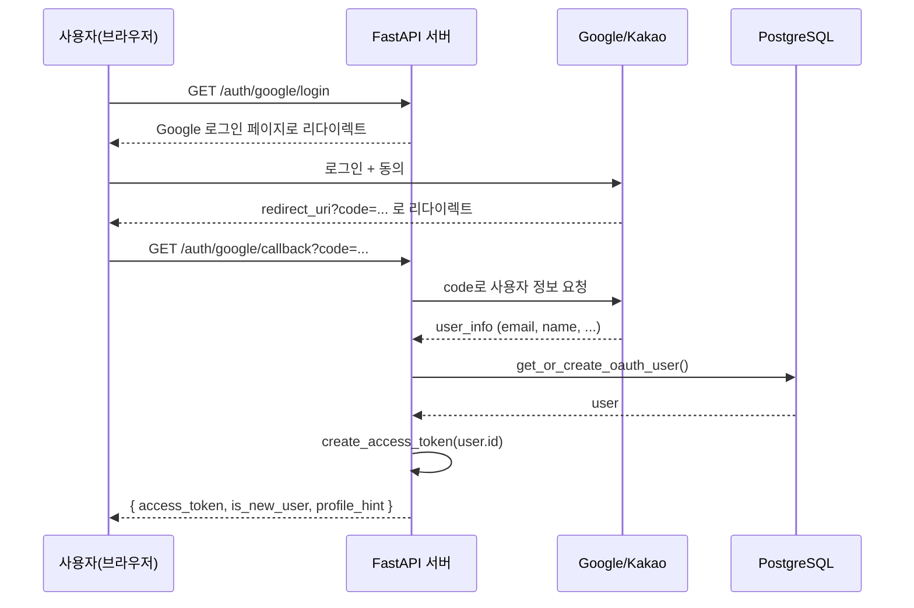

ISMS-P를 공부하다 보면 "인증", "인가", "암호화" 같은 통제항목이 계속 등장하는데, 개념만 외우면 금방 휘발된다. 그래서 이번 스터디는 순서를 뒤집어서 진행했다 — 먼저 ISMS-P가 인증/인가에 무엇을 요구하는지 정리하고, 그 잣대를 실제로 내가 만든 로그인/JWT 코드에 그대로 들이대 봤다. 결과부터 말하면, 동작은 하지만 ISMS-P 인증 심사 기준으로는 곳곳에서 감점 요소가 나온다. 그 갭을 확인하는 과정 자체가 JWT와 Access/Refresh Token을 이해하는 데 훨씬 도움이 됐다.

## 1. ISMS-P가 인증/인가를 보는 방식

ISMS-P(정보보호 및 개인정보보호 관리체계 인증)는 크게 세 영역으로 나뉜다.

| 영역 | 내용 |
|---|---|
| 1. 관리체계 수립 및 운영 | 정책, 조직, 위험관리 등 프로세스 관점 |
| 2. 보호대책 요구사항 | 실제 시스템에 적용되는 기술적/관리적 보호대책 (인증·접근통제·암호화 등) |
| 3. 개인정보 처리단계별 요구사항 | 수집부터 파기까지 개인정보 라이프사이클 |

이 중 로그인/토큰 구현과 직접 맞닿는 것은 **2. 보호대책 요구사항**이고, 그 안에서도 아래 세 항목이 이번 코드 리뷰의 잣대가 됐다.

- **2.5 인증 및 권한관리** — 사용자 식별·인증, 비밀번호 관리, 권한 부여/회수
- **2.6 접근통제** — 응용프로그램 접근 통제, 세션 관리, 타임아웃
- **2.7 암호화 적용** — 비밀번호·인증정보·개인정보의 저장/전송 시 암호화

즉 ISMS-P는 "로그인 기능이 있다/없다"를 보는 게 아니라 **"인증정보가 어떻게 저장되고, 세션(토큰)이 어떻게 만료·회수되는지"**를 구체적으로 요구한다. 이 기준으로 실제 코드를 보자.

## 2. 먼저 개념 정리 — 인증 vs 인가, 그리고 JWT

### 인증(Authentication) vs 인가(Authorization)

두 단어가 항상 같이 다니지만 역할이 다르다.

| 구분 | 질문 | 예시 |
|---|---|---|
| 인증 (Authentication) | "너 누구야?" | 로그인, 비밀번호 확인, OAuth 로그인 |
| 인가 (Authorization) | "너 이거 할 수 있어?" | 관리자만 삭제 가능, 본인 데이터만 조회 가능 |

인증은 신원 확인, 인가는 권한 확인이다. 로그인에 성공했다고 해서 모든 행동이 허용되는 건 아니다 — 이 차이를 놓치면 "로그인만 하면 뭐든 되는" 구조가 되기 쉬운데, 뒤에서 보겠지만 이번 프로젝트가 정확히 그 상태다.

### JWT(JSON Web Token) 구조

JWT는 `Header.Payload.Signature` 세 부분을 `.`으로 이어 붙인 문자열이다.

```
eyJhbGciOiJIUzI1NiJ9.eyJzdWIiOiJhYmMxMjMiLCJleHAiOjE3ODk5OTk5OTl9.4f8a...

└──── Header ────┘ └──────────── Payload ────────────┘ └ Signature ┘
```

- **Header**: 알고리즘 정보 (`{"alg": "HS256", "typ": "JWT"}`)
- **Payload**: 클레임(claims) — `sub`(subject, 보통 user id), `exp`(만료시간) 등. **암호화가 아니라 Base64 인코딩**이라 누구나 디코딩해서 내용을 볼 수 있다. 그래서 비밀번호 같은 민감정보를 payload에 절대 넣으면 안 된다.
- **Signature**: 서버만 아는 비밀키(secret key)로 Header+Payload를 서명한 값. 이 서명 덕분에 토큰이 변조되지 않았음을 검증할 수 있다.

핵심은 **JWT는 서버가 세션을 기억하지 않는(Stateless) 방식**이라는 점이다. 서버는 DB에 "누가 로그인 중"이라는 상태를 저장하지 않고, 매 요청마다 클라이언트가 들고 온 토큰의 서명만 검증한다. 확장성은 좋지만, 대신 **"이미 발급한 토큰을 취소"하는 게 구조적으로 어렵다** — 이 특성이 뒤에서 로그아웃 문제와 직결된다.

### Access Token vs Refresh Token

| 구분 | Access Token | Refresh Token |
|---|---|---|
| 용도 | 매 API 요청마다 신원 증명 | Access Token이 만료됐을 때 재발급용 |
| 수명 | 짧음 (보통 5분~1시간) | 김 (보통 1~2주) |
| 저장 위치 | 클라이언트 메모리 / 헤더로 전송 | HttpOnly 쿠키 또는 서버 DB/Redis (탈취 대비) |
| 노출됐을 때 피해 | 짧은 시간만 악용 가능 | 장기간 악용 가능 → 더 엄격하게 보관 |

왜 두 개로 나눌까? Access Token 하나만 쓰면 딜레마가 생긴다.

- 수명을 짧게 하면 → 보안은 좋아지지만 사용자가 몇 분마다 로그인을 다시 해야 함
- 수명을 길게 하면 → 사용자는 편하지만 토큰이 탈취됐을 때 오래 악용 가능하고, 로그아웃해도 만료 전까지는 그 토큰이 계속 유효함

그래서 **"짧고 자주 쓰는 Access Token" + "길고 가끔 쓰는 Refresh Token"** 조합으로 절충한다. Access Token이 만료되면 클라이언트는 Refresh Token으로 `/auth/refresh` 같은 엔드포인트를 호출해 새 Access Token을 받는다. Refresh Token은 서버(DB/Redis)에 저장해 두기 때문에, 로그아웃하거나 탈취가 의심되면 서버가 그 Refresh Token을 지워서 **강제로 세션을 끊을 수 있다** — Access Token만으로는 불가능한 "회수" 기능을 Refresh Token이 보완해주는 것이다.

이 개념을 들고 실제 코드로 넘어가 보자.

## 3. 실제 코드: 이 프로젝트는 JWT를 어떻게 발급하고 검증하는가

프로젝트의 인증 관련 코드는 `app/auth/` 아래 모여 있다.

```
app/auth/
├── jwt.py            # JWT 발급/검증
├── router.py         # 로그인, OAuth, /me, 로그아웃
├── service.py         # OAuth 인증 서비스
├── dependencies.py    # get_current_user 의존성
├── schemas.py          # 요청/응답 스키마
└── providers/
    ├── google.py
    └── kakao.py
```

### 3-1. 토큰 발급/검증 — `app/auth/jwt.py`

```python
from datetime import datetime, timedelta, timezone

from fastapi import HTTPException, status
from jose import JWTError, jwt

from app.core.config import settings

ALGORITHM = "HS256"


def create_access_token(user_id: str, extra_claims: dict | None = None) -> str:
    expire = datetime.now(timezone.utc) + timedelta(minutes=settings.ACCESS_TOKEN_EXPIRE_MINUTES)
    payload = {"sub": user_id, "exp": expire}
    if extra_claims:
        payload.update(extra_claims)
    return jwt.encode(payload, settings.JWT_SECRET_KEY, algorithm=ALGORITHM)


def decode_access_token(token: str) -> str:
    """sub 값만 반환 (get_current_user 의존성용)"""
    try:
        payload = jwt.decode(token, settings.JWT_SECRET_KEY, algorithms=[ALGORITHM])
        user_id: str = payload.get("sub")
        if not user_id:
            raise HTTPException(status_code=status.HTTP_401_UNAUTHORIZED, detail="Invalid token")
        return user_id
    except JWTError:
        raise HTTPException(status_code=status.HTTP_401_UNAUTHORIZED, detail="Invalid token")
```

`python-jose`로 HS256(대칭키 서명) 방식을 쓴다. `sub` 클레임에는 유저 UUID(OAuth 로그인의 경우) 또는 이메일(mock 로그인의 경우)이 들어가고, `exp`로 만료시간을 못박는다 — 앞서 설명한 JWT의 표준 구조 그대로다.

만료시간은 `app/core/config.py`에서 설정값으로 관리된다.

```python
class Settings(BaseSettings):
    JWT_SECRET_KEY: str
    ACCESS_TOKEN_EXPIRE_MINUTES: int = 1440   # 24시간
```

**`ACCESS_TOKEN_EXPIRE_MINUTES = 1440`, 즉 24시간.** 앞서 정리한 이론상 Access Token은 "짧게" 가져가는 게 정석인데, 이 프로젝트는 하루 종일 유효하다. 이유를 코드에서 찾아보면 답이 나온다 — **Refresh Token 발급/재발급 로직이 프로젝트 어디에도 없다.** `TokenResponse` 스키마도 `access_token` 필드 하나뿐이다.

```python
# app/auth/schemas.py
class TokenResponse(BaseModel):
    access_token: str
    token_type: str = "bearer"
    is_new_user: bool = False
    profile_hint: Optional[ProfileHint] = None
```

Refresh Token이 없으니 사용자가 자주 재로그인하지 않도록 Access Token 수명을 24시간으로 늘려서 임시로 상쇄한 것이다. 편의와 보안을 맞바꾼 셈인데, 이 트레이드오프를 ISMS-P가 어떻게 보는지는 4장에서 다룬다.

### 3-2. 로그인 엔드포인트 — `app/auth/router.py`

이 프로젝트는 로그인 경로가 두 갈래다. 하나는 개발용 mock 로그인, 하나는 실제로 쓰는 OAuth 로그인이다.

**mock 로그인 (개발/테스트용)**

```python
_MOCK_USERS: dict[str, dict] = {
    "test@mfds.com": {"password": "test1234", "name": "김건강"},
    "user@example.com": {"password": "password", "name": "홍길동"},
}


@router.post("/login", tags=["auth"])
async def mock_login(body: LoginIn):
    mock = _MOCK_USERS.get(body.email)
    if not mock or mock["password"] != body.password:
        raise HTTPException(status_code=401, detail="이메일 또는 비밀번호가 올바르지 않습니다.")

    # DB 저장 없이 이메일을 sub으로 토큰 발급
    token = create_access_token(body.email)
    return {
        "access_token": token,
        "token_type": "bearer",
        "user": {"email": body.email, "name": mock["name"]},
    }
```

**실제 OAuth 로그인 (Google/Kakao)**

```python
@router.get("/google/callback")
async def google_callback(code: str, request: Request, redirect_uri: str | None = None, db: AsyncSession = Depends(get_db)):
    try:
        redirect_uri = redirect_uri or str(request.url_for("google_callback"))
        user_info = await _google.fetch_user_info(code, redirect_uri=redirect_uri)
        return await _service.authenticate(db, user_info)
    except Exception as e:
        logger.error("Google OAuth error: %s", e)
        raise HTTPException(status_code=400, detail="oauth_failed")
```

```python
# app/auth/service.py
class OAuthService:
    async def authenticate(self, db, user_info: OAuthUserInfo) -> TokenResponse:
        user, is_new = await get_or_create_oauth_user(
            db,
            provider=user_info.provider,
            provider_id=user_info.provider_id,
            name=user_info.name,
            email=user_info.email,
            profile_image=user_info.profile_image,
        )
        token = create_access_token(str(user.id))
        hint = ProfileHint(
            name=user_info.name, gender=user_info.gender,
            birth_year=user_info.birth_year, birthday=user_info.birthday,
        ) if is_new else None
        return TokenResponse(access_token=token, is_new_user=is_new, profile_hint=hint)
```

OAuth 플로우는 표준적이다 — Authorization Code를 받아 provider(Google/Kakao)에게서 사용자 정보를 받아오고, 우리 DB에 유저를 조회/생성한 뒤 우리 서버 발급 JWT로 교환한다. 로그인 시퀀스를 그려보면 이렇다.



### 3-3. 인증 의존성 — `app/auth/dependencies.py`

FastAPI는 미들웨어 대신 `Depends`로 인증을 엔드포인트마다 명시적으로 건다.

```python
from fastapi import Depends
from fastapi.security import HTTPAuthorizationCredentials, HTTPBearer

from .jwt import decode_access_token

_bearer = HTTPBearer()


async def get_current_user(credentials: HTTPAuthorizationCredentials = Depends(_bearer)) -> str:
    return decode_access_token(credentials.credentials)
```

`Authorization: Bearer <token>` 헤더를 받아서 서명을 검증하고 `sub`(유저 id)를 돌려준다. 이걸 필요한 라우터마다 붙이는 식이다.

```python
@router.get("/me", response_model=UserResponse)
async def get_me(
    user_id: str = Depends(get_current_user),
    db: AsyncSession = Depends(get_db),
) -> UserResponse:
    ...
```

`journal`, `hospitals`, `recommendations`, `users`, `notifications` 등 유저 데이터를 다루는 라우터 전부가 이 패턴을 그대로 재사용한다. **다만 이 함수가 확인하는 건 "유효한 토큰을 들고 왔는가"뿐이다.** 그 유저가 요청한 리소스의 소유자인지, 어떤 role인지는 별도로 체크하지 않는다 — 즉 이 프로젝트에는 **인증(Authentication) 계층만 있고 인가(Authorization) 계층이 없다.** 지금은 각 리포지토리 함수가 `user_id`로 쿼리를 필터링해서 결과적으로 "내 데이터만 보인다"가 지켜지고 있을 뿐, 명시적인 권한 검사 로직(예: role 기반 접근 제어)은 존재하지 않는다.

## 4. ISMS-P 잣대로 점검하기

이제 위 코드를 ISMS-P 통제항목에 하나씩 대조한다. "구현됨 / 부분구현 / 미구현" 3단계로 표시했다.

| ISMS-P 통제항목 | 요구사항 요지 | 이 프로젝트 현황 | 상태 |
|---|---|---|---|
| **2.5.3** 사용자 인증 | 안전한 인증 방식 적용, 인증 실패 시 시도 제한 등 | 실제 서비스 경로인 OAuth 로그인은 provider에 위임되어 안전 | 구현됨 |
| **2.6.3** 응용프로그램 접근(세션 관리) | 정보 민감도에 맞는 세션 타임아웃 적용 | Access Token 만료 24시간 — Refresh Token 없이 단일 토큰을 이렇게 길게 유지하는 건 세션 타임아웃 정책치고 과함 | 부분구현 |
| **2.6.x** 세션(토큰) 종료 | 로그아웃 시 세션이 실제로 무효화되어야 함 | `POST /auth/logout`이 아무 상태도 변경하지 않는 스텁. 로그아웃해도 기존 토큰은 만료 전까지 계속 유효 | 미구현 |
| **2.7.1** 암호화 적용 | 인증정보(비밀번호, 시크릿 키 등)는 안전하게 관리 | `JWT_SECRET_KEY`는 `.env`로 분리되어 소스에 하드코딩되지 않음 | 구현됨 |
| 인가(권한) 검증 | 사용자가 요청 리소스에 접근할 권한이 있는지 별도 확인 | `get_current_user`는 신원만 확인. role/권한 체크 로직 없음, 데이터 격리는 쿼리 필터링에 암묵적으로만 의존 | 미구현 |

핵심은 이거다 — **ISMS-P 심사는 메인 로그인 플로우보다 로그아웃, 세션 회수처럼 "예외 경로/부가 기능"에서 구멍을 주로 잡아낸다.** 실제 심사에서도 비밀번호 재설정, 관리자 계정처럼 덜 신경 쓰기 쉬운 기능에서 지적이 많이 나온다고 하는데, 내 코드로 직접 확인하니 왜 그런지 체감이 됐다.

## 5. 그래서 어떻게 고칠 것인가 (스터디용 설계 메모)

아래는 실제로 구현한 코드가 아니라, 위 갭을 메우기 위한 방향을 정리한 메모다.

**Refresh Token 도입 — DB에 저장해 회수 가능하게**

```python
def create_refresh_token(user_id: str) -> str:
    expire = datetime.now(timezone.utc) + timedelta(days=14)
    payload = {"sub": user_id, "exp": expire, "type": "refresh"}
    return jwt.encode(payload, settings.JWT_REFRESH_SECRET_KEY, algorithm=ALGORITHM)

# 로그인 시: refresh_token을 DB(users 테이블 또는 별도 sessions 테이블)에 저장
# /auth/refresh: DB에 저장된 값과 대조 후에만 새 access_token 발급
# /auth/logout: DB에서 refresh_token 레코드를 삭제 → 이후 재발급 불가
```

Access Token 수명은 짧게(예: 30분)로 줄이고, Refresh Token을 서버 DB나 이미 프로젝트에 연결돼 있는 Redis(`REDIS_URL` 설정은 있지만 현재 auth와 무관하게 방치돼 있었다)에 저장해두면, 로그아웃 시 그 레코드를 지우는 것만으로 세션을 실질적으로 끊을 수 있다 — JWT의 "발급된 토큰은 취소 못 한다"는 구조적 한계를 Refresh Token 계층에서 보완하는 정석적인 방법이다.

**인가 계층 추가 — 최소한의 리소스 소유권 검증**

```python
async def get_current_user_owned_journal(
    journal_id: uuid.UUID,
    user_id: str = Depends(get_current_user),
    db: AsyncSession = Depends(get_db),
):
    journal = await get_journal_by_id(db, journal_id)
    if journal.user_id != uuid.UUID(user_id):
        raise HTTPException(status_code=403, detail="접근 권한이 없습니다.")
    return journal
```

지금처럼 리포지토리 쿼리의 `WHERE user_id = ...` 조건에만 기대는 대신, 인가 체크를 의존성 레벨에서 명시적으로 드러내면 "이 엔드포인트가 무엇을 보호하는지"가 코드만 보고도 드러난다.

## 6. 정리

- **인증(누구인지)**과 **인가(뭘 할 수 있는지)**는 다른 개념이고, 이 프로젝트는 전자만 있다.
- **JWT는 Base64로 인코딩될 뿐 암호화되지 않으며, 발급 후에는 서버가 임의로 취소할 수 없는 Stateless 토큰**이다 — 이 한계 때문에 Access/Refresh Token을 분리해서 쓴다.
- **Access Token은 짧게, Refresh Token은 서버에 저장해서 길게** — 이 프로젝트는 Refresh Token이 없어서 그 절충을 "Access Token을 24시간으로 늘리는" 방식으로 우회하고 있는데, 이는 편의는 얻지만 회수 불가능한 세션을 하루 동안 열어두는 트레이드오프다.
- ISMS-P의 인증/접근통제/암호화 통제항목을 실제 코드에 대입해보면, **메인 로그인 플로우(OAuth)는 준수 수준이 괜찮지만, 로그아웃 시 세션 무효화, 인가 검증처럼 "부가적으로 보이는" 부분에서 갭이 크게 드러난다** — 이론으로 읽을 때보다 훨씬 명확하게 와닿았다.
