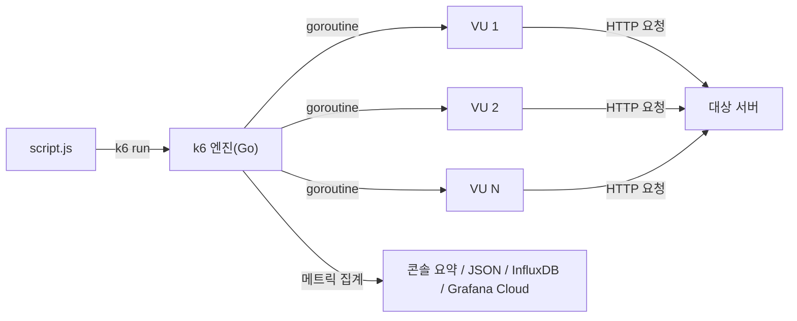

부하테스트는 "얼마나 빠른가"보다 "얼마나 견디는가"를 재는 작업이다. 평소 트래픽에서는 멀쩡하던 API가 동시 요청이 몇 배로 늘었을 때 응답 시간이 튀는지, 에러율이 올라가는지, 어느 지점에서 무너지는지를 미리 확인하는 게 목적이다. k6는 이 작업을 스크립트 하나로 반복 가능하게 만들어주는 오픈소스 부하테스트 도구다.

## 부하테스트 도구는 많은데 왜 k6인가

JMeter는 오래됐고 기능도 많지만 GUI 기반 XML 설정이 무겁고, JVM 위에서 스레드 하나당 가상 사용자 하나를 띄우는 구조라 동시 사용자 수를 늘릴수록 부하테스트 도구 자체가 리소스를 많이 먹는다. Locust는 Python으로 스크립트를 짜는 대신 gevent 기반 이벤트 루프를 쓰지만, Python GIL 특성상 CPU 바운드 시나리오에서는 워커 프로세스를 여러 개 띄워 분산시켜야 한다.

k6는 Go로 작성됐고 스크립트는 JavaScript(ES2015+, 단 Node.js가 아니라 자체 goja 런타임)로 짠다. 가상 사용자(VU)마다 스레드를 띄우는 대신 Go의 goroutine으로 처리해서, 같은 하드웨어에서 훨씬 많은 동시 연결을 만들어낼 수 있다. 실행도 GUI 없이 CLI 한 줄(`k6 run script.js`)로 끝나기 때문에 CI 파이프라인에 끼워 넣기 쉽다.



## 핵심 개념: VU와 iteration

- **VU(Virtual User)** — 스크립트를 반복 실행하는 가상의 사용자 한 명. VU 수를 늘리는 게 곧 동시 접속자 수를 늘리는 것과 같다.
- **iteration** — VU 하나가 스크립트 본문을 한 번 끝까지 실행하는 것. 기본적으로 iteration이 끝나면 바로 다음 iteration을 시작한다.
- **스크립트 생명주기** — `init` 코드(모듈 최상단, VU마다 한 번씩 실행되며 여기서 HTTP 요청을 보내면 안 된다) → `setup()`(테스트 시작 전 한 번, 전체 VU가 공유할 데이터 준비) → 기본 export 함수(각 VU·iteration마다 반복 실행되는 실제 부하) → `teardown()`(테스트 종료 후 한 번, 정리 작업).

## 시나리오 설계: executor 고르기

k6는 "몇 명이 몇 초 동안"을 여러 방식으로 표현할 수 있게 `executor`를 제공한다. 가장 자주 쓰는 세 가지는 성격이 다르다.

| executor | 통제 대상 | 언제 쓰는가 |
|---|---|---|
| `constant-vus` | VU 수를 고정 | 정해진 동시 사용자 수를 일정 시간 유지하며 안정성 확인 |
| `ramping-vus` | VU 수를 단계적으로 증감 | 트래픽이 서서히 늘었다 줄어드는 상황(피크타임) 재현 |
| `ramping-arrival-rate` | 초당 요청 수(RPS)를 직접 통제 | 응답 시간과 무관하게 "초당 몇 건"이라는 목표를 맞춰야 할 때 |

`ramping-vus`는 VU 수만 정할 뿐 실제 요청 처리 속도는 응답 시간에 따라 달라진다. 반대로 `ramping-arrival-rate`는 요청이 늦게 와도 목표 RPS를 유지하려고 k6가 알아서 VU를 늘린다(`preAllocatedVUs`/`maxVUs`로 상한을 정해줘야 한다). "동시 사용자 수 기준"으로 볼지 "초당 요청 수 기준"으로 볼지에 따라 executor를 다르게 골라야 한다.

## 스크립트 기본 구조

```javascript
import http from "k6/http";
import { check, sleep } from "k6";

export const options = {
  scenarios: {
    peak_traffic: {
      executor: "ramping-vus",
      startVUs: 0,
      stages: [
        { duration: "30s", target: 20 },  // 0 -> 20명, 30초간 서서히 증가
        { duration: "1m", target: 20 },   // 20명 유지
        { duration: "30s", target: 100 }, // 20 -> 100명, 스파이크
        { duration: "1m", target: 100 },  // 100명 유지
        { duration: "30s", target: 0 },   // 정리
      ],
    },
  },
  thresholds: {
    http_req_duration: ["p(95)<500"], // 95%의 요청이 500ms 안에 끝나야 함
    http_req_failed: ["rate<0.01"],   // 에러율 1% 미만
  },
};

export default function () {
  const res = http.get("https://api.example.com/health");

  check(res, {
    "status is 200": (r) => r.status === 200,
    "body has ok": (r) => r.json("status") === "ok",
  });

  sleep(1);
}
```

## checks vs thresholds

이 둘을 헷갈리면 결과 해석이 틀어진다.

- **check**는 응답 하나하나에 대한 "소프트 검증"이다. `status === 200` 같은 조건이 실패해도 테스트 자체는 멈추지 않고, 실패 비율이 요약 리포트에 남을 뿐이다.
- **threshold**는 테스트 전체의 "합격/불합격 기준"이다. `options.thresholds`에 지정한 조건을 어느 하나라도 만족하지 못하면 k6 프로세스가 **0이 아닌 종료 코드**를 반환한다. CI 파이프라인에서 부하테스트 단계를 실패시키는 건 바로 이 threshold다.

즉 check는 "이 요청이 정상이었는가"를 기록하는 로그에 가깝고, threshold는 "이 테스트가 통과인가"를 결정하는 게이트다. CI에 자동화하려면 check만으로는 부족하고 반드시 threshold를 걸어야 한다.

## 결과 읽기: 어떤 지표를 봐야 하는가

테스트가 끝나면 k6가 콘솔에 요약을 출력하는데, 실전에서 눈여겨봐야 할 지표는 이 정도다.

- **`http_req_duration`** — 요청 시작부터 응답 완료까지 걸린 시간. `avg`(평균)보다 **`p(95)`, `p(99)`(상위 5%, 1% 사용자가 겪는 지연)**가 실제 사용자 경험에 더 가깝다. 평균은 낮아도 p99가 튀면 일부 사용자는 계속 느린 응답을 받고 있다는 뜻이다.
- **`http_req_failed`** — 요청 실패율. HTTP 상태 코드 4xx/5xx나 타임아웃이 여기 잡힌다.
- **`http_req_waiting`** — TTFB(Time To First Byte)에 해당. 이 값이 `http_req_duration`에서 큰 비중을 차지하면 네트워크보다 서버 처리 자체가 느리다는 신호다.
- **`vus` / `vus_max`** — 특정 시점에 실제로 활성 상태였던 VU 수. 목표한 VU 수만큼 실제로 부하가 걸렸는지 확인하는 용도.
- **`iteration_duration`** — VU 하나가 스크립트 한 바퀴를 도는 데 걸린 시간. `sleep()`을 포함하므로 순수 응답 시간과는 다르다.
- **`data_sent` / `data_received`** — 네트워크 대역폭 사용량. 응답 바디가 큰 API를 테스트할 때 병목이 서버 CPU가 아니라 대역폭일 수도 있다는 걸 알려준다.

```
     ✓ status is 200
     ✓ body has ok

     http_req_duration..............: avg=142ms min=48ms med=118ms max=1.2s p(95)=310ms p(99)=890ms
     http_req_failed.................: 0.42% ✓ 12      ✗ 2838
     http_reqs.......................: 2850   47.5/s
     vus_max.........................: 100
```

이 예시라면 p95(310ms)는 threshold(500ms)를 통과하지만, p99(890ms)가 크게 튄다는 건 최소 1%의 사용자가 체감상 느린 응답을 받고 있다는 뜻이다. 평균값만 보고 넘어가면 이런 꼬리 지연(tail latency)을 놓치기 쉽다.

## CI에 붙이기

k6는 종료 코드로 성공/실패를 전달하기 때문에 [Jenkins 파이프라인](/blog/jenkins-ci-cd-pipeline)이나 GitHub Actions의 한 스테이지로 그대로 끼워 넣을 수 있다.

```groovy
stage('Load Test') {
    steps {
        sh 'k6 run --out json=results.json load-test.js'
    }
}
```

threshold를 만족하지 못하면 `k6 run`이 non-zero로 종료되고, 그 결과 이 스테이지가 실패하면서 파이프라인 전체가 멈춘다. 배포 직전에 이 스테이지를 넣어두면, 성능이 기준치 아래로 떨어진 변경 사항이 프로덕션에 나가기 전에 걸러진다. `--out json`으로 남긴 결과는 Grafana나 별도 대시보드에 적재해서 배포 전후 성능 추이를 비교하는 데도 쓸 수 있다.

부하테스트 대상이 [HPA](/blog/kubernetes-hpa)로 오토스케일링되는 서비스라면, k6로 트래픽을 서서히 늘리면서 `kubectl get hpa -w`를 같이 관찰하면 "메트릭이 임계치를 넘은 뒤 실제로 Pod가 몇 초 만에 늘어나는지", "새로 뜬 Pod가 트래픽을 받기 시작한 뒤 p95가 다시 안정화되는 데 걸리는 시간"을 함께 확인할 수 있다.

## 정리

- k6는 goroutine 기반이라 적은 리소스로도 높은 동시성을 낼 수 있고, CLI 중심이라 CI에 넣기 쉽다.
- VU는 가상 사용자, iteration은 그 사용자가 스크립트를 한 번 도는 단위다. `constant-vus`/`ramping-vus`/`ramping-arrival-rate` 중 무엇을 통제할지에 따라 executor를 고른다.
- check는 개별 요청의 성공/실패를 기록하는 소프트 검증이고, threshold는 테스트 전체의 합격 기준이자 CI를 실패시키는 게이트다.
- 결과를 읽을 때는 평균이 아니라 `p(95)`/`p(99)` 같은 꼬리 지연을 우선 본다. 평균이 낮아도 일부 사용자가 겪는 지연은 따로 확인해야 한다.
- threshold를 배포 파이프라인의 게이트로 걸어두면, 성능 저하가 있는 변경이 프로덕션에 나가기 전에 자동으로 걸러진다.
