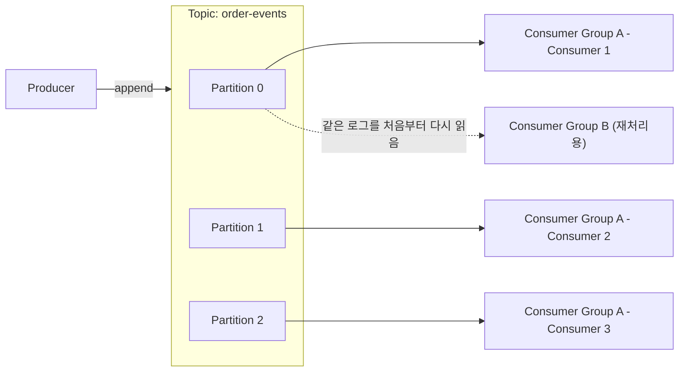

## 셋 다 "메시지를 넘긴다"는 건 같은데

Kafka, RabbitMQ, Redis는 모두 "A가 보낸 걸 B가 받는다"는 메시징에 쓸 수 있다. 그래서 종종 "이 셋 중에 뭘 써야 하냐"는 질문이 하나로 뭉뚱그려지는데, 실제로는 설계 목적이 완전히 다른 세 가지 도구다.

- **RabbitMQ**는 "이 작업을 누군가 한 번은 확실히 처리하게 만든다"에 최적화된 메시지 브로커다. ([RabbitMQ는 메시지를 어떻게 안전하게 넘기나](/blog/rabbitmq-basics) 참고)
- **Kafka**는 "일어난 일을 순서대로 기록하고, 여러 소비자가 각자 원하는 시점부터 다시 읽을 수 있게 한다"는 분산 로그다.
- **Redis**는 원래 인메모리 캐시/데이터 저장소이고, Pub/Sub과 Streams는 그 위에 얹힌 기능이다.

이 차이는 "메시지를 받은 뒤 큐에서 사라지는가, 계속 남아있는가"라는 한 가지 질문으로 요약된다. RabbitMQ는 사라진다. Kafka는 남는다. Redis는 기능에 따라 다르다.

## Kafka: 메시지가 아니라 로그를 다룬다

Kafka는 메시지 브로커라기보다 **분산 커밋 로그**에 가깝다. Producer가 보낸 메시지는 큐에서 소비되고 사라지는 게 아니라, Topic이라는 로그 파일 끝에 순서대로 추가(append-only)된다. Consumer는 이 로그에서 "내가 어디까지 읽었는지"를 나타내는 offset을 스스로 관리하며 읽어나간다 — 메시지를 읽어도 로그에서 지워지지 않는다.



- **Partition** — Topic은 여러 Partition으로 나뉘고, 같은 key를 가진 메시지는 항상 같은 Partition에 순서대로 쌓인다. Partition을 늘리면 그만큼 병렬로 처리할 Consumer를 늘릴 수 있다 — Kafka의 처리량은 여기서 나온다.
- **Consumer Group** — 같은 그룹에 속한 Consumer들은 Partition을 나눠 가져 병렬로 소비한다. 서로 다른 그룹은 완전히 독립적으로, 같은 로그를 각자의 속도로 읽는다. 이게 RabbitMQ와 가장 다른 지점이다: RabbitMQ에서 한 메시지는 하나의 Consumer가 가져가면 끝이지만, Kafka에서는 그룹 A와 그룹 B가 같은 메시지를 동시에, 완전히 독립적으로 소비할 수 있다.
- **Retention** — 메시지는 Consumer가 읽었는지와 무관하게, 설정한 보관 기간(예: 7일) 동안 로그에 그대로 남는다. 그래서 장애가 나서 재처리가 필요하면 offset을 과거로 되돌려 같은 데이터를 다시 읽을 수 있다 — **replay**가 가능하다는 게 Kafka의 핵심 강점이다.

## 코드로 보면: Producer/Consumer

Python `confluent-kafka` 라이브러리로 주문 이벤트를 발행하고 소비하는 예제다.

```python
# producer.py
from confluent_kafka import Producer

producer = Producer({"bootstrap.servers": "localhost:9092"})

def on_delivery(err, msg):
    if err is not None:
        print(f"delivery failed: {err}")

producer.produce(
    topic="order-events",
    key=str(order_id),          # 같은 key는 같은 partition으로 → 순서 보장
    value='{"order_id": 42, "status": "paid"}',
    callback=on_delivery,
)
producer.flush()
```

```python
# consumer.py
from confluent_kafka import Consumer

consumer = Consumer({
    "bootstrap.servers": "localhost:9092",
    "group.id": "billing-service",
    "auto.offset.reset": "earliest",   # 그룹 첫 실행 시 로그 맨 앞부터 읽기
    "enable.auto.commit": False,       # offset은 처리 완료 후 수동 commit
})
consumer.subscribe(["order-events"])

while True:
    msg = consumer.poll(1.0)
    if msg is None or msg.error():
        continue
    process(msg.value())
    consumer.commit(msg)               # 여기서 커밋해야 재시작 시 중복 처리를 줄인다
```

`group.id`가 Consumer Group을 결정한다는 점, `auto.offset.reset`으로 그룹이 처음 붙을 때 로그 어디서부터 읽을지 정한다는 점, offset commit을 수동으로 미뤄서 "처리 완료 후에만 진행했다고 기록한다"는 점이 RabbitMQ의 `basic_ack`와 개념적으로 같은 역할을 한다 — 다만 Kafka는 메시지 단위가 아니라 offset(위치) 단위로 진행 상황을 기록한다는 차이가 있다.

## Redis: Pub/Sub과 Streams는 성격이 다르다

Redis를 메시징에 쓴다고 하면 보통 셋 중 하나를 가리킨다.

- **List(`LPUSH`/`BRPOP`)** — 가장 단순한 작업 큐. [RabbitMQ 글](/blog/rabbitmq-basics)에서 다룬 것처럼, 값을 꺼내는 순간 사라지고 전달 보장이 없다.
- **Pub/Sub(`PUBLISH`/`SUBSCRIBE`)** — 발행 시점에 구독 중인 Consumer에게만 전달된다. Consumer가 그 순간 연결돼 있지 않으면 메시지를 영영 못 받는다 — 저장 자체가 안 된다. 실시간 알림처럼 "받으면 좋고 놓쳐도 큰일 안 나는" 데이터에 적합하다.
- **Streams(`XADD`/`XREADGROUP`)** — Kafka를 의식하고 만든 기능으로, append-only 로그에 메시지를 쌓고 Consumer Group·offset 개념까지 흉내 낸다. 다만 어디까지나 인메모리 구조이고, AOF/RDB로 영속화하더라도 디스크 기반으로 페타바이트급 로그를 오래 쌓아두도록 설계된 Kafka와는 운영 규모가 다르다.

즉 "Redis로 메시징을 한다"는 말은 List냐 Pub/Sub이냐 Streams냐에 따라 전달 보장 수준이 완전히 달라진다 — 이 셋을 뭉뚱그려 "Redis는 전달 보장이 약하다"고만 말하는 건 부정확하다.

## 핵심 차이 한눈에 보기

| | Kafka | RabbitMQ | Redis (List / Streams) |
|---|---|---|---|
| 저장 모델 | 디스크 기반 append-only 로그 | 큐 (소비되면 삭제) | 인메모리 (일부 영속화 가능) |
| 소비 후 메시지 | 남아있음 (retention까지) | 사라짐 | List는 사라짐, Streams는 남음 |
| Replay(재처리) | 가능 (offset을 되돌리면 됨) | 불가능 | List는 불가능, Streams는 제한적으로 가능 |
| 순서 보장 | Partition 내에서만 보장 | Queue 단위로 보장 | List는 보장, Streams는 보장 |
| 동일 메시지 다중 소비 | 여러 Consumer Group이 독립적으로 가능 | 불가능 (한 Consumer가 가져가면 끝) | 기본적으로 불가능 |
| 라우팅 유연성 | 낮음 (partition key 정도) | 높음 (Exchange 4종) | 낮음 |
| 처리량 특성 | 매우 높음 (파티션 병렬) | 중간 | 높음 (인메모리) |
| 운영 복잡도 | 높음 (브로커 클러스터, 파티션 리밸런싱) | 중간 | 낮음 (이미 캐시로 쓰고 있다면) |

## 언제 무엇을 쓰나

- **"이벤트가 일어났다는 사실을 여러 팀·시스템이 각자의 속도로 소비해야 한다"** → Kafka. 결제 이벤트를 정산 시스템, 알림 시스템, 데이터 웨어하우스가 각자 원하는 시점에 독립적으로 읽어가야 한다면, 하나의 이벤트를 여러 Consumer Group이 동시에 소비할 수 있는 Kafka가 맞다.
- **"이 작업은 정확히 한 번, 확실하게 처리돼야 한다"** → RabbitMQ. 결제 요청, 이미지 리사이즈처럼 "누가 처리했으면 됐고, 재처리하거나 여러 팀이 다시 볼 필요는 없는" 작업 단위라면 ack 기반의 RabbitMQ가 단순하고 안전하다.
- **"지연 시간이 가장 중요하고, 유실돼도 치명적이지 않다"** → Redis. 실시간 알림, 온라인 상태 브로드캐스트처럼 밀리초 단위 지연이 중요하고 가끔 놓쳐도 되는 데이터라면 Redis Pub/Sub이 가볍다. 이미 캐시로 Redis를 쓰고 있다면 별도 인프라 없이 바로 쓸 수 있다는 것도 장점이다.

## DFLOW라면: 학습 이벤트를 어디에 흘려보낼까

DFLOW는 라벨링 작업 큐를 Redis `LPUSH`/`BRPOP`으로 GPU 워커에 분배한다([RabbitMQ 글](/blog/rabbitmq-basics)에서 다룬 구조). 여기에 "모델 학습이 끝날 때마다 그 결과를 여러 곳에서 써야 한다"는 요구가 추가된다고 하면 어떨까.

- 정산 시스템은 "이 학습 작업에 GPU를 몇 분 썼는지" 과금 데이터를 쌓아야 하고,
- 대시보드는 "최근 학습 성공/실패 추이"를 실시간으로 그려야 하고,
- 데이터팀은 나중에 "지난달 학습 이벤트 전체"를 다시 읽어서 분석하고 싶어 한다.

이 세 소비자는 같은 "학습 완료" 이벤트를 서로 다른 시점에, 서로 다른 목적으로 읽는다 — 한 Consumer가 가져가면 사라지는 RabbitMQ 큐로는 이 구조를 만들 수 없다(소비자마다 별도 큐를 만들고 발행 시점에 3번 복제해서 넣어야 한다). `training-events`라는 Kafka Topic 하나에 학습 완료 이벤트를 발행해두면, 정산 서비스·대시보드·데이터팀이 각자의 Consumer Group으로 같은 로그를 독립적으로 읽고, 데이터팀은 몇 주 뒤에도 retention 기간 내라면 처음부터 다시 읽을 수 있다. 반면 지금 쓰고 있는 라벨링 작업 큐는 "GPU 워커 중 하나가 한 번 처리하면 끝"이라는 성격이 바뀌지 않으므로 Redis/RabbitMQ 구조를 유지하는 게 맞다 — 셋을 굳이 하나로 통일할 필요는 없다.

## 정리

- Kafka는 메시지를 지우지 않고 로그로 쌓아두는 분산 로그다. 여러 Consumer Group이 같은 이벤트를 독립적으로, 필요하면 과거 시점부터 다시 읽을 수 있다.
- RabbitMQ는 메시지가 한 번 소비되면 사라지는 브로커다. "정확히 한 번, 확실하게 처리된다"를 ack 기반으로 보장하는 데 강하다.
- Redis는 List·Pub/Sub·Streams 중 무엇을 쓰느냐에 따라 전달 보장 수준이 완전히 다르다 — "Redis는 메시징이 약하다"고 뭉뚱그리지 말 것.
- 선택 기준은 결국 하나다: **이 메시지를 여러 소비자가 각자 다시 읽어야 하는가(Kafka), 한 번 처리되면 끝인가(RabbitMQ), 지연이 유실보다 중요한가(Redis)**.
