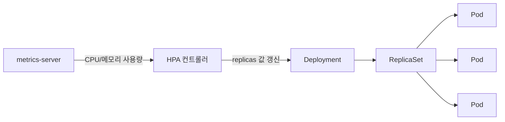

Deployment는 replicas 개수를 고정된 값으로 선언한다. 트래픽이 몰릴 때마다 사람이 그 값을 수동으로 바꾸는 건 현실적이지 않다. HPA(Horizontal Pod Autoscaler)는 이 replicas 값을 메트릭에 따라 자동으로 조정해주는 컨트롤러다.

## HPA가 하는 일

HPA는 Pod를 직접 만들지 않는다. 대신 Deployment(정확히는 Deployment가 관리하는 ReplicaSet)의 `replicas` 필드를 자동으로 갱신하는, **한 단계 위에 있는 컨트롤러**다. 기본 15초 간격으로 메트릭을 확인하고 필요한 replicas 값을 계산해서 그 값으로 갱신하면, 그다음은 Deployment/ReplicaSet의 원래 reconciliation loop가 그 갱신된 숫자에 맞춰 Pod를 늘리거나 줄인다. HPA는 스케줄링에 관여하지 않고, "몇 개가 떠 있어야 하는가"라는 숫자 하나만 계속 고쳐 쓰는 셈이다.



## 메트릭은 어디서 오는가

`metrics-server`가 각 노드의 kubelet으로부터 CPU·메모리 사용량을 주기적으로 수집해서 Metrics API로 노출한다. HPA는 기본적으로 이 CPU/메모리 utilization(%)을 기준 메트릭으로 쓴다. Custom Metrics API나 External Metrics API를 연결하면 큐 길이, 초당 요청 수 같은 애플리케이션 레벨 지표도 기준으로 삼을 수 있다.

## 몇 개로 늘릴지 계산하는 식

HPA는 컨트롤 루프마다 다음 식으로 목표 replica 수를 계산한다.

```
desiredReplicas = ceil(currentReplicas × (currentMetricValue / desiredMetricValue))
```

예를 들어 현재 replicas가 3, 목표 CPU utilization이 50%인데 실제 평균 CPU가 80%라면 `ceil(3 × (80 / 50)) = ceil(4.8) = 5`가 되어 5개로 늘어난다. 반대로 실제 사용률이 목표보다 낮으면 이 값은 1보다 작아지고, replicas는 줄어든다.

## 급격한 변동을 막는 안전장치

메트릭 값 그대로 즉시 반응하면, 트래픽이 순간적으로 튈 때마다 Pod가 늘었다 줄었다를 반복하는 flapping이 생긴다. HPA는 일정 시간 동안 계산된 추천값들 중 가장 완만한 방향을 선택하는 **stabilization window**로 이 진동을 완화한다. 스케일 다운은 기본적으로 더 보수적으로(기본 5분 창) 적용되고, 스케일 업은 상대적으로 빠르게 반영되도록 설정하는 경우가 많다.

## HPA vs VPA vs Cluster Autoscaler

셋 다 "자동 확장"이라는 이름이 붙지만 스케일하는 축이 다르다.

- **HPA (Horizontal)** — Pod의 **개수**를 늘리고 줄인다.
- **VPA (Vertical Pod Autoscaler)** — Pod **하나**가 요청하는 CPU/메모리 양 자체를 조정한다. 값을 바꾸려면 Pod 재시작이 필요하다.
- **Cluster Autoscaler** — HPA가 Pod를 늘리려 하는데 그걸 스케줄링할 노드 자체가 부족하면, 노드를 추가하거나(반대로 여유가 넘치면 제거) 한다.

실무에서는 HPA와 Cluster Autoscaler를 함께 쓰는 경우가 많다. HPA가 Pod 개수를 늘리라고 결정해도 노드에 자리가 없으면 Pod는 `Pending` 상태로 남는데, 이때 Cluster Autoscaler가 노드를 추가해서 그 Pod가 스케줄링될 자리를 만들어준다.

### HPA 매니페스트 예시

앞서 계산식에서 쓴 것과 같은 조건(목표 CPU 50%)을 `HorizontalPodAutoscaler` 리소스로 선언하면 이런 모습이다.

```yaml
apiVersion: autoscaling/v2
kind: HorizontalPodAutoscaler
metadata:
  name: web-app-hpa
spec:
  scaleTargetRef:
    apiVersion: apps/v1
    kind: Deployment
    name: web-app
  minReplicas: 2
  maxReplicas: 10
  metrics:
    - type: Resource
      resource:
        name: cpu
        target:
          type: Utilization
          averageUtilization: 50
```

`scaleTargetRef`가 어떤 Deployment의 replicas를 조정할지 가리키고, `minReplicas`/`maxReplicas`가 HPA의 계산 결과가 벗어날 수 없는 상한·하한을 정한다.

### VPA 매니페스트 예시

VPA는 별도 CRD(`VerticalPodAutoscaler`)로 설치해야 쓸 수 있다. `updateMode: "Auto"`면 VPA가 권장 리소스 값을 계산해서 Pod를 재생성하며 적용까지 자동으로 한다.

```yaml
apiVersion: autoscaling.k8s.io/v1
kind: VerticalPodAutoscaler
metadata:
  name: web-app-vpa
spec:
  targetRef:
    apiVersion: apps/v1
    kind: Deployment
    name: web-app
  updatePolicy:
    updateMode: "Auto"
  resourcePolicy:
    containerPolicies:
      - containerName: "*"
        minAllowed:
          cpu: "100m"
          memory: "128Mi"
        maxAllowed:
          cpu: "2"
          memory: "2Gi"
```

같은 Deployment에 HPA와 VPA를 CPU 기준으로 동시에 걸면 서로 충돌한다 — HPA는 Pod를 늘려서 부하를 나누려 하고, VPA는 Pod 하나의 CPU 요청량을 바꾸려 들기 때문이다. 보통 CPU는 HPA, 메모리는 VPA처럼 기준 지표를 나누거나 둘 중 하나만 쓴다.

### Cluster Autoscaler 예시

Cluster Autoscaler는 CRD가 아니라 클러스터에 떠 있는 컨트롤러 Deployment 자체에 클라우드 프로바이더와 노드 그룹 정보를 인자로 넘겨서 설정한다.

```yaml
apiVersion: apps/v1
kind: Deployment
metadata:
  name: cluster-autoscaler
  namespace: kube-system
spec:
  template:
    spec:
      containers:
        - name: cluster-autoscaler
          image: registry.k8s.io/autoscaling/cluster-autoscaler:v1.29.0
          command:
            - ./cluster-autoscaler
            - --cloud-provider=aws
            - --nodes=2:10:my-node-group
            - --scale-down-delay-after-add=10m
```

`--nodes=2:10:my-node-group`이 "이 노드 그룹은 최소 2대, 최대 10대까지 자동으로 늘리고 줄여라"는 선언이고, `--scale-down-delay-after-add`는 노드를 새로 추가한 직후 바로 다시 줄여버리는 flapping을 막는 안전장치다.

## 정리

- HPA는 Pod를 직접 만들지 않고, Deployment의 replicas 값을 대신 조정하는 상위 컨트롤러다.
- 판단 기준이 되는 메트릭은 metrics-server가 수집하며, 기본은 CPU/메모리지만 Custom/External Metrics API로 다른 지표도 붙일 수 있다.
- desiredReplicas는 "현재 메트릭 ÷ 목표 메트릭" 비율을 현재 replicas에 곱해서 계산하고, 급격한 변동은 stabilization window로 완화한다.
- Pod 개수(HPA), Pod 크기(VPA), 노드 개수(Cluster Autoscaler)는 서로 다른 축이라 상황에 맞게 조합해서 쓴다.
