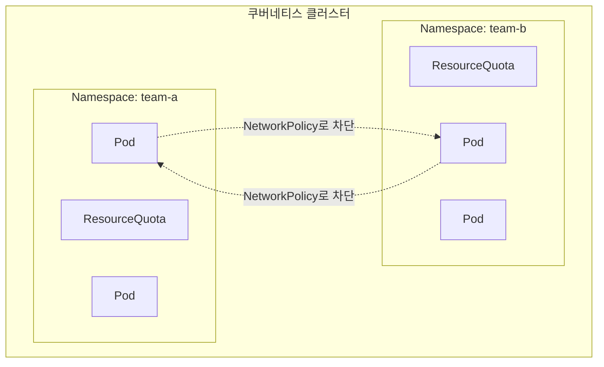

멀티테넌시는 여러 팀이나 서비스가 쿠버네티스 클러스터 하나를 나눠 쓰는 것이다. 문제는 "격리를 하느냐 마느냐"가 아니라 **얼마나 격리하느냐**다. Namespace 하나로 이름만 나눠도 멀티테넌시고, 노드나 클러스터 자체를 통째로 분리해도 멀티테넌시다. 둘 다 맞는 답이지만 해결하는 문제가 다르다.

## 왜 격리가 필요한가

여러 팀이 같은 클러스터에 모여 있으면 생기는 문제는 크게 세 가지다.

- **리소스 경합** — 한 팀이 CPU/메모리를 제한 없이 요청하면, 다른 팀의 Pod가 스케줄링될 자리가 없어진다("noisy neighbor").
- **네트워크 노출** — 쿠버네티스는 기본적으로 모든 Pod가 서로 통신 가능한 flat network다. 한 팀의 내부 DB에 다른 팀 Pod가 그냥 접근할 수 있다.
- **권한 침범** — 한 팀의 서비스 어카운트가 다른 팀 네임스페이스의 시크릿이나 리소스를 조회·수정할 수 있으면 안 된다.

## Namespace — 가장 기본적인 논리적 경계

Namespace는 리소스 이름의 충돌을 막아주고, RBAC를 적용하는 단위가 된다. 하지만 Namespace를 나누는 것 자체는 리소스 사용량을 제한하거나 네트워크를 막아주지 않는다. 기본값 그대로면 Namespace는 "이름표를 나눠 붙인 것"에 가깝고, 실질적인 격리는 그 위에 몇 가지를 더 얹어야 생긴다.

## ResourceQuota / LimitRange — 리소스 격리

`ResourceQuota`는 네임스페이스 전체가 쓸 수 있는 CPU·메모리·오브젝트 개수의 총량을 제한한다. `LimitRange`는 그 안에서 개별 Pod·컨테이너 단위로 기본 요청량과 최대치를 강제한다. 이 둘이 없으면 한 팀의 실수로 만든 Pod 하나가 리소스를 독점해서 다른 팀의 배포가 실패하는 일이 실제로 벌어진다.

## NetworkPolicy — 네트워크 격리

기본 쿠버네티스 네트워크는 모든 Pod가 서로에게 열려 있다. `NetworkPolicy`는 특정 네임스페이스나 레이블에서 들어오는 트래픽만 화이트리스트로 허용하는 방식으로 이 flat network를 잠근다. NetworkPolicy가 없으면 팀 A의 Pod가 팀 B의 내부 서비스 포트에 직접 연결하는 걸 막을 방법이 없다.

## RBAC — 권한 격리

`Role`/`RoleBinding`을 네임스페이스 단위로 스코프하면, 팀 A의 서비스 어카운트는 팀 A 네임스페이스 안의 리소스만 다룰 수 있다. 클러스터 전체 권한이 필요한 작업(`ClusterRole`)은 최소한으로 줄이는 게 원칙이다.

## 그래도 남는 문제 — 소프트 vs 하드 멀티테넌시

Namespace, ResourceQuota, NetworkPolicy, RBAC를 전부 갖춰도 이건 **소프트 멀티테넌시**다. 모든 Pod가 같은 노드의 같은 커널을 공유하기 때문에, 컨테이너 런타임이나 커널 취약점으로 격리를 뚫는 공격(컨테이너 탈옥)이 성공하면 같은 노드의 다른 테넌트까지 영향을 받을 수 있다.

신뢰 수준이 낮은 테넌트를 섞어야 한다면 소프트 격리로는 부족하다. 이때는 taints/tolerations와 nodeSelector로 테넌트별 전용 노드를 분리하거나, 아예 컨트롤 플레인까지 분리하는 방법(별도 클러스터, 혹은 vcluster 같은 가상 클러스터)으로 넘어가야 한다. 이걸 **하드 멀티테넌시**라고 부른다.

## 정리

- 멀티테넌시는 격리 여부가 아니라 **격리 수준**을 고르는 문제다.
- Namespace만으로는 이름 충돌 방지 정도이고, 실질적인 격리는 ResourceQuota(리소스)·NetworkPolicy(네트워크)·RBAC(권한)를 각각 추가해야 만들어진다.
- 이 넷을 다 갖춰도 커널은 공유하므로 완전한 격리는 아니다("소프트 멀티테넌시"). 신뢰할 수 없는 테넌트가 섞인다면 노드나 클러스터 자체를 분리하는 "하드 멀티테넌시"를 고려해야 한다.
