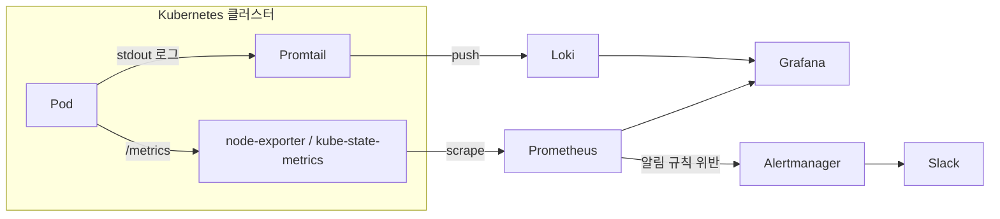

## 왜 K8s에서는 관측이 따로 필요한가

VM 한 대를 운영할 때는 장애가 나면 SSH로 들어가서 `/var/log`를 뒤지면 됐다. Kubernetes에서는 이 방식이 통하지 않는다.

- **파드는 죽으면 사라진다.** CrashLoopBackOff로 파드가 재시작되거나 스케줄러가 다른 노드로 옮기면, 그 파드 안에 있던 로그 파일도 컨테이너와 함께 사라진다. "방금까지 떠 있던 파드"의 로그를 나중에 다시 볼 방법이 없다.
- **IP와 위치가 계속 바뀐다.** 같은 서비스라도 재배포될 때마다 파드 IP가 바뀌고 노드도 바뀔 수 있어서, "이 서버에 들어가서 확인한다"는 접근 자체가 성립하지 않는다.
- **하나의 요청이 여러 파드를 거친다.** Ingress → Service → Pod → 다른 Pod로 요청이 넘어가는 구조에서, 장애 지점을 찾으려면 여러 파드의 로그·메트릭을 한 곳에서 시계열로 봐야 한다.

그래서 K8s 환경에서는 메트릭·로그를 파드 바깥의 중앙 저장소로 계속 실어 나르고, 파드가 사라져도 그 파드가 살아있던 동안의 기록은 남도록 만드는 별도의 관측 스택을 둔다.

## 관측의 세 축: Metrics, Logs, Traces

관측(Observability)은 보통 세 종류의 신호로 나눠 이야기한다.

- **Metrics** — "지금 CPU 사용률이 몇 %인가"처럼 숫자로 집계된 시계열 데이터. Prometheus가 담당한다.
- **Logs** — "그 순간 애플리케이션이 실제로 뭘 하고 있었는가"를 보여주는 텍스트 기록. Loki가 담당한다.
- **Traces** — 하나의 요청이 여러 서비스를 거치는 동안의 호출 경로와 각 구간 소요 시간. Jaeger/Tempo가 담당하는데, 이 글에서는 다루지 않는다.

Metrics로 "이상하다"는 걸 먼저 감지하고, Logs로 "왜 이상한지" 원인을 파고드는 게 기본 흐름이다.

## Prometheus — 메트릭을 Pull로 긁어온다

Prometheus는 애플리케이션이 메트릭을 보내주길 기다리는 게 아니라, 정해진 간격으로 대상에 직접 요청을 보내 메트릭을 긁어온다(**Pull 방식**). K8s에서는 보통 다음 두 exporter가 메트릭을 노출한다.

- **node-exporter** — 노드(서버) 자체의 CPU·메모리·디스크 사용량을 노출한다.
- **kube-state-metrics** — "Deployment가 원하는 replica 수 대비 실제로 몇 개가 떠 있는가", "Pod가 몇 번 재시작됐는가" 같은 K8s 오브젝트 상태를 메트릭으로 노출한다.

Prometheus Operator를 쓰면 어떤 대상을 긁을지도 K8s 리소스로 선언한다.

```yaml
apiVersion: monitoring.coreos.com/v1
kind: ServiceMonitor
metadata:
  name: dflow-app
spec:
  selector:
    matchLabels:
      app: dflow-app
  endpoints:
    - port: metrics
      interval: 15s
```

이렇게 선언하면 Prometheus가 `app: dflow-app` 라벨을 가진 Service를 찾아서 15초마다 `/metrics` 엔드포인트를 긁는다. 수집된 데이터는 PromQL이라는 쿼리 언어로 조회한다.

```promql
# 최근 5분간 Pod가 재시작된 횟수
increase(kube_pod_container_status_restarts_total[5m]) > 0

# 컨테이너별 메모리 사용량이 limit의 90%를 넘은 경우
container_memory_working_set_bytes / container_spec_memory_limit_bytes > 0.9
```

## Loki — "로그를 위한 Prometheus"

Loki는 Grafana Labs가 만든 로그 저장소로, 설계 철학이 ELK(Elasticsearch)와 다르다. 로그 내용 전체에 대해 풀텍스트 인덱스를 만드는 대신, `namespace`, `pod`, `app` 같은 **라벨(메타데이터)에만 인덱스를 걸고 실제 로그 본문은 그대로 압축해서 저장**한다. 인덱스 크기가 훨씬 작아지는 대신, 본문 검색은 인덱싱된 라벨로 범위를 좁힌 뒤 그 안에서 grep하듯 처리된다.

로그를 Loki로 실어 나르는 역할은 각 노드에 DaemonSet으로 떠 있는 **Promtail**(또는 Grafana Agent)이 한다. 컨테이너의 stdout/stderr를 자동으로 수집해서, 어떤 파드·네임스페이스에서 나온 로그인지 라벨을 붙여 Loki로 보낸다.

```logql
# dflow 네임스페이스의 dflow-app 파드 로그 중 error 포함된 것만
{namespace="dflow", app="dflow-app"} |= "error"

# 최근 5분간 error 로그 발생 횟수를 1분 단위로 집계
sum(count_over_time({app="dflow-app"} |= "error" [1m]))
```

Prometheus의 PromQL과 Loki의 LogQL이 문법을 의도적으로 비슷하게 맞춰서, 메트릭 보다가 로그로 넘어갈 때 새 쿼리 언어를 처음부터 배우지 않아도 되게 만들어져 있다.

## Grafana — 한 화면에서 메트릭과 로그를 같이 본다

Grafana는 그 자체로 데이터를 수집하지 않고, Prometheus와 Loki를 각각 데이터 소스로 등록해서 하나의 대시보드에서 같이 보여준다. 여기서 중요한 건 **같은 라벨(예: `pod`, `app`)로 메트릭 그래프와 로그를 나란히 배치할 수 있다는 점**이다. CPU 그래프에서 튀는 지점을 확인하고, 바로 옆 로그 패널에서 같은 시간대의 로그를 필터링해서 보는 식의 조사가 한 화면에서 끝난다.

## 장애가 나면 실제로 이렇게 조사한다

전체 흐름을 그리면 이렇다.



예를 들어 특정 파드가 반복적으로 재시작되는 상황이라면 아래 순서로 조사한다.

1. **Alertmanager가 먼저 알린다.** Prometheus에 `increase(kube_pod_container_status_restarts_total[5m]) > 3` 같은 알림 규칙을 걸어두면, 조건을 만족하는 순간 Alertmanager가 Slack으로 알림을 보낸다. 사람이 대시보드를 계속 들여다보지 않아도 이상 신호를 먼저 받는다.
2. **Grafana에서 메트릭으로 범위를 좁힌다.** 해당 파드의 메모리·CPU 그래프를 보고, 재시작 직전에 메모리가 limit에 붙어 OOMKilled 됐는지, 아니면 다른 패턴인지를 먼저 확인한다.
3. **Loki에서 그 시간대 로그를 확인한다.** `{pod="dflow-app-xxxxx"}` 라벨로 좁혀서, 재시작 직전 몇 분간 무슨 에러가 찍혔는지 본다. 파드가 이미 사라졌어도 Loki에는 그 파드가 살아있던 동안의 로그가 라벨과 함께 그대로 남아있다.
4. **원인을 확정하고 대응한다.** 메모리 누수라면 limit 조정이나 코드 수정, 특정 요청 패턴이 원인이면 그 요청을 차단하거나 재시도 로직을 손본다.

## 지금 하고 있는 방식과 비교하면

DFLOW·핫딜 프로젝트에서는 이 역할을 정식 스택 없이 더 단순한 방식으로 대체하고 있다. 학습/배치 작업의 상태·에러 로그를 Redis Hash에 중앙화해서 실시간 상태 API로 노출하고, 실패 시 Slack Webhook으로 바로 알림을 보내는 방식이다. "관측 가능한 상태를 만들고 이상 시 즉시 알린다"는 목표는 같지만, 몇 가지 차이가 있다.

- **집계·조회의 유연성** — Redis Hash는 "이 job의 지금 상태"를 조회하는 데는 충분하지만, "최근 1시간 동안 실패율이 어떻게 변했는가"처럼 시계열로 집계·질의하려면 애플리케이션 코드에서 직접 계산해야 한다. PromQL/LogQL은 이런 시계열 집계 쿼리를 기본으로 지원한다.
- **파드가 사라져도 기록이 남는가** — Redis Hash는 애플리케이션이 명시적으로 기록한 값만 남는다. Loki는 컨테이너의 모든 stdout을 자동으로 수집하기 때문에, 애플리케이션이 로그로 남기기만 하면 별도로 상태를 기록하는 코드를 짜지 않아도 나중에 조회할 수 있다.
- **운영 부담** — Redis Hash + Slack Webhook은 이미 쓰고 있는 Redis에 몇 줄 붙이는 정도라 도입 비용이 거의 없다. Prometheus·Loki·Grafana·Alertmanager는 별도로 배포·운영해야 하는 컴포넌트가 늘어난다.

즉 지금 규모에서는 Redis 기반 방식으로도 "이상 감지 → 알림"이라는 목표를 충분히 달성하고 있고, 서비스·팀 규모가 커져서 여러 컴포넌트를 넘나드는 장애를 시계열로 추적해야 하는 시점이 오면 정식 관측 스택으로 옮겨가는 게 자연스러운 방향이다.

## 정리

- K8s는 파드가 죽으면 로그도 같이 사라지고 IP·위치도 계속 바뀌기 때문에, 메트릭·로그를 파드 바깥으로 계속 실어 나르는 별도의 관측 스택이 필요하다.
- Prometheus는 Pull 방식으로 node-exporter/kube-state-metrics를 주기적으로 긁어 메트릭을 모으고, PromQL로 시계열을 집계·조회한다.
- Loki는 로그 본문이 아니라 `pod`, `namespace` 같은 라벨에만 인덱스를 걸어 가볍게 로그를 저장하고, LogQL로 조회한다. Promtail이 각 노드에서 stdout을 수집해 전달한다.
- Grafana는 Prometheus·Loki를 데이터 소스로 묶어 메트릭과 로그를 같은 라벨 기준으로 한 화면에서 보여주고, Alertmanager는 메트릭이 규칙을 위반하면 Slack 등으로 먼저 알린다.
- 장애 조사는 보통 Alertmanager 알림 → Grafana 메트릭으로 범위 좁히기 → Loki 로그로 원인 확인 순서로 진행된다.
