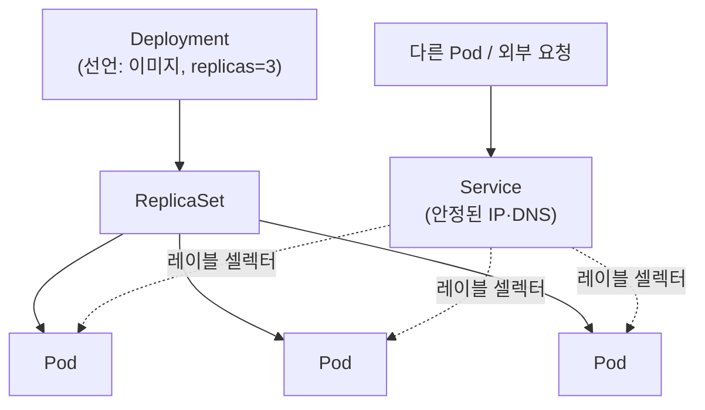

컨테이너 하나를 실행하는 거라면 `docker run`으로 충분하다. 그런데 쿠버네티스는 그 위에 Pod, Deployment, Service라는 세 개의 리소스를 겹겹이 쌓아 놓는다. 각각이 뭘 위해 존재하는지 모르고 보면 그냥 개념이 많아서 복잡해 보이지만, 사실 이 세 계층은 순서대로 하나씩 문제를 해결하면서 쌓인 것이다.

## Pod — 가장 작은 배포 단위

Pod는 쿠버네티스가 다루는 가장 작은 단위다. 컨테이너 하나를 그대로 감싼 것처럼 보이지만, 정확히는 **하나 이상의 컨테이너가 네트워크 네임스페이스와 볼륨을 공유하는 묶음**이다. 같은 Pod 안의 컨테이너들은 `localhost`로 서로 통신하고 같은 IP를 쓴다. 로깅 사이드카나, 메인 애플리케이션과 항상 같이 뜨고 같이 죽어야 하는 헬퍼 컨테이너를 묶을 때 이 구조가 필요해진다.

문제는 Pod 자체는 **일회성**이라는 점이다. Pod를 직접 만들어서 띄우면, 그 Pod가 어떤 이유로든 죽었을 때 아무도 다시 살려주지 않는다. 다시 만들어도 새 Pod는 이전과 다른 IP를 받는다. Pod만 놓고 보면 "떠 있는 동안만 유효한 컨테이너 묶음"인 셈이다.

## Deployment — Pod의 개수와 상태를 선언적으로 관리

Pod를 직접 만드는 대신 Deployment를 만들면, Deployment는 그 스펙대로 Pod를 몇 개 유지할지를 대신 책임진다. 정확히는 Deployment가 Pod를 직접 다루지 않고, 중간에 **ReplicaSet**을 만들어서 ReplicaSet이 "지금 실행 중인 Pod 개수가 선언한 replicas 값과 같은가"를 계속 확인한다. Pod가 죽으면 ReplicaSet이 즉시 새 Pod를 만들어 개수를 맞춘다.

이게 바로 **선언적 상태 관리**다. "Pod를 만들어라"가 아니라 "이 상태(이미지 버전, replica 개수)가 항상 유지되도록 해라"를 선언하는 것이고, Deployment는 그 선언과 실제 상태의 차이를 계속 좁혀나간다. 이미지 버전을 바꾸는 롤링 업데이트나, 문제가 생겼을 때 이전 버전으로 되돌리는 롤백도 전부 이 메커니즘 위에서 동작한다.

## Service — 계속 바뀌는 Pod 집합에 안정적인 주소 붙이기

Deployment 덕분에 Pod 개수는 유지되지만, 여전히 남는 문제가 있다. Pod가 죽고 새로 뜰 때마다 IP가 바뀐다는 것이다. 다른 서비스가 이 Pod를 호출하려면 매번 바뀌는 IP를 어떻게든 다시 알아내야 한다.

Service는 이 문제를 **레이블 셀렉터(label selector)** 로 해결한다. Service는 특정 레이블을 가진 Pod들을 찾아서 그 앞에 안정적인 가상 IP와 클러스터 내부 DNS 이름을 하나 붙여준다. 실제로 요청을 받는 Pod가 몇 개인지, 어떤 IP인지는 Service 뒤에 숨겨지고, 호출하는 쪽은 그 Service 이름만 알면 된다. Pod가 죽고 새로 떠서 IP가 바뀌어도 Service가 자동으로 새 Pod를 다시 찾아서 트래픽을 연결한다.

## 정리 — 세 리소스의 차이

정리하면 각 계층은 서로 다른 관심사를 담당한다.

- **Pod** — 무엇을 실행할 것인가 (컨테이너, 볼륨, 네트워크 네임스페이스)
- **Deployment** — 그것을 몇 개, 어떤 버전으로 유지할 것인가 (replica 개수, 롤링 업데이트, 자가치유)
- **Service** — 계속 바뀌는 그 Pod 집합에 어떻게 안정적으로 접근할 것인가 (가상 IP, DNS, 로드밸런싱)

이 셋을 합쳐 놓지 않고 따로 둔 이유는, 각 계층이 책임지는 변화의 주기가 다르기 때문이다. Pod 스펙은 배포할 때마다 바뀌고, replica 개수나 버전은 운영 중에도 조정되고, Service의 이름과 주소는 그 위 두 계층이 어떻게 바뀌든 절대 바뀌면 안 된다. 하나의 리소스로 뭉쳐 놨다면 Pod를 재배포할 때마다 그걸 호출하던 다른 서비스들도 새 주소를 알아야 했을 것이다. 계층을 나눴기 때문에 Pod가 몇 번을 죽고 다시 뜨든, Deployment가 몇 번을 롤링 업데이트하든, Service 주소 하나만은 그대로 유지된다.
