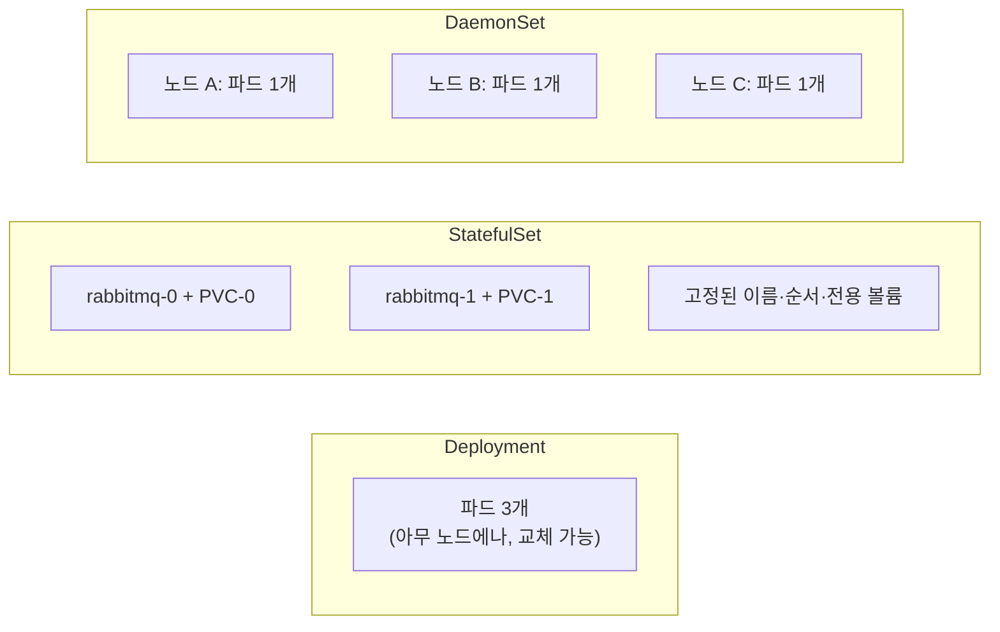

[Pod, Deployment, Service 글](/blog/kubernetes-pod-deployment-service)에서 봤듯, Deployment는 "Pod가 죽으면 아무 노드에나 새로 하나 띄워서 개수만 맞추면 된다"는 전제 위에 서 있다. 이 전제가 성립하려면 Pod들이 서로 **완전히 교체 가능(interchangeable)** 해야 한다 — 어떤 Pod가 죽어도 상관없고, 새 Pod는 어디에 떠도 상관없어야 한다. 그런데 실제 클러스터를 운영하다 보면 이 전제가 깨지는 워크로드가 둘 있다. **"이 파드는 다른 파드로 대체할 수 없다"**는 것과 **"이 파드는 모든 노드에 하나씩 있어야 한다"**는 것. 각각 StatefulSet과 DaemonSet이 다루는 문제다.

## StatefulSet — 교체 가능하지 않은 파드

RabbitMQ, Postgres, Jenkins처럼 **자기만의 데이터나 정체성을 디스크에 들고 있는** 컴포넌트를 생각해보자. RabbitMQ 노드 하나가 죽었다고 아무 노드에나 새 인스턴스를 띄우면 안 된다 — 그 노드가 갖고 있던 큐 데이터와 디스크가 없으면 그냥 빈 브로커일 뿐이다. Deployment는 "Pod가 몇 개 떠 있는가"만 신경 쓰지, "그 Pod가 어제 그 Pod와 같은 디스크를 물고 있는가"는 신경 쓰지 않는다.

StatefulSet은 이 문제를 두 가지로 해결한다.

- **고정된 이름과 순서** — `rabbitmq-0`, `rabbitmq-1`처럼 파드 이름에 순번이 붙고, 파드가 재시작돼도 같은 이름을 유지한다. 시작/종료도 순서대로(0 → 1 → 2) 진행된다.
- **파드별로 묶인 전용 볼륨(PVC)** — Deployment의 파드들은 볼륨을 공유하거나 아예 없을 수 있지만, StatefulSet은 `volumeClaimTemplates`로 파드마다 자기 것 하나씩 PVC를 만들어준다. `rabbitmq-0`이 재시작돼도 항상 같은 PVC에 다시 붙는다.

## DaemonSet — 파드 개수가 아니라 "노드 커버리지"가 목적

Deployment의 replicas는 "몇 개 띄울까"를 사람이 숫자로 정한다. 그런데 로그 수집기(Promtail), 노드 메트릭 수집기(node-exporter), 스토리지 엔진(Longhorn manager/csi-plugin), 네트워크 컴포넌트(metallb-speaker)처럼 **"클러스터에 노드가 몇 개든, 그 노드마다 반드시 하나씩 떠 있어야 하는"** 워크로드가 있다. 이런 컴포넌트는 replicas 숫자로 관리하는 게 아니라 "노드 개수"에 자동으로 맞춰져야 한다 — 노드가 늘면 파드도 자동으로 하나 더 뜨고, 노드가 줄면 그 파드도 같이 없어져야 한다.

DaemonSet은 이걸 위해 존재한다. replicas 값이 없고, 대신 `nodeSelector`/`tolerations` 조건에 맞는 노드마다 정확히 파드 하나씩을 스케줄러 없이 직접 배치한다.

## 실제로 이 선택이 대가를 요구한 순간

개념만 보면 "상태가 있으면 StatefulSet, 노드마다 필요하면 DaemonSet"으로 끝나는 결정처럼 보인다. 그런데 [K8s 장애 대응 실측 글](/blog/k8s-incident-node-oom-rabbitmq-disk)에서 노드 하나를 실제로 죽여봤을 때, 이 선택이 공짜가 아니라는 게 드러났다.

| | 워크로드 타입 | 노드 다운 시 결과 |
|---|---|---|
| api-server | Deployment (무상태) | evict된 직후 살아있는 노드에 새 파드가 자동으로 뜸 |
| RabbitMQ · Jenkins · Postgres standby | StatefulSet + Longhorn 단일 레플리카 | 노드가 복구될 때까지 그냥 멈춰 있었음 — 볼륨이 죽은 노드에 묶여 있어 재스케줄 자체가 불가능 |

StatefulSet이 파드마다 전용 볼륨을 붙여주는 건 "데이터 정체성을 지켜준다"는 장점인 동시에, **그 볼륨이 있는 노드가 죽으면 다른 노드로 옮겨갈 수 없다는 가용성 손실**이기도 하다. Deployment의 무상태 파드가 누리는 "아무 데나 다시 뜨면 그만"이라는 자유를 StatefulSet은 애초에 갖고 있지 않다 — 데이터 정합성과 가용성을 맞바꾼 것이다. (실제 프로덕션이라면 레플리카 3개로 구성된 RabbitMQ 클러스터나 CloudNativePG처럼, 볼륨이 여러 노드에 분산된 구성으로 이 손실을 줄인다.)

디스크풀 실험에서는 정반대 방향의 착각이 드러났다. "DaemonSet은 노드 시스템 컴포넌트니까 disk-pressure 상황에서도 tolerate하도록 기본 설계돼 있을 것"이라고 예상했지만, 실제로는 longhorn-manager, longhorn-csi-plugin, engine-image, metallb-speaker, loki-promtail, node-exporter까지 DaemonSet 파드 6개가 그대로 축출됐다. **"노드마다 하나씩 뜬다"는 배치 방식과 "disk-pressure에도 안 죽는다"는 내결함성은 완전히 다른 문제**였다 — 후자를 보장하려면 `priorityClassName: system-node-critical` 같은 설정을 별도로 줘야 한다.

## 정리

- **Deployment** — 파드가 서로 완전히 교체 가능할 때. "몇 개가 떠 있는가"만 관리한다.
- **StatefulSet** — 파드가 자기만의 데이터/정체성을 가질 때. 고정된 이름 + 파드별 전용 볼륨을 주는 대신, 그 볼륨이 묶인 노드가 죽으면 재스케줄이 막힌다는 가용성 손실을 감수해야 한다.
- **DaemonSet** — 노드마다 정확히 하나씩 필요할 때. 배치는 노드 수에 자동으로 맞춰지지만, disk-pressure 같은 노드 레벨 압박 상황에서 살아남는 건 별도로 보장해줘야 하는 문제다.

리소스 타입을 고르는 기준은 결국 "이 워크로드가 상태를 갖는가, 노드 단위로 필요한가"이지만, 그 선택마다 실측으로만 드러나는 가용성 트레이드오프가 따로 있다는 게 이번에 확인한 부분이다.
