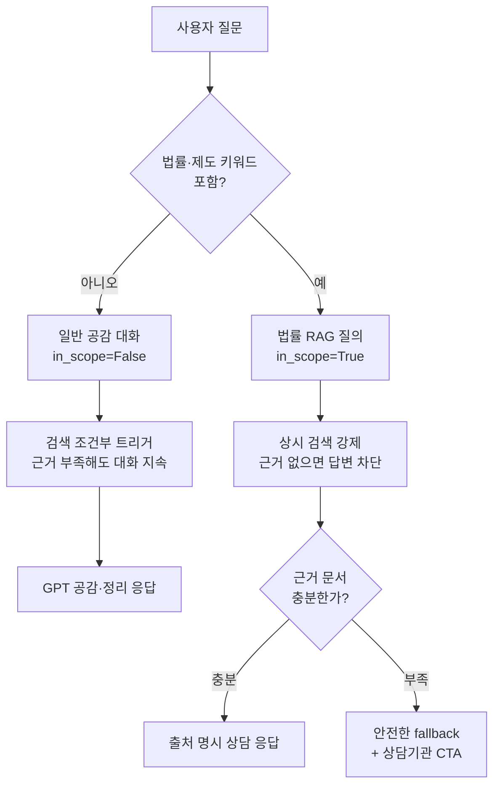

LangChain을 처음 접하면 "그냥 OpenAI API 감싼 라이브러리 아닌가?"라는 생각이 들기 쉽다. `chain.invoke()` 한 줄로 LLM을 부르는 코드만 보면 정말 그렇게 보인다. 하지만 실제로 프로덕션 RAG 기능을 만들면서 LangChain이 진짜 값어치를 하는 지점은 LLM 호출 자체가 아니라, **"이 요청이 왔을 때 검색을 할지 말지, 검색한다면 얼마나 엄격하게 근거를 요구할지, 실패하면 어떻게 대응할지"**를 코드로 표현하는 오케스트레이션 레이어였다. [부부·연인 관계 케어 웹앱 쀼라인드](/?project=ppurine)의 상담 챗봇을 만들면서 이 구분이 왜 중요한지 체감한 과정을 정리한다.

## LangChain이 안 하는 일부터 정리하기

먼저 LangChain이 하지 않는 일을 짚고 가는 게 오해를 줄인다.

- **LLM을 대체하지 않는다** — 실제 추론은 여전히 Azure OpenAI, OpenAI 같은 provider가 한다. LangChain은 그 앞뒤로 프롬프트를 만들고 응답을 다루는 계층이다.
- **벡터 DB가 아니다** — 임베딩 저장·검색은 pgvector, Azure AI Search 같은 별도 저장소가 한다. LangChain은 그 저장소를 호출하는 공통 인터페이스(리트리버)를 제공할 뿐이다.
- **RAG를 자동으로 "잘" 만들어주지 않는다** — 문서를 검색해서 프롬프트에 넣는 배관(plumbing)은 몇 줄이면 된다. 어려운 건 "언제 검색해야 하는가", "검색 결과가 부실하면 어떻게 할 것인가" 같은 정책 설계이고, 이건 라이브러리가 대신 결정해주지 않는다.

즉 LangChain의 역할은 **프롬프트 템플릿, LLM, 리트리버, 파서 같은 조각들을 하나의 파이프라인으로 엮는 것**이다. [LangChain structured output으로 PII 마스킹을 구현한 글](/blog/langchain-structured-output-pii-masking)에서 다룬 `프롬프트 | 구조화 LLM` 체이닝도 이 역할의 한 예다. 이번 글은 그중에서도 **"검색을 언제, 얼마나 엄격하게 쓸 것인가"**를 다룬 리트리버 오케스트레이션 쪽이다.

## 문제: 상담 챗봇 하나에 성격이 다른 두 종류의 질문이 온다

쀼라인드에는 상담 챗봇이 하나 있지만, 실제로 들어오는 질문은 크게 둘로 나뉜다.

1. **일반 관계 상담** — "남편이 자꾸 애 앞에서 화를 내요, 어떻게 해야 할까요" 같은 공감·정리가 필요한 대화. 정답이 하나로 정해져 있지 않고, 오히려 매번 판박이 같은 답이 나오면 상담 챗봇으로서 부자연스럽다.
2. **법률·제도 질문** — "이혼하면 양육비는 어떻게 산정되나요" 같은 질문. 이런 질문에 근거 없이 LLM이 지어낸 답을 주면, 사용자는 그걸 실제 법률 자문처럼 받아들일 위험이 있다.

같은 챗봇이지만 이 둘을 **똑같은 방식으로 처리하면 둘 다 망가진다.** 모든 질문에 항상 RAG 검색을 걸면, 일반 공감 대화에서도 억지로 문서를 찾아 붙이려다 답변이 딱딱해지고 부자연스러워진다. 반대로 아예 검색을 안 쓰면, 법률 질문에 LLM이 근거 없이 답을 만들어내는 hallucination 리스크를 그대로 안게 된다.

## 해결: 응답 유형별로 검색 트리거·엄격도를 다르게 설계

임베딩·청킹·인덱싱 같은 RAG의 인프라 영역은 Azure AI Search의 관리형 기능(On Your Data)에 맡기고, 애플리케이션 코드는 그 위에서 **"언제 검색을 트리거할지"**와 **"검색 결과를 얼마나 엄격한 근거로 취급할지"**를 결정하는 정책 레이어에 집중했다.



이 라우팅을 LangChain의 LCEL(`|` 파이프 연산자)로 구성하면 대략 이런 형태다. 실제 코드를 그대로 옮긴 건 아니고, 두 경로가 무엇이 다른지 보여주기 위해 구조를 재구성한 예시다.

```python
from langchain_core.prompts import ChatPromptTemplate

_GENERAL_PROMPT = ChatPromptTemplate.from_messages([
    ("system",
     "당신은 부부·연인 관계 상담사입니다. 사용자의 감정에 공감하고 "
     "대화를 자연스럽게 이어가세요. 근거 문서가 없어도 상담 흐름을 끊지 마세요."),
    ("human", "{question}"),
])

_LEGAL_PROMPT = ChatPromptTemplate.from_messages([
    ("system",
     "당신은 가사소송법·양육비 관련 법률 정보를 안내하는 상담사입니다. "
     "아래 근거 문서에 없는 내용은 답하지 말고, 반드시 출처를 함께 제시하세요. "
     "이것은 법률 자문이 아니라 정보 제공이라는 점을 명시하세요.\n\n근거 문서:\n{context}"),
    ("human", "{question}"),
])

_LEGAL_KEYWORDS = ("양육비", "재산분할", "이혼 소송", "친권", "위자료")

def route_and_answer(question: str) -> str:
    if any(kw in question for kw in _LEGAL_KEYWORDS):
        # 법률 질문: 상시 검색 강제(in_scope=True), 근거 없으면 답변하지 않음
        docs = legal_retriever.invoke(question)
        if not docs:
            return _safety_fallback_with_cta()
        chain = _LEGAL_PROMPT | llm
        return chain.invoke({"question": question, "context": _format(docs)}).content

    # 일반 상담: 검색은 보조 수단일 뿐, 없어도 대화가 끊기지 않음(in_scope=False)
    chain = _GENERAL_PROMPT | llm
    return chain.invoke({"question": question}).content
```

여기서 LangChain이 실제로 기여하는 부분은 `_LEGAL_PROMPT | llm`, `_GENERAL_PROMPT | llm`처럼 **프롬프트와 모델을 파이프로 엮어서 두 경로를 나란히 놓고 비교할 수 있게 만든 것**이다. 두 프롬프트는 시스템 메시지의 지시 수준이 완전히 다르다 — 하나는 "근거 없어도 대화를 이어가라", 다른 하나는 "근거에 없으면 답하지 말라". 이 차이를 코드 레벨에서 명확히 분리해두지 않으면, 나중에 프롬프트를 수정할 때 두 성격의 지시가 한 프롬프트 안에서 뒤섞이기 쉽다.

## 근거가 부족할 때: "그럴듯한 답"보다 "안전한 회피"

법률 질문 경로에서 검색 결과가 부실하면, 그 상태로 LLM에게 답을 만들게 하지 않고 곧바로 fallback으로 빠지게 했다. 이 판단이 중요한 이유는, 법률 자문처럼 보이는 질문에 어설픈 답을 주는 것이 "모른다"고 답하는 것보다 훨씬 위험하기 때문이다. 그래서 fallback 응답은 두 가지를 항상 포함하도록 고정했다.

- 이 답변이 법률 자문이 아니라 정보 제공 범위로 한정된다는 고지
- 위험 신호나 판단이 어려운 사안이면 공식 상담기관 CTA를 우선 노출

즉 RAG 파이프라인에서 "검색 실패"를 처리하는 방식 자체가 서비스 도메인(관계 상담)의 리스크 정책을 반영한 설계다. 이건 LangChain이 대신 정해주는 게 아니라, 애플리케이션이 직접 책임지고 짜야 하는 부분이다.

## 정리

- LangChain은 LLM·벡터 검색을 대체하는 도구가 아니라, 프롬프트·모델·리트리버를 하나의 흐름으로 엮는 오케스트레이션 레이어다.
- RAG를 "붙이느냐 마느냐"보다 어려운 건 **언제 검색을 트리거하고, 근거를 얼마나 엄격하게 요구하고, 실패하면 어떻게 대응할지** 응답 유형별로 정책을 나누는 일이다.
- LCEL의 `|` 연산자는 이 정책 차이를 프롬프트 단위로 명확히 분리해서, 성격이 다른 두 응답 경로가 하나의 프롬프트 안에서 뒤섞이지 않게 해준다.
- 근거가 부족할 때 그럴듯한 답을 만들게 두는 대신 안전한 fallback으로 빠지게 하는 것도, 결국 애플리케이션이 직접 설계해야 하는 정책이지 라이브러리가 대신 해주는 부분이 아니다.
