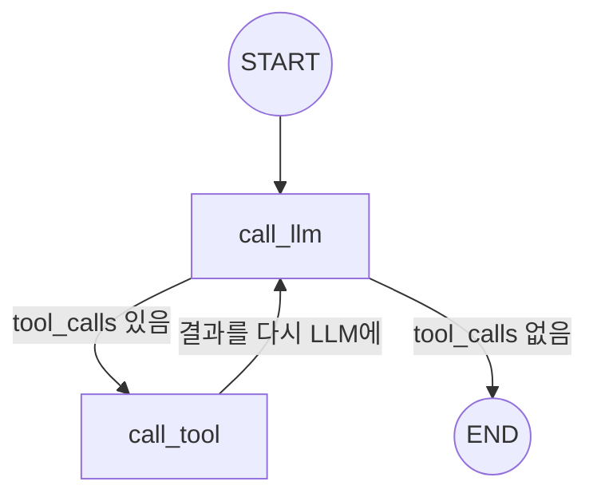

[LangChain으로 RAG 오케스트레이션을 정리한 글](/blog/langchain-rag-orchestration)에서는 질문 종류에 따라 `프롬프트 | LLM` 체인 두 개 중 하나로 분기하는 구조를 다뤘다. 이런 "한 번 분기해서 한 번 실행하고 끝"인 흐름은 LCEL의 `|` 파이프만으로 충분하다. 그런데 LLM을 스터디하다 보면 금방 다른 종류의 요구가 나온다 — **"도구를 호출한 결과를 보고, LLM이 다시 판단해서 또 도구를 호출할 수도 있어야 한다."** 이런 반복(루프)이 필요한 순간, LCEL 체인은 구조적으로 막힌다. 이 지점을 풀기 위해 나온 게 LangGraph라는 걸 개념적으로 정리해본다.

## LCEL 체인은 방향이 있는 그래프(DAG)다

`prompt | llm | parser`처럼 파이프로 이은 체인은 사실 **DAG(Directed Acyclic Graph, 방향성 비순환 그래프)** 구조다. A에서 B로, B에서 C로만 흐르고, 다시 A로 돌아오는 경로는 없다. 분기(`RunnableBranch`, 조건부 라우팅)는 가능하지만, 그것도 결국 "여러 경로 중 하나를 골라서 앞으로만 진행"하는 것이지 뒤로 돌아가는 구조는 아니다.

문제는 실제 에이전트(Agent)가 필요한 흐름은 이렇지 않다는 점이다.

```
사용자 질문
  → LLM이 "날씨 API를 호출해야겠다"고 판단
  → 도구(Tool) 실행 → 결과 획득
  → LLM이 그 결과를 보고 "이제 답할 수 있다" 또는 "다른 도구가 더 필요하다"고 재판단
  → (필요하면) 다시 도구 호출 → ... 반복
  → 최종 답변
```

"LLM 판단 → 도구 실행 → 다시 LLM 판단"이 몇 번 반복될지는 실행하기 전엔 알 수 없다. 이건 순서가 고정된 파이프라인이 아니라 **조건에 따라 같은 지점으로 되돌아갈 수 있는 그래프**, 즉 사이클(cycle)이 있는 구조다. LCEL 체인은 애초에 DAG로 설계돼 있어서 이런 되돌아가는 흐름을 표현할 방법이 없다.

## LangGraph의 해법: State + Node + Edge

LangGraph는 흐름을 "체인"이 아니라 **그래프**로 다시 표현한다. 세 가지 개념만 있으면 뼈대를 만들 수 있다.

- **State** — 그래프 전체가 공유하는 상태. 대화 기록, 지금까지 호출한 도구 결과 등이 여기 쌓인다.
- **Node** — 상태를 입력받아 상태의 일부를 갱신하고 반환하는 함수. "LLM 호출", "도구 실행"이 각각 하나의 노드가 된다.
- **Edge** — 노드와 노드를 잇는 연결. 조건에 따라 다음 노드를 다르게 고르는 **조건부 엣지(conditional edge)**가 핵심이다 — 바로 이 조건부 엣지가 "다시 이전 노드로 돌아갈지, 끝낼지"를 결정하면서 사이클을 만든다.

```python
from typing import TypedDict, Annotated
from langgraph.graph import StateGraph, START, END
from langgraph.graph.message import add_messages

class AgentState(TypedDict):
    messages: Annotated[list, add_messages]  # 대화 기록이 누적되는 상태


def call_llm(state: AgentState) -> dict:
    response = llm_with_tools.invoke(state["messages"])
    return {"messages": [response]}


def call_tool(state: AgentState) -> dict:
    last_message = state["messages"][-1]
    results = [tool_registry[call["name"]].invoke(call["args"])
               for call in last_message.tool_calls]
    return {"messages": results}


def should_continue(state: AgentState) -> str:
    last_message = state["messages"][-1]
    # LLM이 도구를 호출하기로 했으면 도구 노드로, 아니면 종료
    return "call_tool" if last_message.tool_calls else END


graph = StateGraph(AgentState)
graph.add_node("call_llm", call_llm)
graph.add_node("call_tool", call_tool)
graph.add_edge(START, "call_llm")
graph.add_conditional_edges("call_llm", should_continue, {"call_tool": "call_tool", END: END})
graph.add_edge("call_tool", "call_llm")  # 도구 실행 후 다시 LLM 노드로 — 여기가 사이클

app = graph.compile()
```

여기서 사이클을 만드는 건 마지막 두 줄이다. `call_tool`에서 `call_llm`으로 다시 이어지는 엣지가 있고, `call_llm` 다음에는 `should_continue`가 상태를 보고 "도구가 더 필요하면 call_tool로, 아니면 END로" 매번 다시 판단한다. 도구 호출 → LLM 재판단이 몇 번 반복되든, 이 그래프 구조 자체는 바뀌지 않는다 — 루프 횟수를 코드가 미리 정해두지 않고, 실행 중 상태(도구 호출 유무)가 그때그때 결정한다는 점이 LCEL 체인과의 근본적인 차이다.



## State가 그냥 변수가 아니라 "누적 방식"까지 정의하는 이유

`AgentState`의 `messages` 필드가 `Annotated[list, add_messages]`로 선언된 게 눈에 띈다. 일반적인 딕셔너리 갱신이라면 노드가 반환한 값이 기존 값을 덮어쓰겠지만, 대화 기록은 덮어쓰면 안 되고 계속 **누적**되어야 한다. `add_messages`는 "이 필드는 새 값을 기존 값에 이어 붙여라"는 리듀서(reducer)를 지정하는 역할을 한다.

이게 중요한 이유는, 그래프의 각 노드는 상태 전체가 아니라 **자기가 갱신할 부분만** 반환하기 때문이다. `call_llm`은 `{"messages": [response]}`만 반환하지 전체 대화 기록을 다시 안 넘긴다. 그 조각을 상태 전체에 어떻게 합칠지(덮어쓸지, 이어붙일지, 병합할지)를 필드마다 리듀서로 정해두지 않으면, 노드가 늘어날수록 "이 필드를 이번에 덮어쓴 게 맞나, 이어붙인 게 맞나"를 매번 노드 코드 안에서 신경 써야 한다.

## 체크포인터 — 그래프 중간에서 멈췄다 다시 이어가기

LangGraph를 쓰는 또 다른 이유는 **상태를 저장했다가 나중에 그 지점부터 다시 실행할 수 있다**는 점이다. `compile()`에 체크포인터를 넘기면 매 노드 실행 후 상태가 저장된다.

```python
from langgraph.checkpoint.memory import MemorySaver

app = graph.compile(checkpointer=MemorySaver())
config = {"configurable": {"thread_id": "user-42"}}

app.invoke({"messages": [user_message]}, config)
# 같은 thread_id로 다시 invoke하면, 이전 상태(대화 기록)를 이어서 실행한다
```

이게 왜 LCEL 체인과 다른 문제인지 짚어볼 필요가 있다. LCEL 체인은 `invoke()` 한 번이 처음부터 끝까지 실행되는 게 기본 단위라, 중간에 멈췄다가 나중에 이어가려면 그 상태를 애플리케이션 코드가 직접 어딘가(DB, 세션)에 저장하고 복원해야 한다. LangGraph는 그래프의 노드 단위가 이미 상태 저장의 자연스러운 경계이기 때문에, "사람의 승인을 기다렸다가 계속 진행"(human-in-the-loop) 같은 시나리오도 그래프를 특정 노드 앞에서 멈추게(interrupt) 하는 방식으로 표현할 수 있다.

## 그럼 뭐든 LangGraph로 짜야 하나

아니다. [RAG 오케스트레이션 글](/blog/langchain-rag-orchestration)에서 다룬 "질문 종류를 보고 프롬프트 두 개 중 하나로 분기"하는 흐름은 애초에 되돌아갈 필요가 없는 구조다. `if/else`나 LCEL의 `RunnableBranch`로 충분히 표현되는 흐름을 굳이 State·Node·Edge로 감싸면, 오히려 단순한 분기 로직을 그래프 정의·컴파일·상태 스키마 설계라는 더 무거운 틀에 욱여넣는 셈이다.

LangGraph가 필요해지는 신호는 명확하다 — **"이번 실행 결과에 따라 이전 단계로 되돌아갈 수도 있는가"**, **"실행을 중간에 멈췄다가 나중에(또는 사람의 개입 후) 이어가야 하는가"**. 이 둘 중 하나라도 해당하면 DAG 기반 체인으로는 억지로 흉내 내야 하고(재귀 호출, while 루프를 체인 바깥에 직접 짜는 식), 그 흉내가 커질수록 LangGraph가 표준으로 제공하는 사이클·체크포인트 구조를 쓰는 편이 낫다.

## 정리

- LCEL 체인(`|`)은 DAG다 — 분기는 가능해도 되돌아가는 흐름(사이클)은 구조적으로 표현할 수 없다.
- LangGraph는 State(공유 상태) · Node(상태를 갱신하는 함수) · Edge(다음 노드를 정하는 연결)로 흐름을 그래프로 표현하고, 조건부 엣지가 이전 노드로 되돌아가게 하면서 사이클을 만든다.
- State의 각 필드는 "노드가 반환한 조각을 어떻게 합칠지"를 리듀서(`add_messages` 등)로 정의해야 한다 — 노드는 상태 전체가 아니라 갱신할 조각만 반환하기 때문이다.
- 체크포인터를 쓰면 노드 단위로 상태가 저장되어, 실행을 멈췄다가 나중에(혹은 사람의 승인 후) 이어갈 수 있다.
- "결과에 따라 이전 단계로 돌아갈 수 있는가", "중간에 멈췄다 이어가야 하는가" — 이 둘에 해당하지 않는 단순 분기라면 LCEL 체인으로 충분하고, LangGraph는 오히려 과한 도구가 된다.
