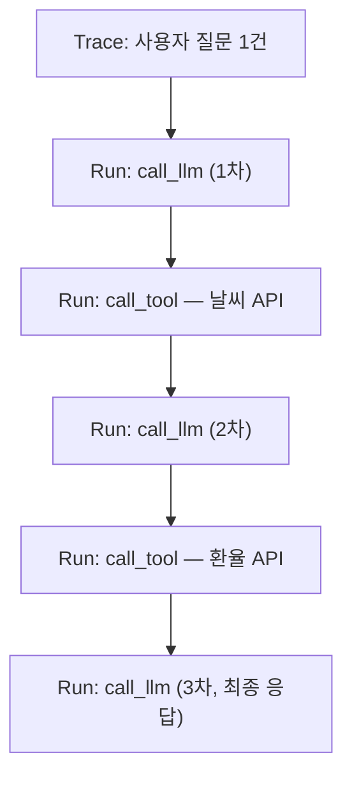

[LangGraph 글](/blog/langgraph-state-graph-cycles)에서 다룬 에이전트 루프를 다시 떠올려보자. `call_llm → call_tool → call_llm → ...`이 조건에 따라 몇 번이고 반복될 수 있는 구조였다. 이 코드를 짜고 나면 자연스럽게 궁금해지는 게 있다 — **실제로 실행했을 때 이 루프가 몇 번 돌았는지, 각 단계에서 LLM이 정확히 뭘 받고 뭘 반환했는지, 왜 하필 그 도구를 호출하기로 판단했는지**는 코드를 아무리 다시 읽어도 알 수 없다는 점이다. 일반적인 프로그램이라면 디버거로 한 줄씩 실행하며 변수를 찍어보면 되지만, LLM 호출은 그 자체가 매번 다른 결과를 낼 수 있는 비결정적 블랙박스라 "다시 실행해서 재현"하는 것도 보장이 안 된다. 이 틈을 메우기 위한 도구가 LangSmith다.

## 왜 평범한 로그로는 부족한가

`print`나 로거로 각 단계의 입출력을 찍는 것도 방법이긴 하다. 그런데 LangGraph처럼 노드가 순환하는 구조에서는 이 방식이 금방 한계에 부딪힌다.

- 로그 줄은 시간 순서로만 나열되지, **어느 노드의 몇 번째 반복에서 나온 로그인지** 구조적으로 보여주지 않는다. 루프가 5번 돌면 같은 노드의 로그가 5번 뒤섞여 찍힌다.
- 토큰 사용량·지연시간(latency)처럼 "이 LLM 호출 하나가 얼마나 비쌌는가"를 보려면 로그에 일일이 타이머와 토큰 카운터를 심어야 한다.
- 체인이 여러 단계로 깊어지면(리트리버 → 프롬프트 → LLM → 파서) 그 전체를 하나의 실행 단위로 묶어서 "이 요청 하나가 총 몇 초, 몇 토큰 들었는가"를 보기가 어려워진다.

LangSmith는 이 문제를 로그가 아니라 **트레이스(trace)** 단위로 접근한다. 하나의 요청이 들어오면, 그 안에서 호출되는 모든 체인·노드·LLM 호출·도구 호출이 부모-자식 관계를 가진 트리 구조로 자동 기록된다.



이 트리 하나만 열어보면 "루프가 몇 번 돌았는지", "각 단계가 몇 ms 걸렸는지", "어느 단계에서 토큰을 가장 많이 썼는지"가 한눈에 보인다. 코드 위에서 조건문(`should_continue`)을 아무리 들여다봐도 알 수 없던 걸, 실행 결과를 직접 관측해서 얻는 것이다.

## 트레이싱은 코드를 거의 안 건드리고 켜진다

LangChain·LangGraph로 짠 코드는 이미 내부적으로 각 컴포넌트(Runnable)를 계측 가능한 단위로 다루고 있어서, 트레이싱을 켜는 데 코드 변경이 거의 필요 없다. 환경 변수만 설정하면 된다.

```bash
export LANGCHAIN_TRACING_V2=true
export LANGCHAIN_API_KEY="ls__..."
export LANGCHAIN_PROJECT="dear-me-letter-pipeline"
```

```python
# 코드는 그대로다 — LangGraph 노드를 부르는 코드 자체는 바뀌지 않는다
app = graph.compile()
result = app.invoke({"messages": [user_message]})
# 이 한 번의 invoke가 위 그림 같은 트레이스 트리 하나로 LangSmith에 기록된다
```

`call_llm`, `call_tool` 같은 개별 노드 함수를 트레이싱 전용 코드로 감쌀 필요가 없다는 점이 중요하다. LangGraph의 노드도, LCEL 체인의 각 구성요소도 이미 LangChain의 실행 인터페이스(Runnable) 위에서 동작하기 때문에, 환경 변수 하나로 그 실행 경계마다 자동으로 트레이스 구간이 생긴다.

## 관측만으로는 안 끝난다 — "이 답변이 좋은 답변인가"

트레이싱이 "무슨 일이 일어났는가"를 보여준다면, 평가(Evaluation)는 "그 결과가 괜찮은가"를 판단하는 영역이다. 이게 전통적인 소프트웨어 테스트와 근본적으로 다른 지점이 있다.

일반적인 단위 테스트는 `assert result == expected`처럼 정답이 하나로 고정돼 있다. 그런데 LLM이 생성한 답변은 표현이 매번 달라질 수 있어서, 문자열이 정확히 같은지 비교하는 방식으로는 "틀렸다"고 잘못 판정하는 경우가 대부분이다. 그래서 LangSmith의 평가는 보통 **LLM 자신에게 판단을 맡기는 방식(LLM-as-judge)**을 쓴다.

```python
from langsmith.evaluation import evaluate

def correctness_judge(run, example) -> dict:
    """생성된 답변이 기준 답변과 같은 의미를 담고 있는지, 별도 LLM에게 채점을 맡긴다"""
    judgment = judge_llm.invoke(
        f"질문: {example.inputs['question']}\n"
        f"기준 답변: {example.outputs['answer']}\n"
        f"생성된 답변: {run.outputs['answer']}\n"
        f"생성된 답변이 기준 답변과 같은 의미를 전달하면 1, 아니면 0으로만 답하라."
    )
    return {"key": "correctness", "score": int(judgment.content.strip())}

results = evaluate(
    lambda inputs: app.invoke({"messages": [inputs["question"]]}),
    data="qa-regression-dataset",  # 미리 만들어둔 (질문, 기준 답변) 데이터셋
    evaluators=[correctness_judge],
)
```

이 구조의 실익은 **프롬프트나 모델을 바꿀 때마다 회귀(regression)를 자동으로 잡아낼 수 있다는 것**이다. 데이터셋에 있는 질문들을 새 프롬프트로 다시 돌려서 채점만 하면, "이번 수정이 기존에 잘 되던 케이스를 망가뜨리지 않았는가"를 사람이 일일이 눈으로 비교하지 않아도 확인할 수 있다.

## 한계 — 관측과 평가가 문제를 대신 풀어주지는 않는다

- **LLM-as-judge 자체가 비결정적이다.** 채점하는 LLM도 매번 똑같이 판단한다는 보장이 없고, 채점 기준(프롬프트)을 어떻게 짜느냐에 따라 관대해지거나 엄격해질 수 있다. "평가를 또 다른 LLM에게 맡긴다"는 구조는 문제를 없앤 게 아니라 한 단계 위임한 것에 가깝다.
- **트레이스에는 실제 요청·응답 내용이 그대로 남는다.** [LangChain structured output으로 PII 마스킹을 다룬 글](/blog/langchain-structured-output-pii-masking)에서 다룬 것처럼, 개인정보가 포함된 대화라면 그 원문이 외부 관측 서비스(LangSmith SaaS)로 전송되는 것 자체가 별도로 검토해야 할 문제다. 민감한 도메인이라면 셀프호스팅이나 트레이스 필드 마스킹 같은 조치가 트레이싱 도입과 같이 논의돼야 한다.
- **트레이스를 보는 것과 원인을 고치는 것은 다른 일이다.** LangSmith는 "3번째 LLM 호출에서 이상한 답이 나왔다"는 사실을 보여줄 뿐, 그게 프롬프트 문제인지 리트리버가 부실한 문서를 가져온 탓인지는 사람이 트레이스를 읽고 판단해야 한다. 관측 도구는 문제를 보이게 해줄 뿐, 진단과 수정은 여전히 사람의 몫이다.

## 정리

- 로그는 시간 순서로만 쌓이지만, LangSmith의 트레이스는 노드 간 부모-자식 관계를 유지한 트리로 기록돼서 LangGraph처럼 순환하는 실행도 구조적으로 파악할 수 있다.
- LangChain·LangGraph 코드가 이미 Runnable 인터페이스로 계측 가능하게 짜여 있어서, 트레이싱은 노드 코드를 건드리지 않고 환경 변수만으로 켤 수 있다.
- LLM 출력은 문자열 완전 일치로 채점할 수 없어서, LangSmith의 평가는 보통 LLM-as-judge로 "의미가 같은가"를 판단하고, 이를 통해 프롬프트·모델 변경 시 회귀를 자동으로 잡는다.
- 다만 평가자도 비결정적 LLM이라는 한계가 있고, 트레이스에 원문이 그대로 남기 때문에 민감한 데이터를 다룰 땐 별도 검토가 필요하며, 관측 도구는 원인을 대신 찾아주지 않는다 — 결국 트레이스를 읽고 판단하는 건 사람이다.
