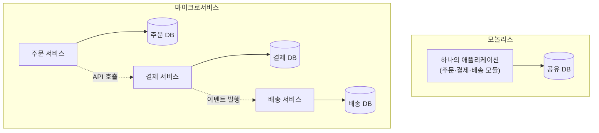
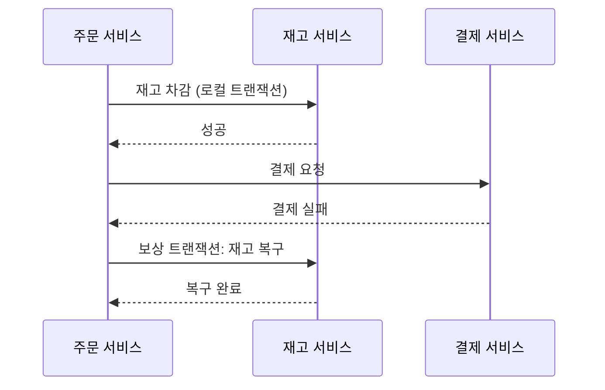
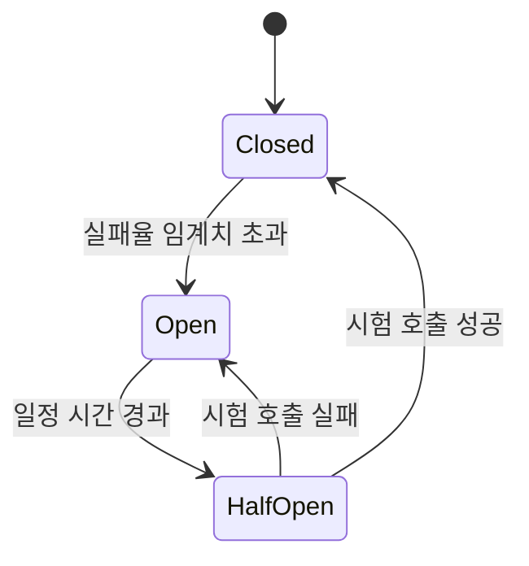

MSA(Microservice Architecture)를 "서비스를 여러 개로 쪼갠 것"이라고만 이해하면 위험하다. 컨테이너를 몇 개로 나누느냐는 결과일 뿐이고, 그 나눔이 몇 가지 원칙을 지키지 않으면 **분산 모놀리스(distributed monolith)** — 여러 개로 쪼갰지만 여전히 서로 강하게 얽혀 있어서, 네트워크 호출 오버헤드만 추가된 상태 — 가 되기 쉽다.

## 모놀리스 vs 마이크로서비스

- **모놀리스(Monolith)**: 하나의 코드베이스, 하나의 배포 단위, 보통 하나의 데이터베이스를 여러 모듈이 함께 쓴다. 배포가 단순하고 트랜잭션 관리가 쉽지만, 코드베이스가 커질수록 빌드·배포·테스트가 전부 느려지고, 한 모듈의 변경이 전체 재배포를 요구한다.
- **마이크로서비스(Microservice)**: 기능 단위로 서비스를 쪼개서 각각 독립적으로 개발·배포·확장한다. 팀 단위 자율성과 부분 확장(트래픽이 몰리는 서비스만 스케일 아웃)이 가능해지지만, 그 대가로 분산 시스템 특유의 복잡성(네트워크 장애, 데이터 일관성, 운영 부담)을 떠안는다.

## MSA를 MSA답게 만드는 원칙

- **비즈니스 능력(business capability) 기준 경계** — "주문", "결제", "배송"처럼 도메인 단위로 나눠야지, 그냥 기술적으로 편해서 나누면 안 된다. 이 경계를 잘못 그으면 서비스 하나를 위한 작업이 다른 서비스 코드까지 건드리게 된다.
- **독립적으로 배포 가능** — 서비스 A를 배포할 때 서비스 B를 같이 재배포할 필요가 없어야 한다. 이게 안 되면 "여러 개인데 항상 같이 배포되는" 상태가 된다.
- **Database per Service** — 각 서비스는 자기 데이터를 자기가 소유한다. 다른 서비스의 데이터가 필요하면 그 서비스의 API를 호출해야지, 테이블을 직접 조인하면 안 된다. 이걸 어기면 한 서비스의 스키마 변경이 다른 서비스를 깨뜨리는, MSA가 없애려던 바로 그 결합이 다시 생긴다.
- **네트워크를 통한 통신** — 함수 호출이 아니라 REST/gRPC 같은 동기 호출이나, 메시지 큐를 통한 비동기 이벤트로 통신한다.
- **장애 격리** — 한 서비스가 죽어도 다른 서비스는 (적어도 부분적으로는) 계속 동작해야 한다.

이 중 하나라도 빠지면, 겉보기엔 MSA인데 실제로는 "쪼개기만 한 모놀리스"가 된다 — 서비스 여러 개를 함께 배포해야 하고, DB 스키마 하나가 전체에 영향을 주는 상태다.

## 통신 패턴 — 동기 vs 비동기

서비스 간 통신 방식을 어떻게 고르느냐가 결합도를 크게 좌우한다.

- **동기 호출(REST/gRPC)** — A가 B를 호출하고 응답을 기다린다. 구현이 직관적이지만, B가 느려지거나 죽으면 그 영향이 곧바로 A로 전파된다(cascading failure). 서비스가 여러 단계로 체이닝되면(A→B→C) 가장 느린 서비스의 지연이 전체에 누적된다.
- **비동기 메시징(메시지 큐/이벤트)** — A가 이벤트를 큐에 발행하고, B는 자기 속도로 그 이벤트를 소비한다. B가 잠깐 죽어 있어도 이벤트는 큐에 쌓여 있다가 나중에 처리되므로 장애가 전파되지 않는다. 대신 "지금 이 순간 B가 처리를 끝냈는가"를 보장할 수 없는 **최종 일관성**(eventual consistency)을 감수해야 한다.

실무에서는 즉시 응답이 필요한 조회는 동기로, 여러 서비스에 걸친 후속 처리(알림 발송, 통계 집계 등)는 비동기로 나누는 식으로 섞어 쓰는 경우가 많다.

## 데이터 일관성 — Saga 패턴

Database per Service를 지키면 골치 아픈 문제가 하나 생긴다. "주문 생성 + 재고 차감 + 결제"처럼 여러 서비스에 걸친 작업을 하나의 트랜잭션으로 묶을 수가 없다 — 각 서비스가 자기 DB만 갖고 있으니 전통적인 분산 트랜잭션(2PC, Two-Phase Commit)은 MSA 환경에서 성능·가용성 이유로 잘 쓰지 않는다.

대신 쓰는 게 **Saga 패턴**이다. 전체 작업을 여러 개의 로컬 트랜잭션으로 쪼개고, 각 단계마다 실패했을 때 되돌리는 **보상 트랜잭션**(compensating transaction)을 함께 정의한다. 예를 들어 "재고 차감 → 결제 → 배송 시작" 순서로 진행하다가 결제가 실패하면, 이미 실행된 "재고 차감"을 취소하는 보상 트랜잭션("재고 복구")을 실행해서 전체를 일관된 상태로 되돌린다. 분산 트랜잭션의 강한 원자성 대신, "실패하면 되돌리는 절차"를 애플리케이션 레벨에서 직접 설계하는 셈이다.

## 장애 전파 차단 — Circuit Breaker

동기 호출을 쓰는 이상 장애 전파 위험은 남는다. 이를 완화하는 대표적인 패턴이 **서킷 브레이커**(Circuit Breaker)다. 전기 회로 차단기와 같은 개념으로, 특정 서비스 호출이 일정 비율 이상 실패하면 회로를 "열어서"(open) 이후 요청은 아예 그 서비스를 호출하지 않고 즉시 실패 처리하거나 대체 응답(fallback)을 준다. 일정 시간이 지나면 회로를 "반쯤 열어"(half-open) 몇 개만 시험 삼아 호출해보고, 성공하면 다시 닫는다(closed). 죽어가는 서비스에 요청을 계속 쏟아부어 상황을 악화시키는 대신, 빠르게 실패하고 회복할 시간을 벌어주는 방식이다.

## 정리

- MSA는 "컨테이너를 여러 개로 나누는 것"이 아니라 비즈니스 능력 기준 경계·독립 배포·자체 데이터 소유·네트워크 통신·장애 격리라는 원칙을 지키는 것이다. 이 원칙 없이 나누기만 하면 분산 모놀리스가 된다.
- 동기 호출은 구현이 쉽지만 장애를 전파시키고, 비동기 메시징은 결합도를 낮추는 대신 최종 일관성을 감수해야 한다 — 이 트레이드오프를 이해하고 상황에 맞게 섞어 써야 한다.
- Database per Service를 지키면 여러 서비스에 걸친 트랜잭션을 못 쓰게 되는데, 이 문제는 Saga 패턴(로컬 트랜잭션 + 보상 트랜잭션)으로 우회한다.
- 서킷 브레이커 같은 장애 격리 패턴 없이 서비스만 쪼개면, 한 서비스의 장애가 동기 호출 체인을 타고 전체로 퍼질 수 있다.
- MSA 도입 여부는 "서비스를 몇 개로 쪼갤까"가 아니라 "이 서비스들이 서로 다른 팀이, 다른 주기로, 독립적으로 배포해야 하는가"라는 질문에서 출발해야 한다.
