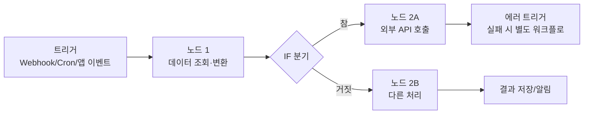

사내 자동화 요청은 늘 비슷한 패턴을 띤다. "이 폼에 응답 오면 슬랙에 알려줘", "매일 아침 리포트를 뽑아서 이메일로 보내줘", "이 API 결과를 받아서 DB에 저장하고 이상하면 알림 보내줘". 코드로 짜면 몇 시간이면 끝날 일이지만, 문제는 이런 요청이 하루에도 여러 건씩 들어오고, 대부분 일회성이거나 요구사항이 자주 바뀐다는 점이다. **n8n**은 이런 "코드로 짜기엔 아깝고, 노코드 SaaS로 하기엔 제약이 많은" 자동화 영역을 채우는 오픈소스 워크플로 자동화 툴이다.

## n8n이 뭔가

n8n(발음은 "n-eight-n". "nodemation"(node + automation을 합친 조어)의 첫 글자 n과 끝 글자 n 사이에 알파벳 8개가 있다는 뜻)은 **노드 기반 워크플로 자동화 플랫폼**이다. 웹 캔버스에서 노드를 드래그해 연결하면 그게 곧 실행 가능한 파이프라인이 된다.

```
[Webhook 트리거] → [HTTP Request: API 호출] → [IF: 조건 분기] → [Slack: 알림 전송]
                                              └─ [Postgres: DB 저장]
```

각 노드는 트리거(워크플로 시작 조건), 액션(외부 서비스 호출), 로직(분기·반복·변환) 중 하나를 맡는다. Zapier·Make(구 Integromat)와 같은 카테고리지만 결정적으로 다른 지점이 셋 있다.

- **오픈소스, 셀프호스팅 가능** — Docker 한 줄로 자체 인프라에 올릴 수 있다. Zapier처럼 실행 횟수·연동 개수마다 과금되는 구조가 아니라, 인프라 비용만 부담하면 무제한에 가깝게 쓸 수 있다.
- **노드마다 코드로 탈출구가 있다** — 막히는 지점마다 "Code" 노드로 떨어져 JavaScript/Python을 직접 짤 수 있다. 노코드 툴 대부분이 "여기까진 되고 그 이상은 안 됨"의 벽에 부딪히는데, n8n은 그 벽 앞에 항상 코드 노드를 열어둔다.
- **데이터가 워크플로 밖으로 안 나간다(셀프호스팅 시)** — SaaS형 자동화 툴은 모든 데이터가 벤더 서버를 거친다. 사내 DB 자격증명이나 고객 PII를 다루는 자동화라면 이 차이가 결정적이다.

## 실행 모델 — 워크플로는 결국 DAG다

n8n 워크플로는 내부적으로 노드와 노드 사이의 연결로 이뤄진 **방향성 비순환 그래프(DAG)**로 실행된다. 트리거 노드가 실행되면 그 출력이 다음 노드의 입력으로 흐르고, 각 노드는 JSON 배열을 받아 JSON 배열을 내보낸다 — 이 "노드 사이를 흐르는 건 JSON 배열"이라는 규약 하나로 어떤 노드든 서로 붙일 수 있다.



트리거 방식은 크게 세 가지다.

| 트리거 유형 | 예시 | 실행 시점 |
|---|---|---|
| Webhook | 폼 제출, 결제 이벤트, GitHub push | 외부 이벤트가 HTTP로 도착하는 즉시 |
| Schedule(Cron) | 매일 09:00 리포트 생성 | 정해진 주기 |
| Poll | Gmail 새 메일, RSS 갱신 확인 | 주기적으로 상태 확인 후 변화 감지 |

이 구조는 [GitHub Actions](/blog/github-actions-aws-oidc-wif)나 Jenkins 같은 CI 파이프라인과 본질적으로 같은 패턴이다 — 이벤트가 파이프라인을 트리거하고, 각 스텝이 이전 스텝의 출력을 받아 처리한다. 차이는 n8n이 코드 스텝보다 "미리 만들어진 400개+ 서비스 연동 노드"를 붙이는 데 최적화돼 있다는 점이다.

## 요즘 왜 다시 뜨는가 — AI 에이전트 오케스트레이션 도구로의 전환

n8n은 원래 "Zapier의 오픈소스 대안"으로 알려졌지만, 최근 관심이 폭증한 이유는 따로 있다. **LLM 워크플로를 조립하는 도구**로 포지션을 옮기면서다.

- **AI Agent 노드** — LangChain 기반의 에이전트 노드를 기본 제공한다. LLM(OpenAI, Anthropic, 로컬 Ollama 등)을 붙이고, 그 옆에 "Tool"로 다른 n8n 노드(HTTP 요청, DB 조회, 코드 실행)를 연결하면 그 자체로 함수 호출이 가능한 에이전트가 된다. [LangChain/LangGraph로 직접 오케스트레이션을 짜는 글](/blog/langchain-rag-orchestration)에서 다룬 것과 같은 패턴을, 코드 없이 캔버스 위에서 구성하는 셈이다.
- **MCP(Model Context Protocol) 지원** — n8n이 MCP 서버 역할도, 클라이언트 역할도 할 수 있게 되면서 Claude 같은 외부 에이전트가 n8n 워크플로를 "도구"로 호출하거나, 반대로 n8n 워크플로 안에서 다른 MCP 서버의 도구를 가져다 쓸 수 있다.
- **RAG 파이프라인 조립** — 문서를 쪼개고(Text Splitter 노드), 임베딩하고(Embeddings 노드), 벡터 DB에 넣는(Pinecone/Qdrant/pgvector 노드) 과정을 캔버스에서 이어붙일 수 있다. [pgvector 유사도 검색 글](/blog/pgvector-community-similarity-search)에서 짚은 파이프라인 단계들이 그대로 노드로 대응된다.
- **비개발자와 개발자의 협업 지점** — 기획자·운영팀이 캔버스에서 워크플로 뼈대를 만들고, 복잡한 로직만 개발자가 Code 노드로 채워 넣는 협업이 실제로 자주 일어난다. "프로토타입은 n8n으로, 트래픽이 커지면 코드로 이관"하는 흐름도 흔한 채택 이유다.

정리하면, 종전에는 "반복 업무 자동화 툴"이었다면, 지금은 여기에 "LLM 에이전트를 빠르게 조립하고 시각적으로 디버깅하는 도구"라는 축이 하나 더 붙었다. 에이전트 워크플로는 프롬프트·툴 호출·분기 로직이 뒤섞여 코드만으로는 흐름을 한눈에 보기 어려운데, n8n 캔버스는 그 흐름을 그래프로 보여주고 각 노드의 입출력을 실행 시점에 그대로 확인할 수 있어 디버깅이 빠르다.

## 실무에서 흔한 사용 패턴

- **내부 도구 접착제(Glue)** — Slack, Notion, Jira, Google Sheets처럼 서로 API가 다른 SaaS를 이어 붙이는 사내 자동화. "Jira 티켓이 특정 상태로 바뀌면 Slack 채널에 알리고 Notion 문서를 갱신"류의 워크플로가 전형적이다.
- **알림·모니터링 보조** — 외부 API 상태를 주기적으로 폴링하다 임계치를 넘으면 Slack/이메일로 알림. 정식 옵저버빌리티 스택([EKS 관측 플랫폼](/blog/eks-multi-cluster-observability-platform) 같은)을 대체하진 않지만, 그 정도 투자가 아까운 소규모 체크에 적합하다.
- **AI 에이전트 프로토타입** — 고객 문의를 분류해 담당 팀에 라우팅하거나, 문서를 요약해 요약본을 슬랙에 올리는 등 LLM 호출 + 도구 호출이 섞인 워크플로의 초기 버전을 빠르게 만들어 검증한다.
- **ETL 라이트(Lite)** — 정식 데이터 파이프라인 툴(Airflow 등)을 놓기엔 과한, 소규모·저빈도 데이터 이관 작업.

## 언제 n8n이 안 맞는가

- **초당 수백~수천 건 규모의 고빈도 처리** — 워크플로 엔진 특성상 노드 하나하나가 오버헤드를 가지므로, 진짜 고성능 스트림 처리에는 [Kafka/RabbitMQ 같은 메시지 브로커](/blog/kafka-rabbitmq-redis-comparison)나 전용 코드가 맞다.
- **복잡한 상태 관리·재시도 로직이 핵심인 파이프라인** — 워크플로가 복잡해질수록 캔버스는 오히려 가독성이 떨어진다. 이 지점을 넘어서면 코드 기반 오케스트레이션([LangGraph의 상태 그래프](/blog/langgraph-state-graph-cycles) 같은)이 유지보수하기 더 쉽다.
- **버전 관리·리뷰가 엄격해야 하는 프로덕션 배포 파이프라인** — 워크플로가 JSON으로 export/import는 되지만, Git 기반 코드 리뷰·CI 게이트만큼 엄격한 변경 관리 체계를 기본 제공하진 않는다. 자체적으로 Git 연동(워크플로를 Git에 커밋)을 붙이는 방식으로 보완하는 경우가 많다.

## 정리

| 질문 | 답 |
|---|---|
| n8n이란 | 노드 기반 오픈소스 워크플로 자동화 플랫폼. Zapier/Make류와 같은 카테고리, 셀프호스팅과 코드 탈출구가 차별점 |
| 실행 모델 | 트리거(Webhook/Cron/Poll)로 시작해 노드 사이를 JSON으로 주고받는 DAG |
| 왜 요즘 다시 뜨는가 | AI Agent 노드 + MCP 지원으로 LLM 에이전트 워크플로를 시각적으로 조립하는 도구가 됨 |
| 잘 맞는 곳 | 사내 SaaS 접착제, 경량 알림·모니터링, AI 에이전트 프로토타이핑, 소규모 ETL |
| 안 맞는 곳 | 고빈도 스트림 처리, 복잡한 상태 관리가 핵심인 파이프라인, 엄격한 버전 관리가 필요한 프로덕션 배포 |

한 줄 요약: **n8n은 "코드 짜기엔 아깝고 SaaS 노코드 툴로는 제약이 많은" 자동화 영역을 채우던 도구였는데, AI Agent 노드와 MCP 지원이 붙으면서 LLM 오케스트레이션을 캔버스 위에서 빠르게 조립하고 눈으로 디버깅하는 도구로 확장됐다.**
