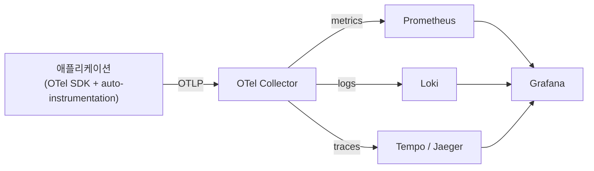

## 왜 OpenTelemetry가 필요한가

[Kubernetes 관측 스택](/blog/kubernetes-observability-prometheus-loki) 글에서 Metrics는 Prometheus, Logs는 Loki가 담당한다고 정리했고, Traces는 다루지 않고 넘겼다. Traces가 필요한 이유는 분명하다. 요청 하나가 Ingress → Service A → Service B → DB를 거치는 구조에서, "전체 응답이 왜 느려졌는가"는 각 파드의 메트릭·로그를 따로 보는 것만으로는 답이 잘 안 나온다. 어느 구간에서 시간이 소요됐는지를 요청 단위로 이어 붙여서 봐야 한다. 이게 **분산 추적(Distributed Tracing)**이고, Traces가 답하는 질문이다.

문제는 Traces를 붙이려고 하면 계측(instrumentation) 방식이 벤더마다 달랐다는 점이다. Jaeger를 쓰려면 Jaeger 클라이언트로 계측하고, Zipkin을 쓰려면 Zipkin 포맷으로 계측해야 했다. 나중에 백엔드를 바꾸려면 애플리케이션 코드의 계측 부분을 다시 다 고쳐야 했다. **OpenTelemetry(OTel)**는 이 문제를 "계측은 벤더 중립적인 표준으로 한 번만 하고, 어디로 보낼지는 나중에 설정으로 바꾸자"는 방향으로 푼다. OpenTracing과 OpenCensus라는 두 개의 경쟁하던 표준이 합쳐져서 만들어진 CNCF 프로젝트다.

## OTel이 다루는 세 가지 신호

OTel은 Traces뿐 아니라 Metrics, Logs까지 세 신호를 모두 같은 프레임워크 안에서 표준화한다.

- **Traces** — 요청 하나가 여러 서비스를 거치는 전체 경로. 가장 OTel이 강조하는 영역이다.
- **Metrics** — Prometheus와 호환되는 방식으로 숫자 시계열을 수집·노출할 수 있다.
- **Logs** — 아직 세 신호 중 가장 늦게 표준화됐지만, trace_id를 로그 라인에 자동으로 붙여서 로그와 트레이스를 연결하는 게 핵심 목표다.

세 신호를 하나의 표준으로 묶는 이유는 단순히 통일성 때문이 아니라, **서로를 연결하기 위해서**다. 메트릭 그래프에서 이상 구간을 발견하면 그 구간의 트레이스로 바로 넘어가고, 트레이스에서 에러가 난 스팬을 발견하면 그 순간의 로그로 바로 넘어가는 식으로 세 신호가 같은 `trace_id`/`span_id`를 공유해야 이런 이동이 가능하다.

## 핵심 개념: Span과 Trace

- **Span** — 하나의 작업 단위. "Service B가 DB 쿼리를 실행한 구간" 같은 게 하나의 span이다. 시작 시간, 종료 시간, 태그(속성), 그리고 부모 span에 대한 참조를 갖는다.
- **Trace** — 하나의 요청을 처리하는 동안 생성된 span들의 묶음. 여러 서비스를 거치면 여러 span이 만들어지고, 이들이 부모-자식 관계로 엮여서 하나의 트레이스 트리를 이룬다.
- **Context Propagation** — 서비스 A가 서비스 B를 호출할 때, 지금 처리 중인 trace_id를 HTTP 헤더(W3C Trace Context 표준의 `traceparent` 헤더)에 실어서 넘긴다. B는 이 헤더를 읽어서 자신이 만드는 span을 같은 트레이스에 이어 붙인다. 이 전파가 끊기면 트레이스가 거기서 잘려서 별개의 트레이스처럼 보인다.

```
traceparent: 00-4bf92f3577b34da6a3ce929d0e0e4736-00f067aa0ba902b7-01
             │  └─ trace-id (16바이트)      └─ parent span-id (8바이트)
             └─ version
```

## 구성 요소: API/SDK, Instrumentation, Collector

OTel은 크게 세 부분으로 나뉜다.

1. **API/SDK** — 애플리케이션 코드에서 span을 만들고 속성을 붙이는 표준 인터페이스. 언어별로 구현체가 있다(Java, Go, Python, Node.js 등).
2. **Instrumentation** — 실제로 span을 만드는 코드. 프레임워크(Express, Spring, FastAPI 등)에 대해 **자동 계측(auto-instrumentation)** 라이브러리가 이미 나와 있어서, 코드를 거의 안 건드리고도 HTTP 요청·DB 쿼리 단위로 span이 자동 생성되게 할 수 있다. 세밀한 구간을 보고 싶으면 수동으로 span을 추가한다.
3. **Collector** — 애플리케이션에서 나온 텔레메트리 데이터를 받아서, 가공하고, 원하는 백엔드로 내보내는 별도 프로세스. 애플리케이션은 백엔드가 Jaeger인지 Tempo인지 몰라도 되고, Collector 설정만 바꾸면 내보내는 대상을 바꿀 수 있다.

## OTel Collector: receivers → processors → exporters

Collector 설정은 파이프라인 형태로 선언한다.

```yaml
receivers:
  otlp:
    protocols:
      grpc:
      http:

processors:
  batch: {}
  memory_limiter:
    limit_mib: 512

exporters:
  otlp/tempo:
    endpoint: tempo:4317
  prometheus:
    endpoint: 0.0.0.0:8889
  loki:
    endpoint: http://loki:3100/loki/api/v1/push

service:
  pipelines:
    traces:
      receivers: [otlp]
      processors: [batch, memory_limiter]
      exporters: [otlp/tempo]
    metrics:
      receivers: [otlp]
      processors: [batch]
      exporters: [prometheus]
    logs:
      receivers: [otlp]
      processors: [batch]
      exporters: [loki]
```

- **receivers** — 데이터를 어떻게 받을지. `otlp`는 OTel의 표준 프로토콜(OTLP)로, gRPC나 HTTP로 애플리케이션이 직접 push한다.
- **processors** — 받은 데이터를 내보내기 전에 가공한다. `batch`는 건건이 보내지 않고 모아서 보내 네트워크 오버헤드를 줄이고, `memory_limiter`는 Collector 자체가 메모리를 과하게 먹지 않도록 막는다.
- **exporters** — 최종적으로 어디로 보낼지. 같은 트레이스 데이터라도 Tempo·Jaeger·Zipkin 중 원하는 곳으로 보내도록 바꿀 수 있고, 신호별로 다른 백엔드(트레이스는 Tempo, 메트릭은 Prometheus, 로그는 Loki)로 나눠 보낼 수도 있다.

K8s 환경에서는 Collector를 두 가지 방식으로 배포한다. 각 노드에 **DaemonSet**으로 떠서 그 노드의 애플리케이션 데이터를 1차로 받는 agent 역할, 그리고 여러 agent의 데이터를 모아 처리하는 중앙 **gateway** 역할로 나눠서 배치하는 게 일반적이다.

## 기존 Prometheus·Loki 스택에 어떻게 끼워 넣나



중요한 건 OTel이 Prometheus·Loki를 대체하는 게 아니라 **앞단의 계측·수집 레이어를 표준화**한다는 점이다. Metrics는 여전히 Prometheus가 저장하고, Logs는 여전히 Loki가 저장한다. 달라지는 건 애플리케이션이 데이터를 만드는 방식과, 그 데이터에 `trace_id`가 일관되게 따라붙는다는 점이다. Grafana에서 메트릭 그래프의 특정 지점을 클릭하면 그 시점의 트레이스로(exemplar 기능), 트레이스의 특정 스팬에서 바로 그 시점의 로그로 넘어가는 식의 연결이 이걸로 가능해진다.

## 도입 전후로 뭐가 달라지는가

- **계측 코드의 재사용성** — Jaeger 클라이언트로 직접 계측했다면 백엔드를 바꿀 때 애플리케이션 코드를 다시 고쳐야 한다. OTel로 계측하면 Collector의 exporter 설정만 바꾸면 된다.
- **신호 간 연결** — 기존에는 메트릭·로그·트레이스가 각자 다른 라벨링 방식을 썼다면, OTel은 처음부터 `trace_id`를 공통 키로 세 신호를 엮도록 설계돼 있다.
- **운영 부담** — Collector라는 컴포넌트가 하나 더 늘어난다. 다만 애플리케이션이 백엔드에 직접 데이터를 쏘지 않고 Collector를 거치기 때문에, 백엔드 장애나 배치 처리 부하가 애플리케이션에 바로 전파되지 않는 버퍼 역할도 한다.

## 정리

- OpenTelemetry는 Traces·Metrics·Logs 계측을 벤더 중립적인 표준으로 통일해서, 계측 코드를 바꾸지 않고도 백엔드를 교체할 수 있게 한다.
- Span은 작업 단위, Trace는 하나의 요청이 만든 span들의 묶음이며, 서비스 간에는 `traceparent` 헤더로 trace_id를 전파해서 트레이스를 이어 붙인다.
- OTel Collector는 receiver(수신) → processor(가공) → exporter(전송) 파이프라인으로 동작하며, 신호별로 다른 백엔드(Tempo, Prometheus, Loki)로 나눠 보낼 수 있다.
- 기존 Prometheus·Loki·Grafana 스택을 대체하는 게 아니라, 그 앞단의 계측·수집을 표준화하고 세 신호를 `trace_id`로 연결해주는 레이어다.
