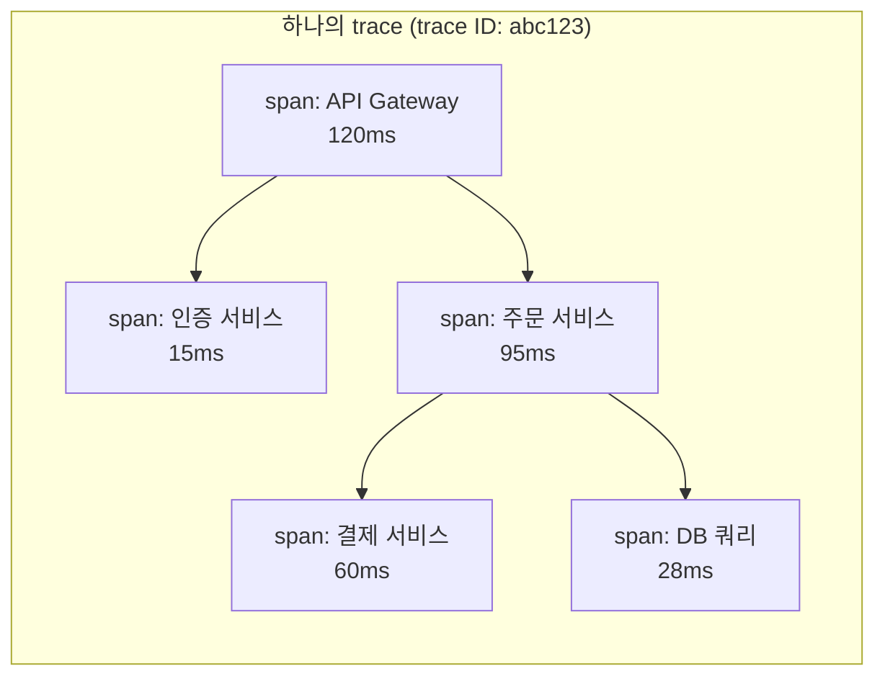

[Prometheus·Loki로 관측 스택을 만든 글](/blog/kubernetes-observability-prometheus-loki)에서 관측의 세 축을 Metrics·Logs·Traces로 나누고 "Traces는 Jaeger/Tempo가 담당하는데 이 글에서는 다루지 않는다"고 미뤄뒀다. 이번 글이 그 축을 채운다.

## 메트릭·로그만으로 안 보이는 것

Prometheus로 "이 서비스 p99 레이턴시가 튀었다"는 걸 감지하고, Loki로 "그 시간대 이 파드에서 에러 로그가 찍혔다"까지는 확인했다고 하자. 그런데 요청 하나가 API 게이트웨이 → 인증 서비스 → 주문 서비스 → 결제 서비스 → DB를 순서대로 거치는 구조라면, 다음 질문에 메트릭·로그만으로는 답하기 어렵다.

- **이 느린 요청이 정확히 어느 서비스, 어느 함수 구간에서 시간을 잡아먹었나?** 각 서비스의 평균 레이턴시는 정상인데, 특정 요청 하나만 느릴 수 있다 — 평균은 이런 개별 사례를 숨긴다.
- **여러 서비스에 걸쳐 찍힌 로그들이 같은 요청에 속하는지 어떻게 아나?** 서비스 A의 로그와 서비스 B의 로그를 시간만으로 짝지으면, 비슷한 시간에 들어온 다른 요청과 섞여버린다.

**분산 트레이싱(Distributed Tracing)**은 요청 하나에 고유한 **trace ID**를 부여하고, 그 요청이 거치는 모든 서비스·함수 호출 구간(**span**)에 같은 trace ID를 실어 나른다. 그러면 "이 trace ID의 전체 호출 트리"를 한 번에 그릴 수 있고, 어느 span이 전체 시간의 대부분을 차지했는지 바로 보인다.



이 트리를 보면 전체 120ms 중 주문 서비스가 95ms를 쓰고, 그중 결제 서비스 호출이 60ms — 즉 "느린 게 DB가 아니라 결제 서비스 호출 대기"라는 게 바로 드러난다. 로그를 서비스별로 따로 열어보며 시간을 맞춰보던 걸 트리 하나로 대체하는 셈이다.

## OpenTelemetry — "계측을 어떻게 할 것인가"의 표준

**OpenTelemetry**(약칭 OTel)는 트레이스를 저장하는 백엔드가 아니라, **애플리케이션에서 트레이스·메트릭·로그를 어떻게 생성하고 전송할지에 대한 벤더 중립 표준**이다. CNCF 프로젝트로, OpenTracing과 OpenCensus라는 두 경쟁 표준이 통합되면서 생겼다. 구성 요소는 크게 넷이다.

| 구성 요소 | 역할 |
|---|---|
| **API** | 언어별로 "span을 시작한다", "속성을 붙인다" 같은 계측 코드를 작성하는 인터페이스 |
| **SDK** | API 호출을 실제로 처리해 span을 만들고 배치·샘플링해서 내보내는 구현체 |
| **Collector** | 애플리케이션과 백엔드 사이에 두는 별도 프로세스 — 수신·가공·라우팅 담당 |
| **OTLP** | OpenTelemetry Protocol. 계측 데이터를 전송하는 표준 포맷/프로토콜(gRPC, HTTP) |

핵심은 **계측 코드가 특정 백엔드를 몰라도 된다**는 점이다. 애플리케이션은 OTel SDK로 span만 만들어 OTLP로 내보내면 되고, 그걸 Tempo로 보낼지 Jaeger로 보낼지 Datadog으로 보낼지는 Collector 설정에서 결정한다. 벤더를 바꿔도 애플리케이션 코드는 그대로 둘 수 있다는 게 [GitHub Actions OIDC 글](/blog/github-actions-aws-oidc-wif)에서 다룬 "구조를 표준화해서 특정 구현체에 묶이지 않게 한다"는 원칙과 같은 방향이다.

```python
from opentelemetry import trace

tracer = trace.get_tracer("order-service")

def process_order(order_id):
    with tracer.start_as_current_span("process_order") as span:
        span.set_attribute("order.id", order_id)
        with tracer.start_as_current_span("charge_payment"):
            charge_result = payment_client.charge(order_id)
        with tracer.start_as_current_span("db.save_order"):
            db.save(order_id)
```

`with tracer.start_as_current_span(...)`으로 감싼 구간이 하나의 span이 되고, 중첩된 span은 자동으로 부모-자식 관계를 갖는다. 별도 서비스 호출(HTTP, gRPC)에서는 **context propagation**으로 trace ID를 실어 나른다 — 표준은 W3C Trace Context의 `traceparent` HTTP 헤더다.

```
traceparent: 00-abc123def456...-span789...-01
             │  │                │          │
           버전  trace ID        parent span ID  flags
```

호출자가 이 헤더를 실어 보내고, 수신자가 이 값을 이어받아 자기 span의 부모로 설정하면, 서비스가 몇 개를 거치든 trace ID 하나로 전체 경로가 연결된다.

### Collector — 계측과 백엔드 사이의 완충 지대

애플리케이션이 백엔드로 직접 데이터를 쏘게 하면, 백엔드를 바꿀 때마다 모든 서비스의 설정을 바꿔야 한다. **OTel Collector**를 중간에 두면 이 결합을 끊을 수 있다.

```yaml
receivers:
  otlp:
    protocols:
      grpc:
      http:

processors:
  batch:                 # 개별 전송 대신 묶어서 전송 — 네트워크 오버헤드 감소
  tail_sampling:          # 에러/느린 요청 위주로 샘플링 결정
    policies:
      - name: errors
        type: status_code
        status_code: { status_codes: [ERROR] }
      - name: slow
        type: latency
        latency: { threshold_ms: 500 }

exporters:
  otlp/tempo:
    endpoint: tempo:4317

service:
  pipelines:
    traces:
      receivers: [otlp]
      processors: [batch, tail_sampling]
      exporters: [otlp/tempo]
```

Collector가 있으면 샘플링 정책·필터링·리라우팅을 한곳에서 관리할 수 있고, 백엔드를 Tempo에서 다른 걸로 바꿀 때도 `exporters` 설정만 바꾸면 된다.

## Tempo — "트레이스를 위한 Loki"

**Tempo**는 Grafana Labs가 만든 트레이스 저장소로, 설계 철학이 [Loki 글](/blog/kubernetes-observability-prometheus-loki)에서 다룬 Loki와 정확히 같다. Loki가 로그 본문 전체를 인덱싱하지 않고 라벨에만 인덱스를 걸었듯, Tempo도 **trace ID 하나만 인덱싱**하고 span 데이터 자체는 S3·GCS 같은 오브젝트 스토리지에 그대로 저장한다.

| | Jaeger/Zipkin (전통 방식) | Tempo |
|---|---|---|
| 인덱스 대상 | span의 태그·속성까지 폭넓게 인덱싱 | trace ID만 |
| 저장소 | Elasticsearch/Cassandra 등 별도 DB | 오브젝트 스토리지(S3/GCS/로컬) |
| 검색 방식 | 태그로 자유 검색(`http.status=500`) | trace ID로 직접 조회, 태그 검색은 별도 인덱스(TraceQL) 필요 |
| 운영 부담 | 인덱스 크기가 커서 별도 DB 클러스터 운영 필요 | 인덱스가 가벼워 오브젝트 스토리지 비용만 |

trace ID만 인덱싱한다는 건 "trace ID를 모르면 검색이 안 된다"는 뜻이기도 한데, 실무에서는 trace ID를 몰라도 되는 경우가 대부분이다. 메트릭에서 이상 구간을 찾고, 그 옆에서 바로 해당 trace로 넘어가는 흐름이기 때문이다 — 그 연결 고리가 다음 절의 핵심이다. 최근 버전은 **TraceQL**이라는 쿼리 언어로 `{ span.http.status_code = 500 }` 같은 속성 기반 검색도 지원해 이 제약을 완화하고 있다.

## 세 신호를 trace ID로 엮는다 — Exemplars

관측의 세 축(Metrics·Logs·Traces)이 따로 놀면 반쪽짜리다. Grafana 생태계(Prometheus·Loki·Tempo, 흔히 "Grafana LGTM 스택"이라 부른다)는 이 셋을 trace ID로 서로 점프할 수 있게 엮는다.


- **Exemplar** — Prometheus 메트릭에 "이 값을 만든 실제 요청의 trace ID"를 함께 저장하는 기능이다. p99 레이턴시 그래프에서 튀는 점을 클릭하면, 그 값을 만든 실제 trace로 바로 넘어갈 수 있다. "평균은 정상인데 이 요청만 느렸다"는 개별 사례를 메트릭 그래프에서 곧장 짚어낼 수 있게 해준다.
- **Trace to Logs** — Tempo에서 특정 span을 보다가, 그 span의 시간 범위·trace ID로 Loki 로그를 바로 필터링해서 연다.
- **Logs to Traces** — 반대로 로그 라인에 trace ID가 찍혀 있으면(구조화 로깅 시 `trace_id` 필드를 넣어두면), 그 로그에서 바로 Tempo의 해당 trace로 넘어간다.

이 연결이 되려면 애플리케이션이 로그를 남길 때 현재 span의 trace ID를 함께 기록해야 한다. OTel SDK는 현재 활성 span의 컨텍스트에서 trace ID를 꺼내는 API를 제공하므로, 로깅 미들웨어에서 이 값을 구조화 로그 필드에 넣어주면 된다.

```python
import logging
from opentelemetry import trace

class TraceIdFilter(logging.Filter):
    def filter(self, record):
        span = trace.get_current_span()
        ctx = span.get_span_context()
        record.trace_id = format(ctx.trace_id, "032x") if ctx.is_valid else "-"
        return True
```

## 샘플링 — 트레이스는 전부 저장할 수 없다

트래픽이 조금만 커져도 모든 요청의 모든 span을 저장하는 건 비용이 감당 안 된다. 그래서 일부만 골라 저장하는 **샘플링**이 필수다.

| 방식 | 결정 시점 | 장점 | 단점 |
|---|---|---|---|
| **Head-based** | 요청이 시작되는 순간(예: 1% 확률) | 구현 단순, 애플리케이션 부하 예측 가능 | 나중에 에러가 난 요청이 애초에 샘플링 안 됐을 수 있음 |
| **Tail-based** | 요청이 끝난 뒤, 전체 trace를 보고 결정(Collector가 담당) | 에러·느린 요청을 놓치지 않고 우선 저장 가능 | 모든 span을 일단 Collector까지 모아야 해서 메모리·지연 비용 발생 |

실무에서는 정상 트래픽은 head-based로 낮은 비율(1% 안팎)만 저장하고, Collector의 tail-based 샘플링으로 "에러가 난 trace"와 "임계값보다 느린 trace"는 확률과 무관하게 항상 붙잡는 조합을 많이 쓴다 — 위 Collector 설정 예시의 `tail_sampling` 프로세서가 이 역할이다.

## 언제 도입해야 하나

- **서비스가 하나뿐이거나 호출 경로가 짧다면** 아직은 우선순위가 낮다. Prometheus·Loki만으로 원인 조사가 충분한 경우가 대부분이다.
- **서비스 3개 이상이 하나의 요청을 순차/병렬로 처리하는 구조**([MSA로 넘어가는 시점](/blog/msa-vs-distributed-monolith)과 대체로 겹친다)라면, "느린 게 정확히 어느 구간인가"를 로그 대조만으로 찾는 비용이 빠르게 커진다. 이 시점부터 트레이싱 도입 효과가 뚜렷해진다.
- **레이턴시 SLO를 운영 중이라면** exemplar로 p99를 만든 실제 요청을 즉시 짚어낼 수 있어야 "왜 이번 달 SLO를 못 지켰나"를 사후에 재구성하기 쉽다.

## 정리

| 질문 | 답 |
|---|---|
| 분산 트레이싱이 채우는 빈틈 | 메트릭·로그만으론 안 보이는 "여러 서비스에 걸친 요청 하나의 시간 분포" |
| OpenTelemetry란 | 트레이스·메트릭·로그를 어떻게 생성·전송할지에 대한 벤더 중립 표준(API/SDK/Collector/OTLP) |
| Tempo란 | Loki와 같은 철학의 트레이스 저장소 — trace ID만 인덱싱, span 본문은 오브젝트 스토리지 |
| 세 신호를 어떻게 엮나 | Exemplar(메트릭→trace), trace ID를 로그 필드에 기록(로그↔trace)으로 상호 점프 |
| 트레이스는 전부 저장하나 | 아니다. Head-based로 기본 비율만 저장하고, Collector의 tail-based 샘플링으로 에러·느린 요청은 항상 붙잡는 조합이 일반적 |

한 줄 요약: **OpenTelemetry는 "계측을 어떻게 할 것인가"의 표준이고, Tempo는 그렇게 만든 트레이스를 Loki와 같은 방식으로 가볍게 저장하는 백엔드다. 이 둘이 Prometheus·Loki와 trace ID로 엮이는 순간, 관측의 세 축이 비로소 하나의 조사 흐름으로 이어진다.**
