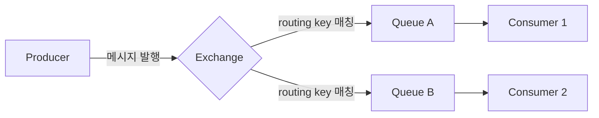
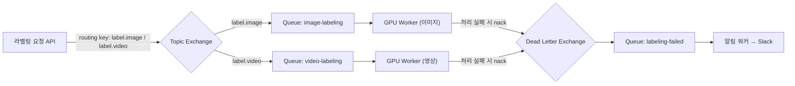

## 왜 서비스 사이에 큐가 필요한가

서비스 A가 서비스 B를 HTTP로 직접 호출하면, A는 B가 응답할 때까지 기다려야 한다. B가 느려지거나 잠깐 죽으면 그 영향이 그대로 A로 전파된다. 이런 동기 호출 방식은 두 서비스를 강하게 결합(coupling)시킨다.

메시지 큐는 그 사이에 중간 지점을 하나 둔다. A는 "이 작업을 처리해달라"는 메시지를 큐에 넣고 바로 다음 일을 하고, B는 자기 속도대로 큐에서 메시지를 꺼내 처리한다. A는 B가 지금 살아있는지, 얼마나 바쁜지 몰라도 된다 — 이 디커플링이 메시지 큐를 쓰는 가장 근본적인 이유다.

## RabbitMQ란 무엇인가

RabbitMQ는 AMQP(Advanced Message Queuing Protocol)를 구현한 오픈소스 메시지 브로커다. Erlang으로 작성돼 있고, 분산 환경에서의 안정성과 메시지 전달 보장(delivery guarantee)에 강점이 있다. 단순히 "메시지를 넣고 빼는 저장소"가 아니라, 메시지를 어떤 규칙으로 어느 큐에 배분할지를 브로커가 직접 결정한다는 점이 특징이다.

## 핵심 구조: Producer → Exchange → Queue → Consumer

RabbitMQ에서 메시지가 흐르는 경로는 항상 이 네 단계를 거친다.



- **Producer** — 메시지를 만들어 보내는 쪽. Queue에 직접 메시지를 넣지 않고, 반드시 Exchange로 보낸다.
- **Exchange** — 들어온 메시지를 어느 Queue로 보낼지 라우팅 규칙에 따라 결정하는 지점. Producer는 Queue의 존재를 몰라도 되고, Exchange만 알면 된다.
- **Queue** — 메시지가 실제로 쌓이는 버퍼. Consumer가 가져갈 때까지 여기서 대기한다.
- **Consumer** — Queue에서 메시지를 꺼내 실제 처리를 하는 쪽.

Producer가 Queue를 직접 모른다는 게 핵심이다. Exchange라는 계층 하나를 더 두었기 때문에, 나중에 라우팅 규칙만 바꾸면 같은 Producer 코드를 건드리지 않고도 메시지를 다른 Queue로, 혹은 여러 Queue로 동시에 보낼 수 있다.

## Exchange 타입 4가지

Exchange가 메시지를 어떤 규칙으로 분배하느냐에 따라 네 종류로 나뉜다.

| 타입 | 라우팅 규칙 | 쓰는 상황 |
|---|---|---|
| Direct | routing key가 정확히 일치하는 Queue로만 전달 | 특정 작업 타입별로 정확히 나눠 처리하고 싶을 때 |
| Fanout | routing key를 무시하고 바인딩된 모든 Queue에 전달 | 하나의 이벤트를 여러 서비스에 동시에 알려야 할 때 (브로드캐스트) |
| Topic | routing key를 패턴(`order.*`, `*.error`)으로 매칭 | 세부 카테고리별로 유연하게 구독 범위를 나누고 싶을 때 |
| Headers | routing key 대신 메시지 헤더 속성으로 매칭 | 라우팅 조건이 문자열 패턴으로 표현하기 어려울 때 |

실무에서 가장 자주 쓰는 건 Direct와 Topic이다. Fanout은 "이 이벤트가 발생했다"를 여러 구독자에게 동시에 뿌려야 하는 알림성 작업에, Headers는 상대적으로 드물게 쓰인다.

## 코드로 보면

Python `pika` 라이브러리로 Direct Exchange를 통해 메시지를 보내고 받는 예제다.

```python
# producer.py
import pika

connection = pika.BlockingConnection(pika.ConnectionParameters(host="localhost"))
channel = connection.channel()

channel.exchange_declare(exchange="tasks", exchange_type="direct")
channel.queue_declare(queue="image_resize", durable=True)
channel.queue_bind(exchange="tasks", queue="image_resize", routing_key="resize")

channel.basic_publish(
    exchange="tasks",
    routing_key="resize",
    body='{"image_id": 42}',
    properties=pika.BasicProperties(delivery_mode=2),  # 메시지를 디스크에 영속화
)
connection.close()
```

```python
# consumer.py
import pika

connection = pika.BlockingConnection(pika.ConnectionParameters(host="localhost"))
channel = connection.channel()

channel.queue_declare(queue="image_resize", durable=True)

def callback(ch, method, properties, body):
    print("received:", body)
    ch.basic_ack(delivery_tag=method.delivery_tag)

channel.basic_qos(prefetch_count=1)
channel.basic_consume(queue="image_resize", on_message_callback=callback)
channel.start_consuming()
```

몇 가지 눈여겨볼 옵션이 있다.

- `durable=True` — 큐 자체가 RabbitMQ 재시작 후에도 남아있게 한다.
- `delivery_mode=2` — 메시지를 메모리뿐 아니라 디스크에도 기록해서, 브로커가 죽어도 메시지가 사라지지 않게 한다.
- `basic_ack` — Consumer가 메시지를 실제로 처리 완료했다고 브로커에 알리는 확인 응답이다. 이 ack를 보내기 전에 Consumer가 죽으면, RabbitMQ는 그 메시지를 처리되지 않은 것으로 보고 다른 Consumer에게 다시 전달한다 — "메시지가 한 번은 처리된다"는 보장이 여기서 나온다.
- `prefetch_count=1` — Consumer가 ack를 보내기 전까지 한 번에 1개 메시지만 받게 제한한다. 이게 없으면 브로커가 여러 메시지를 한 Consumer에 몰아주고, 그 Consumer가 느리면 나머지 메시지가 쌓이는 동안 다른 idle한 Consumer는 놀게 된다.

## Redis 큐와 무엇이 다른가

Redis의 `BRPOP`/`LPUSH`로도 큐를 흉내 낼 수 있다. 실제로 `LPUSH`로 작업을 넣고 여러 워커가 `BRPOP`으로 꺼내 가는 구조는, DFLOW 프로젝트에서 학습 작업을 GPU 워커들에게 분배할 때 썼던 방식이기도 하다. 다만 Redis 큐와 RabbitMQ는 애초에 설계 목적이 다르다.

- **라우팅 유연성** — Redis는 리스트 하나에 넣고 빼는 게 전부라, "이 메시지는 A 워커군에게, 저 메시지는 B 워커군에게"처럼 조건별로 나누려면 리스트 자체를 여러 개 만들고 그 분배 로직을 애플리케이션 코드에서 직접 짜야 한다. RabbitMQ는 이 분배를 Exchange 라우팅 규칙으로 브로커가 대신해준다.
- **전달 보장** — Redis의 `BRPOP`은 워커가 값을 꺼내는 순간 리스트에서 사라진다. 꺼낸 워커가 처리 도중 죽으면 그 작업은 그냥 유실된다. RabbitMQ는 `ack` 기반이라, Consumer가 처리를 끝냈다고 확인해줄 때까지 메시지를 큐에 남겨두고, 죽으면 다른 Consumer에게 재전달한다.
- **가벼움 vs 기능** — Redis는 이미 캐시나 상태 저장용으로 쓰고 있다면 별도 인프라 없이 큐도 같이 처리할 수 있어 가볍다. 반면 확실한 전달 보장, 복잡한 라우팅, 데드레터 큐 같은 기능이 필요해지면 RabbitMQ 같은 전용 메시지 브로커로 옮기는 게 맞다.

즉 "지금 당장 워커에게 작업만 나눠주면 되는가"라면 Redis 큐로 충분하고, "메시지가 반드시 한 번은 처리된다는 걸 브로커 차원에서 보장받아야 하는가"로 넘어가면 RabbitMQ가 필요해진다.

## 실제로 붙이는 시나리오: 라벨링 작업 큐를 RabbitMQ로 바꾼다면

앞서 비교한 것처럼 DFLOW는 이미지/영상 라벨링 작업을 Redis `LPUSH`/`BRPOP` 큐로 GPU 워커들에게 분배하고, 실패 시 Redis Hash에 에러를 기록한 뒤 Slack Webhook으로 알린다. 이 구조를 RabbitMQ로 옮긴다면 어떤 모습이 될지 시나리오로 그려보자.



1. **Topic Exchange로 작업 타입별 라우팅을 분리한다.** 지금은 이미지·영상 라벨링 작업이 같은 Redis 리스트에 섞여 들어가고, 어떤 GPU 워커가 어떤 작업을 처리할지는 애플리케이션 코드가 조건문으로 걸러낸다. `label.image`, `label.video` 라우팅 키를 쓰는 Topic Exchange를 두면 이 분배를 브로커가 대신하고, 워커는 자기 큐만 구독하면 된다.
2. **Dead Letter Exchange(DLX)로 실패 처리를 큐 레벨에서 분리한다.** 지금은 라벨링이 실패하면 애플리케이션 코드가 직접 Redis Hash에 에러를 남기고 Slack Webhook을 호출한다. RabbitMQ에서는 Consumer가 `nack`한 메시지를 DLX가 자동으로 `labeling-failed` 큐로 옮겨주고, 그 큐를 구독하는 별도의 작은 알림 워커 하나가 Slack 전송만 전담하도록 분리할 수 있다 — 실패 처리 로직이 각 GPU 워커 코드마다 반복되지 않는다.
3. **prefetch로 GPU 성능 차이를 흡수한다.** GPU마다 처리 속도가 다르면, 느린 워커는 `prefetch_count`를 낮게 잡아 새 메시지를 덜 받아가게 하고 빠른 워커가 더 많이 가져가도록 브로커가 자동으로 부하를 맞춰준다. Redis `BRPOP`은 "먼저 요청한 워커가 가져간다"는 것 말고는 워커별 처리 속도를 고려한 분배 개념이 없다.

물론 공짜는 아니다. RabbitMQ 자체를 별도 인프라로 운영·모니터링해야 하고, 재전달된 메시지를 워커가 중복 처리하지 않도록 처리 로직을 멱등하게(같은 이미지를 두 번 라벨링해도 결과가 같도록) 만들어야 한다. Redis Hash 하나로 상태를 중앙화해서 단순하게 운영하던 것과 비교하면, RabbitMQ로 옮기는 건 "지금 구조에서 라우팅·재시도·알림이 실제로 발목을 잡고 있는가"를 먼저 따져보고 결정할 문제다.

## 정리

- 메시지 큐는 두 서비스가 서로의 상태(살아있는지, 바쁜지)를 몰라도 되도록 디커플링하기 위해 쓴다.
- RabbitMQ에서 메시지는 항상 Producer → Exchange → Queue → Consumer 순서로 흐르고, Producer는 Queue를 직접 모른 채 Exchange에만 메시지를 보낸다.
- Exchange 타입(Direct/Fanout/Topic/Headers)이 라우팅 규칙을 결정하고, 실무에서는 Direct와 Topic이 가장 흔히 쓰인다.
- `ack` 기반 확인 응답 덕분에 Consumer가 처리 도중 죽어도 메시지가 유실되지 않고 재전달된다 — 이게 단순 리스트 기반의 Redis 큐와 가장 크게 갈리는 지점이다.
- 실제로 붙일 때는 작업 타입별 라우팅(Topic Exchange), 실패 처리(Dead Letter Exchange), 워커별 부하 분산(prefetch)을 조합해서 설계하되, 그만큼 늘어나는 운영 부담과 멱등성 처리 부담도 함께 고려해야 한다.
