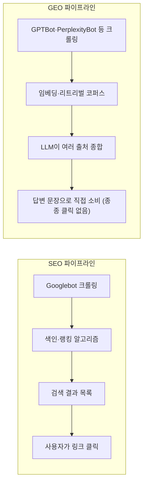

## 같은 "최적화"인데 최종 소비자가 다르다

SEO(Search Engine Optimization)는 검색 결과 목록에서 내 페이지 링크가 최대한 위쪽에 뜨게 만드는 최적화다. 사용자는 파란 링크 목록을 보고, 그중 하나를 클릭해서 내 사이트로 들어온다. 이 흐름의 최종 소비자는 결국 **사람**이고, 검색엔진은 그 사람에게 "어떤 링크를 먼저 보여줄지" 순서를 매기는 중개자다.

GEO(Generative Engine Optimization)는 이 중개자의 역할 자체가 바뀐 상황을 다룬다. ChatGPT 검색, Perplexity, Google AI Overview 같은 생성형 답변 엔진은 여러 출처를 찾아 읽은 다음, **그 내용을 요약·종합해서 하나의 답변 문장으로 직접 사용자에게 준다.** 사용자는 종종 원문 링크를 클릭하지 않고 그 답변만 보고 만족한다(zero-click). 이 경우 최종 소비자는 사람이 아니라 **LLM**이다 — LLM이 내 문장을 "읽고 그대로 옮겨 쓸 만한 문장"으로 판단해야 내 콘텐츠가 답변에 반영된다.

같은 "최적화"라는 이름이 붙어 있지만, 최적화 대상이 "검색 결과 순위 알고리즘"이냐 "LLM의 인용 판단"이냐가 다르기 때문에 실제로 신경 써야 하는 지점이 갈라진다.

## 파이프라인 자체가 다르다

SEO는 "색인된 페이지 중 이 검색어에 가장 관련성 높은 걸 순서대로 나열"하는 랭킹 문제다. GEO는 "여러 후보 문장 중 이 질문에 답할 근거로 인용할 만한 걸 검색해서 요약에 녹여 넣는" RAG(Retrieval-Augmented Generation)에 더 가까운 구조다. 실제로 Perplexity나 ChatGPT 검색이 답변을 만드는 과정은, 이전에 [LangChain RAG 오케스트레이션 글](/blog/langchain-rag-orchestration)에서 다룬 "질문에 맞는 문서를 검색해서 근거로 답을 생성"하는 구조와 근본적으로 같다. 차이는 그 리트리버가 내 사이트 하나만 보는 게 아니라 웹 전체(또는 사전 학습 데이터)를 대상으로 한다는 점이다.

## 크롤러부터 다르게 관리해야 한다

SEO는 `robots.txt`에서 Googlebot·Bingbot 같은 검색엔진 크롤러의 접근을 관리하면 끝이었다. GEO 시대에는 이 목록에 없는 크롤러들이 따로 있다.

| 크롤러 | 주체 | 용도 |
|---|---|---|
| Googlebot, Bingbot | Google, Microsoft | 전통적 검색 색인 (SEO) |
| GPTBot | OpenAI | ChatGPT 학습·검색 답변용 수집 |
| ClaudeBot, anthropic-ai | Anthropic | Claude 학습·답변용 수집 |
| PerplexityBot | Perplexity | 실시간 답변 생성용 수집 |
| Google-Extended | Google | Gemini 등 AI 모델 학습용 (일반 검색 색인과 별도 옵트아웃 가능) |
| CCBot | Common Crawl | 다수 LLM의 사전학습 데이터 원천 |

`robots.txt`에 Googlebot·Bingbot만 명시하고 이 크롤러들을 신경 쓰지 않으면, 사이트 자체는 검색에 잘 잡히더라도 **AI 답변에는 애초에 후보로도 오르지 못한다.** 반대로, 저작권·트래픽 우회 문제로 학습용 크롤러(GPTBot, Google-Extended 등)만 선별적으로 막고 실시간 답변용 크롤러(PerplexityBot 등)는 허용하는 식으로, SEO 때보다 훨씬 세분화된 접근 정책이 필요해졌다는 점도 새로운 문제다.

## "1등 링크"가 아니라 "인용될 만한 한 문장"을 만드는 문제

SEO에서 잘 먹히는 신호(키워드 밀도, 백링크 수, 페이지 체류시간)와 GEO에서 잘 먹히는 신호는 완전히 겹치지 않는다.

| | SEO | GEO |
|---|---|---|
| 핵심 자산 | 백링크 수·도메인 권위 | 사실 정확도·출처 명시·독립적으로 인용 가능한 문장 |
| 콘텐츠 형태 | 키워드를 자연스럽게 포함한 롱폼 텍스트 | 질문-답 형태로 딱 떨어지는 짧고 명확한 서술 |
| 구조화 데이터 | 리치 스니펫용 Schema.org(FAQ, Product 등) | 같은 Schema.org가 LLM의 사실 추출 정확도에도 기여 |
| 측정 지표 | 검색 순위, CTR, 오가닉 트래픽 | 답변 내 인용/언급 빈도(zero-click이라 클릭 기반 지표로 못 잼) |
| 최신성 | 정기 업데이트가 순위에 긍정적 | 실시간 크롤링형 엔진(Perplexity 등)일수록 최신 정보 반영이 즉각적으로 중요 |

특히 측정 지표 차이가 실무적으로 크다. SEO는 "몇 위에 떴는가, 몇 명이 클릭했는가"로 성과를 잴 수 있지만, GEO는 사용자가 애초에 내 사이트를 클릭하지 않기 때문에 애널리틱스 트래픽만 보면 성과가 거의 없는 것처럼 보인다. 그래서 GEO의 성과는 트래픽이 아니라 "AI 답변 안에 내 콘텐츠(또는 출처 링크)가 실제로 등장했는가"를 별도로 확인해야 하는, 아직 표준화된 측정 도구가 부족한 영역이다.

## 겹치는 지점도 있다

SEO와 GEO가 완전히 다른 세계는 아니다. 둘 다 아래 조건에서 이득을 본다.

- **명확한 구조** — 제목·소제목·목록으로 정보가 잘 나뉜 문서는 검색엔진의 파싱에도, LLM의 정보 추출에도 유리하다.
- **사실 기반 정확성** — 부정확한 정보는 SEO에서도 신뢰도(E-E-A-T) 감점 요인이고, GEO에서는 LLM이 애초에 근거로 채택하지 않을 확률이 높다.
- **Schema.org 구조화 데이터** — FAQPage, Article, Person 같은 마크업은 리치 스니펫(SEO)과 사실 추출(GEO) 양쪽에 다 쓰인다.

즉 "잘 쓰인 글"이라는 기반 위에서 SEO는 랭킹 신호(백링크·CTR)를, GEO는 인용 가능성(명확한 단문·정확한 출처)을 추가로 요구하는 구조에 가깝다. 하나를 포기하고 다른 하나만 챙길 수 있는 관계가 아니라, 기본기는 공유하되 그 위에 얹는 최적화 방향이 갈라지는 것이다.

## 정리

- SEO는 검색 결과 "순위"를 다투는 문제이고, GEO는 LLM의 답변에 "인용"되는 문제다 — 최종 소비자가 사람이냐 LLM이냐가 다르다.
- GEO의 파이프라인은 전통적 랭킹 알고리즘이 아니라 RAG 구조(검색 → LLM이 종합 → 답변)에 가깝다.
- `robots.txt` 관리 대상이 Googlebot·Bingbot에서 GPTBot·ClaudeBot·PerplexityBot·Google-Extended·CCBot까지 늘었고, 학습용과 실시간 답변용 크롤러를 구분해서 정책을 정해야 하는 상황이 됐다.
- GEO는 zero-click 특성상 클릭 기반 지표로 성과를 측정하기 어렵고, "답변에 실제로 인용됐는가"를 별도로 확인해야 한다.
- 구조화된 문서·정확한 사실·Schema.org 마크업은 SEO와 GEO 모두에 도움이 되는 공통 기반이고, 그 위에서 SEO는 랭킹 신호를, GEO는 인용 가능성을 추가로 요구한다.
