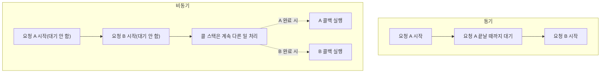

## 동기와 비동기는 정확히 무엇을 가리키는가

동기(synchronous)와 비동기(asynchronous)는 "작업이 끝날 때까지 다음 코드를 기다리게 하는가"의 차이다. 동기 코드는 한 줄이 끝나야 다음 줄로 넘어간다. 비동기 코드는 시간이 걸리는 작업(네트워크 요청, 파일 읽기, 타이머)을 실행만 시켜두고, 결과를 기다리지 않은 채 다음 줄로 바로 넘어간다.

```javascript
// 동기: 각 줄이 끝나야 다음 줄이 실행된다
console.log("1");
const data = readFileSync("data.txt"); // 파일을 다 읽을 때까지 여기서 멈춘다
console.log("2");

// 비동기: 요청만 걸어두고 바로 다음 줄로 넘어간다
console.log("1");
readFile("data.txt", (err, data) => console.log(data)); // 콜백은 나중에 실행
console.log("2");
```

JavaScript는 싱글 스레드다. 동기 코드가 오래 걸리면 그동안 브라우저는 화면을 다시 그리지 못하고, Node.js 서버는 다른 요청을 처리하지 못한다. **비동기는 이 하나뿐인 스레드를 오래 걸리는 작업이 독점하지 못하게 막는 방법**이다. [RabbitMQ가 서비스 간 동기 호출을 큐로 끊어내는 이유](/blog/rabbitmq-basics)와 본질적으로 같은 문제의식이다 — 동기 호출은 "기다리는 쪽"을 상대방의 속도에 강하게 묶어버린다.



## 콜백 → Promise → async/await, 왜 이렇게 바뀌었나

비동기 코드를 표현하는 방식은 세 단계를 거쳐 진화했다. 문제는 항상 같았다 — "비동기 결과를 어떻게 순서대로, 에러 처리까지 포함해서 읽기 쉽게 이어붙이는가."

| 방식 | 예시 | 한계 |
|---|---|---|
| 콜백(callback) | `readFile(path, (err, data) => {...})` | 비동기가 중첩될수록 콜백 안에 콜백이 쌓이는 "콜백 지옥", 에러 처리가 각 콜백마다 따로 필요 |
| Promise | `readFile(path).then(data => ...).catch(err => ...)` | 중첩은 풀리지만 `.then()` 체이닝이 길어지면 여전히 읽기 번거로움 |
| async/await | `const data = await readFile(path)` | Promise를 동기 코드처럼 순서대로 읽고 쓸 수 있게 하는 문법 |

async/await는 새로운 비동기 모델이 아니라 **Promise 위에 얹은 문법(syntactic sugar)**이다. `await`는 Promise가 처리(resolve/reject)될 때까지 해당 `async` 함수의 실행만 일시 정지시키고, 그 사이 다른 코드(이벤트 루프의 다른 작업)는 계속 실행된다. 스레드를 막는 동기의 blocking과는 다르다.

```javascript
// Promise 체이닝
function getUser(id) {
  return fetchUser(id)
    .then((user) => fetchPosts(user.id))
    .then((posts) => console.log(posts))
    .catch((err) => console.error(err));
}

// 같은 로직을 async/await로
async function getUser(id) {
  try {
    const user = await fetchUser(id);
    const posts = await fetchPosts(user.id);
    console.log(posts);
  } catch (err) {
    console.error(err);
  }
}
```

## async/await를 쓰는 두 가지 방식: 순차 실행 vs 병렬 실행

async/await를 배우고 나서 가장 흔하게 하는 실수가 이거다 — 서로 의존하지 않는 비동기 작업까지 습관적으로 한 줄씩 `await`를 걸어 순차 실행해버리는 것. 두 방식은 코드 생김새는 비슷해도 실행 시간과 에러 처리 방식이 다르다.

### 1) 순차 실행 (sequential)

```javascript
async function loadDashboard() {
  const user = await fetchUser();     // 1초 대기
  const orders = await fetchOrders(); // 1초 대기
  const stats = await fetchStats();   // 1초 대기
  return { user, orders, stats };
  // 총 소요 시간 ≈ 3초
}
```

각 `await`가 앞 작업이 끝날 때까지 다음 줄 실행을 멈춘다. `orders`가 `user` 값을 필요로 하는 것도 아닌데 굳이 순서대로 기다리기 때문에, 세 요청의 대기 시간이 그대로 합산된다.

### 2) 병렬 실행 (concurrent, `Promise.all`)

```javascript
async function loadDashboard() {
  const [user, orders, stats] = await Promise.all([
    fetchUser(),
    fetchOrders(),
    fetchStats(),
  ]);
  return { user, orders, stats };
  // 총 소요 시간 ≈ 1초 (가장 오래 걸리는 요청 기준)
}
```

`Promise.all`은 세 요청을 동시에 시작시켜 놓고, 모두 끝날 때까지 한 번만 기다린다. 서로 의존 관계가 없는 작업이라면 이 방식이 세 배 가까이 빠르다. **"작업 B가 작업 A의 결과값을 필요로 하는가"가 순차/병렬을 가르는 기준**이다. `fetchOrders(user.id)`처럼 앞 결과가 필요하면 순차로 갈 수밖에 없고, 그렇지 않으면 병렬로 묶는 게 맞다.

### 에러 처리도 달라진다

```javascript
// Promise.all: 하나라도 reject되면 즉시 전체가 reject (fail-fast)
try {
  const [user, orders] = await Promise.all([fetchUser(), fetchOrders()]);
} catch (err) {
  // user든 orders든 먼저 실패한 쪽의 에러만 잡힌다
}

// Promise.allSettled: 각각의 성공/실패를 개별적으로 확인
const results = await Promise.allSettled([fetchUser(), fetchOrders()]);
results.forEach((r) => {
  if (r.status === "fulfilled") console.log(r.value);
  else console.error(r.reason);
});
```

`Promise.all`은 하나만 실패해도 나머지가 성공했는지와 무관하게 즉시 reject된다. 일부가 실패해도 나머지 결과는 살려서 써야 한다면 `Promise.allSettled`를 써야 한다. 순차 실행에서는 `try/catch`를 각 `await` 단위로 세밀하게 걸 수도, 전체를 하나로 묶을 수도 있어서 실패 지점을 더 좁게 특정할 수 있다는 차이도 있다.

### 반복문 안에서 자주 나오는 함정

```javascript
// 잘못된 예: for...of + await → 배열 요소 수만큼 순차 대기
for (const id of userIds) {
  const user = await fetchUser(id); // 하나씩 끝나야 다음으로
  console.log(user);
}

// 개선: map으로 Promise 배열을 만들고 한 번에 대기
const users = await Promise.all(userIds.map((id) => fetchUser(id)));
```

`forEach`나 `for...of` 안에 `await`를 그대로 넣으면 배열 길이만큼 요청이 순차로 쌓인다. 각 요청이 독립적이라면 `map` + `Promise.all` 조합으로 동시에 날리는 게 대부분 맞는 선택이다.

## 정리

- 동기는 코드가 끝날 때까지 다음 줄을 막고, 비동기는 시간이 걸리는 작업을 걸어두기만 하고 스레드를 계속 다른 일에 쓴다. JavaScript가 싱글 스레드이기 때문에 이 차이가 특히 중요하다.
- 콜백 → Promise → async/await는 같은 문제("비동기를 순서대로 읽기 쉽게 표현하기")를 풀어온 진화의 흐름이고, async/await는 Promise 위의 문법이다.
- 같은 async/await라도 **의존 관계가 없는 작업을 한 줄씩 `await`로 순차 실행하면 대기 시간이 합산**되고, `Promise.all`로 묶어 병렬 실행하면 가장 오래 걸리는 작업 시간만큼만 걸린다.
- 병렬 실행 시 하나라도 실패하면 즉시 전체가 실패하는 `Promise.all`과, 개별 성공/실패를 모두 보존하는 `Promise.allSettled` 중 상황에 맞는 쪽을 선택해야 한다.
- 반복문 안에서 `await`를 무심코 순차로 쓰고 있지 않은지는 성능 리뷰에서 가장 먼저 확인해볼 만한 지점이다.
