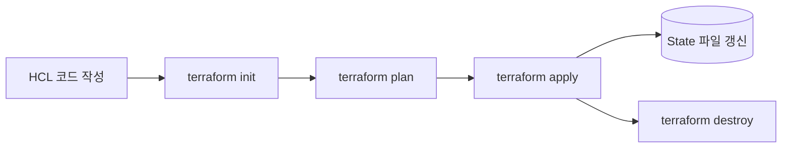

인프라를 콘솔에서 클릭하거나 CLI 명령을 그때그때 실행해서 만들면, 당장은 편하지만 시간이 지날수록 "이 인프라를 지금 상태 그대로 다시 만들 수 있는가"에 답할 수 없게 된다. IaC와 Terraform은 이 질문에 답하기 위한 도구다.

## 손으로 인프라를 만들 때 생기는 문제

콘솔 클릭이나 CLI 명령으로 리소스를 하나씩 만드는 방식은 세 가지 문제를 만든다.

- **재현이 안 된다.** 같은 환경을 dev/staging/prod로 복제하려면 사람이 클릭 순서와 설정값을 기억해서 똑같이 반복해야 한다. 실수로 설정 하나만 빠뜨려도 환경 간 차이(configuration drift)가 생긴다.
- **추적이 안 된다.** 누가 언제 무엇을 바꿨는지가 콘솔 로그에만 남고, "왜 이 값으로 설정했는지"에 대한 맥락은 어디에도 기록되지 않는다.
- **리뷰가 안 된다.** 코드는 PR로 리뷰를 받지만, 콘솔에서 바꾼 인프라 설정은 리뷰 없이 바로 적용된다.

## IaC(Infrastructure as Code)란

IaC는 인프라 구성을 코드로 선언해서 관리하는 방식이다. 코드이기 때문에 Git으로 버전 관리하고, PR로 리뷰하고, 같은 코드를 실행하면 같은 환경을 다시 만들 수 있다. IaC 도구는 크게 두 방식으로 나뉜다.

- **명령형(Imperative)** — "무엇을 어떤 순서로 할지"를 직접 기술한다. 셸 스크립트로 `aws ec2 create-instance` 같은 CLI 명령을 순서대로 나열하는 방식이 여기에 속한다. 실행 순서, 이미 존재하는 리소스를 건너뛰는 로직까지 전부 작성자가 신경 써야 한다.
- **선언적(Declarative)** — "최종적으로 어떤 상태여야 하는지"만 기술한다. 실행 순서나 "이미 있으면 건너뛰고 없으면 만든다" 같은 판단은 도구가 알아서 계산한다. Terraform, Kubernetes YAML이 이 방식이다.

## Terraform이란

Terraform은 HashiCorp이 만든 선언적 IaC 도구다. HCL(HashiCorp Configuration Language)이라는 문법으로 "이런 리소스가 있어야 한다"를 선언하면, Terraform이 각 클라우드의 API를 호출해서 그 상태를 실제로 만든다.

핵심은 **Provider** 개념이다. AWS, Azure, GCP, Kubernetes 등 서로 다른 플랫폼을 같은 HCL 문법으로 다룰 수 있는 건, Provider가 "HCL 선언 → 해당 플랫폼의 API 호출"을 변환해주는 어댑터 역할을 하기 때문이다. 온프레미스 인프라를 클라우드와 같이 관리해야 하는 하이브리드 환경에서 Terraform이 자주 선택되는 이유이기도 하다.

## 왜 Terraform을 쓰는가

- **멀티 클라우드/하이브리드를 같은 문법으로 다룬다.** AWS든 Azure든 provider 블록만 바꾸면 동일한 HCL 구조로 리소스를 선언할 수 있다.
- **선언적이라 순서를 직접 관리하지 않아도 된다.** 리소스 간 참조(`azurerm_resource_group.rg.name`처럼)만 걸어두면, Terraform이 의존성 그래프를 만들어 생성·삭제 순서를 알아서 계산한다.
- **적용 전에 변경 사항을 미리 볼 수 있다.** `terraform plan`이 "무엇이 추가/변경/삭제되는지"를 실행 전에 보여주기 때문에, 실수로 운영 리소스를 지우는 사고를 줄일 수 있다.
- **State로 실제 인프라 상태를 추적한다.** Terraform은 자신이 관리하는 리소스의 현재 상태를 State 파일에 기록해두고, 이걸 기준으로 plan/apply를 계산한다. (State를 팀 단위로 관리할 때 생기는 문제와 해법은 [테라폼 State는 왜 신경 써서 관리해야 하나](/blog/terraform-state-management)에서 다뤘다.)
- **코드이므로 리뷰와 이력 관리가 된다.** 인프라 변경도 애플리케이션 코드와 똑같이 PR 리뷰를 거치고, Git 이력으로 "언제 왜 바뀌었는지"가 남는다.

## 기본 워크플로우



- `terraform init` — 코드에 선언된 provider 플러그인을 내려받고, 백엔드(State 저장소)를 초기화한다.
- `terraform plan` — 코드(목표 상태), State(마지막으로 확인한 상태), 실제 인프라를 비교해서 무엇이 추가·변경·삭제될지 미리 계산해 보여준다.
- `terraform apply` — plan에서 계산한 변경 사항을 실제로 클라우드에 적용하고, 그 결과를 State 파일에 반영한다.
- `terraform destroy` — 코드로 관리 중인 리소스를 전부 삭제한다.

## 코드 예제

Azure에 리소스 그룹과 스토리지 계정을 만드는 간단한 예제다.

```hcl
terraform {
  required_providers {
    azurerm = {
      source  = "hashicorp/azurerm"
      version = "~> 3.0"
    }
  }
}

provider "azurerm" {
  features {}
}

resource "azurerm_resource_group" "rg" {
  name     = "example-rg"
  location = "Korea Central"
}

resource "azurerm_storage_account" "sa" {
  name                     = "examplesa001"
  resource_group_name      = azurerm_resource_group.rg.name
  location                 = azurerm_resource_group.rg.location
  account_tier             = "Standard"
  account_replication_type = "LRS"
}
```

`azurerm_storage_account.sa`가 `azurerm_resource_group.rg.name`을 참조하고 있는 부분이 핵심이다. 이 참조 하나로 Terraform은 "스토리지 계정을 만들기 전에 리소스 그룹이 먼저 있어야 한다"는 의존 관계를 자동으로 파악해서, `apply` 시 리소스 그룹 → 스토리지 계정 순서로 생성한다. 순서를 코드에 직접 적을 필요가 없다.

## 정리

- 인프라를 콘솔·CLI로 그때그때 만들면 재현성·추적·리뷰가 전부 안 된다. IaC는 인프라를 코드로 선언해서 이 문제를 해결한다.
- IaC는 명령형(순서를 직접 기술)과 선언적(목표 상태만 기술)으로 나뉘고, Terraform은 선언적 방식이다.
- Terraform은 Provider를 통해 여러 클라우드/플랫폼을 같은 HCL 문법으로 다루며, 리소스 간 참조로 의존성과 실행 순서를 자동 계산한다.
- 실제 작업은 `init → plan → apply` 순서로 진행되고, `plan`으로 변경 사항을 미리 확인할 수 있다는 점이 수동 작업과의 가장 큰 차이다.
