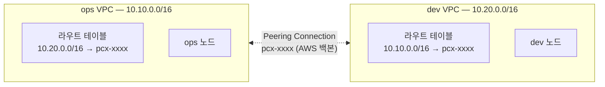

[EKS 관측 플랫폼](/blog/eks-multi-cluster-observability-platform)을 만들 때, ops(관측 도구)와 dev(워크로드)를 완전히 다른 VPC 두 개(`10.10.0.0/16`, `10.20.0.0/16`)에 나눠 올렸다. "관제탑이 관제 대상 안에 있으면 안 된다"는 이유였다. 그런데 완전히 분리하면서도 dev의 로그·지표는 ops로 계속 흘러가야 한다 — 이 둘을 **인터넷을 거치지 않고, 각자의 네트워크 경계는 그대로 유지한 채** 연결한 방법이 VPC Peering이다.

## VPC Peering이 정확히 하는 일

**VPC Peering**은 서로 다른 VPC 두 개 사이에 사설(private) 네트워크 경로를 만드는 기능이다. AWS 백본 네트워크 안에서 트래픽이 오가기 때문에 인터넷 게이트웨이·NAT·공인 IP가 전혀 필요 없다. 중요한 건 **"연결"의 의미가 딱 라우팅까지**라는 점이다.



- **각 VPC는 여전히 완전히 독립적이다.** 주소 공간, 라우트 테이블, 보안 그룹, NACL 전부 따로 관리한다. Peering은 그 둘 사이에 "이 CIDR로 가는 트래픽은 상대 VPC로 보내라"는 라우팅 경로 하나를 뚫어줄 뿐이다.
- **보안 그룹은 그대로 적용된다.** Peering이 연결됐다고 모든 트래픽이 통과되는 게 아니다. [EKS 관측 플랫폼 글](/blog/eks-multi-cluster-observability-platform)에서 dev의 fluent-bit이 ops로 로그를 보내려면 "ops 노드 SG에 dev VPC 대역 → NodePort 범위(30000-32767)를 열어둬야 한다"고 한 게 이 부분이다 — 라우팅이 뚫려도 방화벽 규칙은 별도로 허용해야 한다.
- **비-전이적(non-transitive)이다.** VPC A와 B가 peering돼 있고, B와 C가 peering돼 있어도, A는 B를 거쳐 C로 갈 수 없다. A-C 통신이 필요하면 A-C 간 별도 peering을 직접 맺어야 한다.

## 설정 — 라우트 테이블은 양쪽 다 고쳐야 한다

```hcl
resource "aws_vpc_peering_connection" "ops_dev" {
  vpc_id      = aws_vpc.ops.id
  peer_vpc_id = aws_vpc.dev.id
  auto_accept = true   # 같은 계정/리전이면 자동 수락, 계정이 다르면 수락 단계가 별도로 필요
}

resource "aws_route" "ops_to_dev" {
  route_table_id            = aws_route_table.ops.id
  destination_cidr_block    = aws_vpc.dev.cidr_block
  vpc_peering_connection_id = aws_vpc_peering_connection.ops_dev.id
}

resource "aws_route" "dev_to_ops" {
  route_table_id            = aws_route_table.dev.id
  destination_cidr_block    = aws_vpc.ops.cidr_block
  vpc_peering_connection_id = aws_vpc_peering_connection.ops_dev.id
}
```

Peering Connection 자체를 만드는 것과, **양쪽 VPC의 라우트 테이블에 각각 상대방 CIDR을 추가하는 것**은 별개 단계다. 둘 중 하나라도 빠지면 한쪽 방향만 뚫리거나 아예 통신이 안 된다 — 흔히 나오는 "peering은 Active인데 ping이 안 된다"는 십중팔구 라우트 테이블 한쪽을 빠뜨린 경우다.

## 왜 그냥 VPC 하나로 안 합치나

가장 먼저 드는 의문이다. ops·dev를 애초에 같은 VPC, 같은 서브넷 대역에 두면 라우팅도 SG 설정도 훨씬 단순해진다. 그런데 [EKS 관측 플랫폼 글](/blog/eks-multi-cluster-observability-platform)에서 정리했던 것처럼, VPC를 나눈 이유는 네트워크 편의가 아니라 **격리** 때문이다.

| | 단일 VPC | VPC 2개 + Peering |
|---|---|---|
| 네트워크 경계 | 없음 — 서브넷/SG로만 구분 | VPC 자체가 하드한 경계 |
| 한쪽 사고가 전체에 미치는 영향 | 큼 — 잘못된 라우트·SG 룰 하나가 전체 네트워크에 영향 | 제한적 — VPC 경계를 넘으려면 명시적 peering·라우트·SG가 다 맞아야 함 |
| 계정/팀 분리 | 어려움 | 자연스러움 — 계정을 아예 분리하고 peering으로만 연결 가능 |
| 설정 복잡도 | 낮음 | 높음 (peering, 라우트 양쪽, SG 양쪽) |

VPC를 나누는 건 "실수해도 번지지 않게" 미리 벽을 세워두는 것에 가깝다. ops 클러스터의 설정 실수가 dev VPC의 네트워크까지 직접 건드릴 수 없다 — peering connection과 라우트, SG를 전부 거쳐야만 닿기 때문이다. 그 대가로 설정이 늘어나는 걸 감수하는 트레이드오프다.

## Peering이 못 하는 것 — Transit Gateway가 필요한 순간

VPC가 2개일 땐 peering으로 충분하다. 그런데 VPC가 늘어나면 문제가 생긴다. **비-전이성 때문에 모든 쌍(pair)마다 peering을 따로 맺어야 한다.**

```
VPC 2개 → peering 1개
VPC 4개 → peering 6개 (4×3/2)
VPC 10개 → peering 45개 (10×9/2)
```

VPC가 N개면 완전 연결(full mesh)에 필요한 peering 수는 N(N-1)/2로 **제곱에 가깝게 늘어난다.** 라우트 테이블도 매 VPC마다 나머지 VPC 수만큼 항목이 늘고, 어느 VPC의 CIDR을 바꾸면 관련된 모든 peering의 라우트를 다 고쳐야 한다.

이 지점에서 **Transit Gateway**로 넘어간다. Transit Gateway는 허브 역할을 하는 중앙 라우터 하나에 모든 VPC를 연결(attachment)하는 방식이라, VPC가 늘어도 각 VPC는 Transit Gateway 하나에만 연결하면 된다 — peering 수가 아니라 attachment 수만큼만 늘어난다(N개).

| | VPC Peering | Transit Gateway |
|---|---|---|
| 연결 방식 | VPC 쌍마다 1:1 | 모든 VPC가 중앙 허브 하나에 연결 |
| VPC가 늘어날 때 | 연결 수가 N² 수준으로 증가 | 연결 수가 N만큼만 증가 |
| 전이성 | 없음 (A-C 별도 필요) | 있음 (허브를 통해 전체 도달 가능, 라우팅 테이블로 제어) |
| 비용 | 무료(같은 리전 내 전송은 일반 데이터 전송료만) | 시간당 attachment 비용 + 데이터 처리 비용 |
| 적합한 규모 | VPC 2~3개 안팎의 단순한 구조 | VPC가 여러 개로 늘어나는 조직/멀티 계정 환경 |

[EKS 관측 플랫폼](/blog/eks-multi-cluster-observability-platform)은 VPC가 딱 2개(ops, dev)라 peering이 정확히 맞는 선택이었다. 여기에 클러스터를 하나 더 추가해 3-way, 4-way로 늘어나기 시작하면 그때부터는 Transit Gateway를 검토할 지점이다.

## 흔한 함정

- **CIDR 대역이 겹침** — Peering을 맺으려는 두 VPC의 CIDR이 겹치면 애초에 라우팅 자체가 불가능하다. 나중에 발견하면 한쪽 VPC의 IP 대역을 통째로 바꿔야 하는 큰 작업이 되므로, **VPC를 여러 개 쓸 계획이 있다면 처음부터 대역을 안 겹치게 설계**해야 한다.
- **라우트 테이블을 한쪽만 고침** — 위에서 다룬 대로, 양쪽 VPC 라우트 테이블 모두에 상대 CIDR을 추가해야 양방향 통신이 된다.
- **SG를 안 열어서 "peering은 Active인데 연결이 안 됨"** — peering·라우트가 다 맞아도 보안 그룹이 상대 CIDR의 인바운드를 막고 있으면 트래픽은 여전히 거부된다.
- **비-전이성을 잊고 설계** — "B랑 C가 peering돼 있으니 A-B만 연결하면 A에서 C까지 가겠지"는 틀렸다. A-C 통신이 필요하면 반드시 A-C peering을 별도로 맺어야 한다.
- **Private DNS 확인 안 함** — 상대 VPC의 리소스를 프라이빗 DNS 이름(Route 53 Private Hosted Zone 등)으로 접근하려면 peering connection에서 "DNS 확인 허용(allow-remote-vpc-dns-resolution)" 옵션을 별도로 켜야 한다. 기본값은 꺼져 있다.
- **VPC 개수가 늘어나는데 계속 peering으로 버팀** — 위 표의 N² 문제를 뒤늦게 겪는 경우다. VPC가 4개를 넘어가기 시작하면 Transit Gateway 전환을 미리 검토하는 게 낫다.

## 정리

| 질문 | 답 |
|---|---|
| VPC Peering이란 | 서로 다른 VPC 사이에 AWS 백본을 통한 사설 라우팅 경로를 만드는 기능 |
| 무엇을 바꾸지 않나 | 각 VPC의 독립성 — 주소 공간, 라우트 테이블, SG, NACL은 그대로 각자 관리 |
| 왜 VPC를 나누고 peering으로 잇나 | 네트워크 경계를 하드하게 둬서 한쪽 사고가 반대쪽까지 번지지 않게 하기 위해 |
| 왜 비-전이적인가 | A-B, B-C가 연결돼도 A-C는 자동으로 안 뚫림 — 각 쌍마다 명시적으로 맺어야 함 |
| 언제 Transit Gateway로 넘어가나 | VPC 수가 늘어 peering 쌍이 N² 수준으로 복잡해질 때 |

한 줄 요약: **VPC Peering은 "두 네트워크를 하나로 합친다"가 아니라 "각자의 경계는 그대로 둔 채 인터넷 없이 다닐 좁은 길 하나를 낸다"는 개념이다. 그 길을 내도 SG라는 문은 따로 열어야 하고, VPC가 여러 개로 늘어나면 길을 하나씩 내는 방식 자체가 한계에 부딪혀 Transit Gateway로 넘어가게 된다.**
